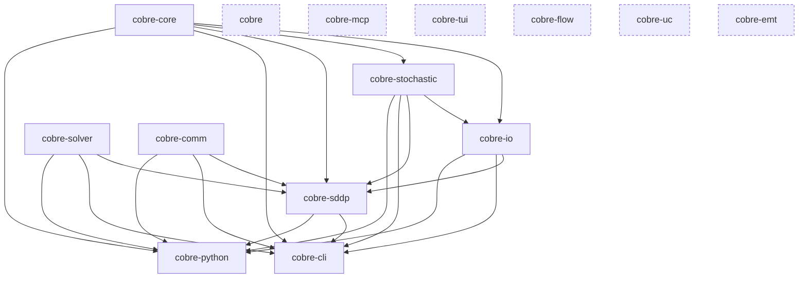

# Architecture

Cobre is a Cargo workspace of focused Rust crates, each with a single
responsibility and an explicit dependency boundary. This document is a
developer-facing map of the workspace: what each crate owns, how they depend
on one another, and the build-time choices that shape the graph. It is a
starting point, not a replacement for each crate's own README — follow the
links at the end of each section for the full detail.

For the mathematical/methodology reference (SDDP formulation, cut derivation,
risk measures, hydro production models) and for user-facing installation and
CLI usage, see the [unified docs site](https://docs.cobre-rs.dev/).

## Crate responsibilities

### Foundation

- **[`cobre-core`](crates/cobre-core/README.md)** — The shared power-system
  data model: buses, lines, hydro/thermal/pumping/contract/non-controllable-source
  entities, network and cascade topology, the temporal (stage/block/policy-graph)
  model, pre-resolved penalty and bound tables, and the immutable `System`
  container built by `SystemBuilder`. Carries no solver, I/O, or algorithm
  dependencies — every other crate in the workspace consumes `System` by
  shared reference. Enforces declaration-order invariance (entities sort into
  canonical order at construction) so results never depend on input ordering.

### Infrastructure (depend only on `cobre-core`, or on nothing)

- **[`cobre-solver`](crates/cobre-solver/README.md)** — Backend-agnostic LP
  solver abstraction (`SolverInterface` trait), with HiGHS as the default
  backend and an optional vendored CLP/CoinUtils backend. Owns the 12-level
  retry escalation ladder for numerically difficult LPs and the per-phase
  `HighsProfile`/`ProfiledSolver` tuning wrapper. Has **no** intra-workspace
  dependency — it is pure infrastructure that algorithm crates consume through
  a generic type parameter (compile-time monomorphization, never `dyn
SolverInterface`).
- **[`cobre-comm`](crates/cobre-comm/README.md)** — Pluggable communication
  backend abstraction (`Communicator` / `SharedMemoryProvider` traits), with a
  zero-overhead single-process `LocalBackend` always available and an MPI 4.x
  `FerrompiBackend` behind the `mpi` feature (built on the external
  [ferrompi](https://github.com/cobre-rs/ferrompi) crate, not a workspace
  member). Also has **no** intra-workspace dependency — like `cobre-solver`,
  it is consumed through a generic bound, so a Cobre binary contains exactly
  one backend instantiation.
- **[`cobre-stochastic`](crates/cobre-stochastic/README.md)** — Stochastic
  process models: PAR(p) inflow time-series models, spectral spatial
  correlation, deterministic communication-free noise generation (SipHash-1-3
  seed derivation), and the opening-tree / forward-sampler infrastructure
  consumed by iterative scenario-based algorithms. Depends only on
  `cobre-core` for entity types; solver-agnostic and comm-agnostic.

### Case I/O

- **[`cobre-io`](crates/cobre-io/README.md)** — The sole boundary between the
  filesystem and `cobre-core`/`cobre-stochastic` types. `load_case` runs a
  five-layer validation pipeline (structural, schema, referential integrity,
  dimensional consistency, semantic) over a case directory of JSON and Parquet
  files, resolves the three-tier penalty/bound cascade, assembles scenario
  models (optionally estimating PAR parameters from historical data), and
  produces a validated `System`. `write_results` writes Parquet result tables,
  FlatBuffers policy checkpoints, and JSON manifests. Depends on `cobre-core`
  (the types it populates) and `cobre-stochastic` (the scenario models it
  assembles).

### Algorithm

- **[`cobre-sddp`](crates/cobre-sddp/README.md)** — The Stochastic Dual
  Dynamic Programming algorithm: forward-pass scenario simulation, backward-pass
  Benders cut generation, cut management (Level-1/LML1/dominated-cut pruning
  and Dynamic Cut Selection), CVaR risk measures, convergence monitoring,
  policy warm-start/resume, and the post-training simulation pipeline. Depends
  on all four infrastructure/I-O crates below it — `cobre-core` (data model),
  `cobre-io` (loading case data and writing results), `cobre-solver` (LP
  subproblem solving, via a generic `SolverInterface` bound), and `cobre-comm`
  (distributed collectives, via a generic `Communicator` bound) — plus
  `cobre-stochastic` for scenario generation. Because it is generic over both
  `SolverInterface` and `Communicator`, `cobre-sddp` itself carries **no**
  `mpi`/`highs`/`clp` selection logic of its own beyond forwarding the
  `highs`/`clp` features to `cobre-solver` — backend choice is made by the
  binary that instantiates it.

### Entry points

- **[`cobre-cli`](crates/cobre-cli/README.md)** — The `cobre` binary:
  `run`/`validate`/`report`/`summary`/`init`/`schema`/`version` subcommands
  with a typed `CliError` → exit-code contract. Wires `cobre-io`,
  `cobre-stochastic`, `cobre-solver`, `cobre-comm`, and `cobre-sddp` into a
  single executable. Selects the concrete solver backend (`highs`/`clp`
  features) and communication backend (`--comm-backend`, forwarding to
  `cobre-comm`'s `mpi` feature) for the process.
- **[`cobre-python`](crates/cobre-python/README.md)** — PyO3 bindings
  (`cdylib`, module name `_native`) exposing case loading, validation,
  training, simulation, and Arrow-backed zero-copy result inspection to
  Python. Depends on the same five crates as `cobre-cli` (`cobre-core`,
  `cobre-io`, `cobre-sddp`, `cobre-stochastic`, `cobre-solver`, `cobre-comm`)
  and mirrors its `highs`/`clp` backend-selection features, but is **excluded**
  from the Cargo workspace (`exclude` in the workspace `Cargo.toml`) because
  building it requires a Python interpreter and PyO3 — the exclusion keeps
  `cargo test --workspace` and `cargo-dist` from requiring one. Built
  separately via `maturin`.
- **[`cobre`](crates/cobre/README.md)** — The umbrella crate. Currently an
  empty skeleton (`src/lib.rs` re-exports nothing yet, `Cargo.toml` has no
  dependencies) reserved for a future single-dependency convenience re-export
  of the ecosystem; for all current work, depend on the specific `cobre-*`
  crates you need.

### Reserved crates (not yet implemented)

Five crate names are reserved in the workspace with a skeleton `Cargo.toml`
(empty `[dependencies]`), a stub `src/lib.rs` or `src/main.rs`, and a README
stating their intended future scope. None currently build any functionality
or participate in the dependency graph below:

- **[`cobre-mcp`](crates/cobre-mcp/README.md)** — reserved for an MCP
  (Model Context Protocol) server binary for AI-agent integration; depend on
  `cobre-cli` for command-line interaction until this lands.
- **[`cobre-tui`](crates/cobre-tui/README.md)** — reserved for a `ratatui`
  terminal UI; depend on `cobre-cli` until this lands.
- **[`cobre-flow`](crates/cobre-flow/README.md)** — reserved for AC/DC power
  flow algorithms (Newton-Raphson, fast-decoupled, etc.).
- **[`cobre-uc`](crates/cobre-uc/README.md)** — reserved for a MILP-based unit
  commitment solver for hydrothermal dispatch.
- **[`cobre-emt`](crates/cobre-emt/README.md)** — reserved for electromagnetic
  transient analysis algorithms.

## Dependency graph

Arrows point from dependency to dependent (an arrow from `cobre-core` to
`cobre-io` means `cobre-io` depends on `cobre-core`). Every edge below is a
direct `path = "../..."` dependency declared in a crate's `Cargo.toml`
`[dependencies]` — none are inferred or transitive-only. The five reserved
crates (`cobre-mcp`, `cobre-tui`, `cobre-flow`, `cobre-uc`, `cobre-emt`) and
the empty `cobre` umbrella crate have no dependency edges yet and are shown
detached.

20 edges: 3 among the foundation/infrastructure/I-O crates
(`core`→`io`, `core`→`stochastic`, `stochastic`→`io`), 5 into `cobre-sddp`
(`core`, `io`, `solver`, `comm`, `stochastic`), and 6 each into `cobre-cli`
and `cobre-python` (`core`, `io`, `solver`, `comm`, `stochastic`, `sddp`).
`cobre-cli` and `cobre-python` depend directly on `cobre-core`/`cobre-io`/
`cobre-solver`/`cobre-comm`/`cobre-stochastic` in addition to `cobre-sddp` —
they do not reach those crates only transitively through `cobre-sddp`.

## Build & feature notes

- **Solver backend selection is compile-time and mutually exclusive.**
  `cobre-solver`'s `highs` (default) and `clp` features gate two entirely
  separate backends (`HighsSolver` / `ClpSolver`); enabling both, or neither,
  is a compile error. `cobre-sddp`, `cobre-cli`, and `cobre-python` each
  re-declare `highs`/`clp` features that forward to **both**
  `cobre-solver/<feature>` and (for `cobre-sddp`) their own per-phase profile
  code, so a binary-level `--features clp` build propagates consistently down
  the graph instead of leaving one crate on its own default.
- **Communication backend selection is compile-time (feature) + runtime
  (`BackendKind`).** `cobre-comm` compiles in `LocalBackend` unconditionally
  and `FerrompiBackend` only behind its `mpi` feature (with `numa` and
  `shared-memory` as further opt-in extensions). `cobre-sddp` has no `mpi`
  feature of its own — it is generic over `Communicator`, so MPI support is
  purely a `cobre-comm` build-time concern plus a `cobre-cli`
  `mpi = ["cobre-comm/mpi"]` forward; `cobre-python` does not currently
  forward an `mpi` feature. At runtime, `create_communicator(BackendKind)`
  picks the active backend (`Auto`/`Mpi`/`Local`) independently of which
  features were compiled in.
- **`cobre-python` is excluded from the workspace.** The root `Cargo.toml`
  lists it under `[workspace] exclude` because PyO3 requires a Python
  interpreter; excluding it keeps `cargo test --workspace` and `cargo-dist`
  from requiring one. It is built separately via `maturin` and pins its own
  `edition`/`rust-version` rather than inheriting `[workspace.package]`.
- **Workspace-wide lints forbid `unsafe`.** `[workspace.lints.rust]` sets
  `unsafe_code = "forbid"`; `cobre-comm` (FFI `unsafe impl Send`/`Sync` for
  `FerrompiBackend`), `cobre-solver` (HiGHS/CLP FFI), and `cobre-python`
  (PyO3 macro-generated code) each override this to `"allow"` in their own
  `Cargo.toml`, re-declaring the rest of the workspace's clippy lints
  manually since Cargo does not allow combining `lints.workspace = true`
  with per-lint overrides.

## Links

| Resource              | URL                                                        |
| --------------------- | ---------------------------------------------------------- |
| Repository            | <https://github.com/cobre-rs/cobre>                        |
| Unified docs site     | <https://docs.cobre-rs.dev/>                               |
| CHANGELOG             | <https://github.com/cobre-rs/cobre/blob/main/CHANGELOG.md> |
