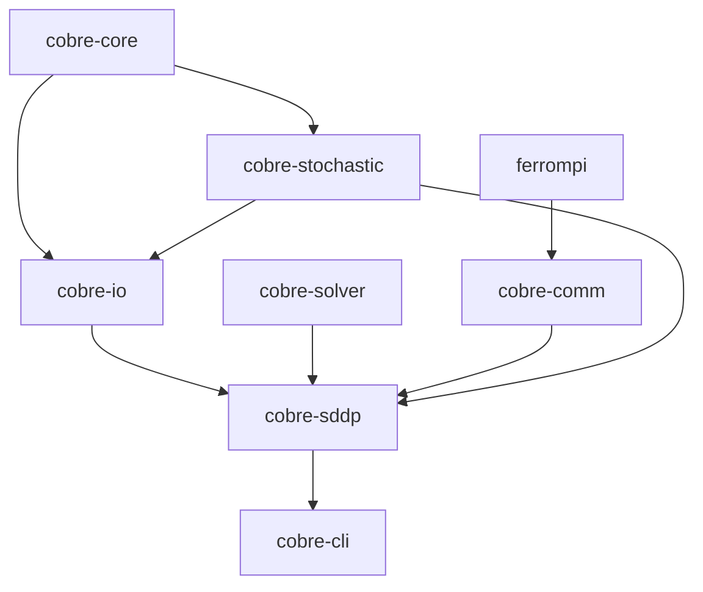

# Crate Overview

Cobre is organized as a Rust workspace of focused crates, each with a single responsibility and well-defined boundaries.

```
cobre/crates/
├── cobre/              Umbrella crate re-exporting workspace API
├── cobre-core/         Entity model (buses, hydros, thermals, lines)
├── cobre-io/           JSON/Parquet input, FlatBuffers/Parquet output
├── cobre-stochastic/   PAR(p) models, scenario generation
├── cobre-solver/       LP solver abstraction (HiGHS backend)
├── cobre-comm/         Communication abstraction (MPI, NUMA, shared-memory placeholder, local)
├── cobre-sddp/         SDDP training loop, simulation, cut management
├── cobre-cli/          Binary: run/validate/report/init/schema/summary/version
├── cobre-mcp/          Binary: MCP server for AI agent integration (reserved)
├── cobre-python/       cdylib: PyO3 Python bindings
├── cobre-tui/          Library: ratatui terminal UI (reserved)
├── cobre-flow/         Library: power flow algorithms (reserved)
├── cobre-uc/           Library: MILP unit commitment for hydrothermal dispatch (reserved)
└── cobre-emt/          Library: electromagnetic transient analysis (reserved)
```

## Dependency Graph

The diagram below shows the primary dependency relationships between workspace crates. Arrows point from dependency to dependent (i.e., an arrow from `cobre-core` to `cobre-io` means `cobre-io` depends on `cobre-core`).



For the full dependency graph and crate responsibilities, see the [methodology reference](https://cobre-rs.github.io/cobre-docs/specs/overview/implementation-ordering.html).

## Feature Summary

The workspace provides an SDDP training and simulation pipeline:

- **Entity model and topology validation** (`cobre-core`)
- **JSON/Parquet case loading** with layered validation (`cobre-io`)
- **LP solver abstraction** with HiGHS backend, warm-start basis management, and bounded retry escalation (`cobre-solver`)
- **Pluggable communication** with MPI and local backends, execution topology reporting, and SLURM integration (`cobre-comm`)
- **PAR(p) inflow models** with deterministic correlated scenario generation, per-class sampling (InSample, OutOfSample, Historical, External), and inflow non-negativity enforcement (`cobre-stochastic`)
- **SDDP training loop** with forward/backward passes, Benders cut generation, cut synchronization, and composite stopping rules (`cobre-sddp`)
- **Two-stage cut management pipeline** with strategy-based selection (Level1/LML1/Dominated) and budget enforcement (`cobre-sddp`)
- **Performance accelerators**: LP scaling, model persistence, incremental cut injection, backward-pass work-stealing, parallel lower bound evaluation, basis-aware padding, and pre-allocated hot-path workspaces (`cobre-sddp`, `cobre-solver`)
- **Simulation pipeline** with Hive-partitioned Parquet output and FlatBuffers policy checkpointing (`cobre-sddp`)
- **Policy warm-start and resume** from checkpoint with per-stage cut counts (`cobre-sddp`)
- **CLI subcommands** (`run`, `validate`, `report`, `init`, `schema`, `summary`, `version`), rayon-based intra-rank thread parallelism, progress bars, and post-run summary (`cobre-cli`)
- **Python bindings** via PyO3 with Arrow zero-copy result loading (`cobre-python`)
- **JSON Schema** files for all input types, hosted for `$schema` editor integration

The workspace is covered by an automated test suite (`cargo nextest run --workspace`),
including the deterministic example regression cases under `examples/deterministic/` — one
per modeled feature; see the
[Deterministic Regression Suite](../examples/deterministic-suite.md).
