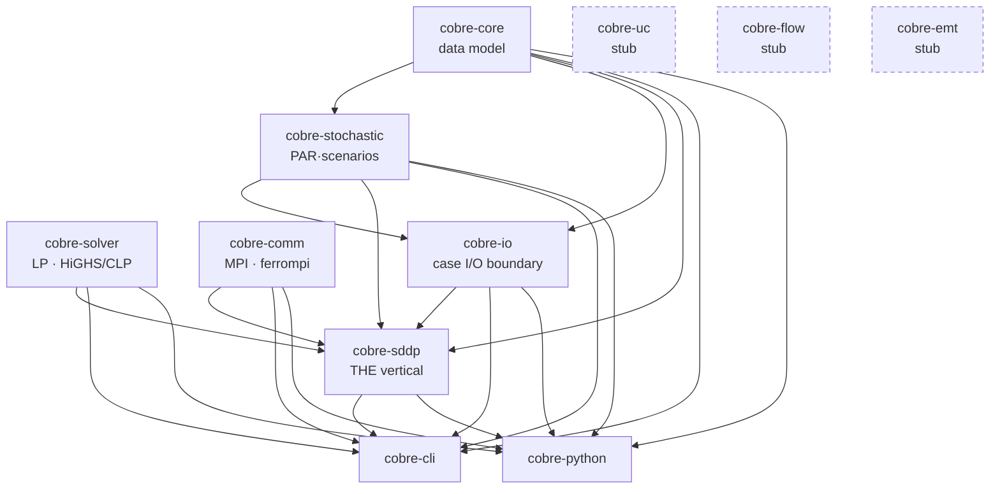
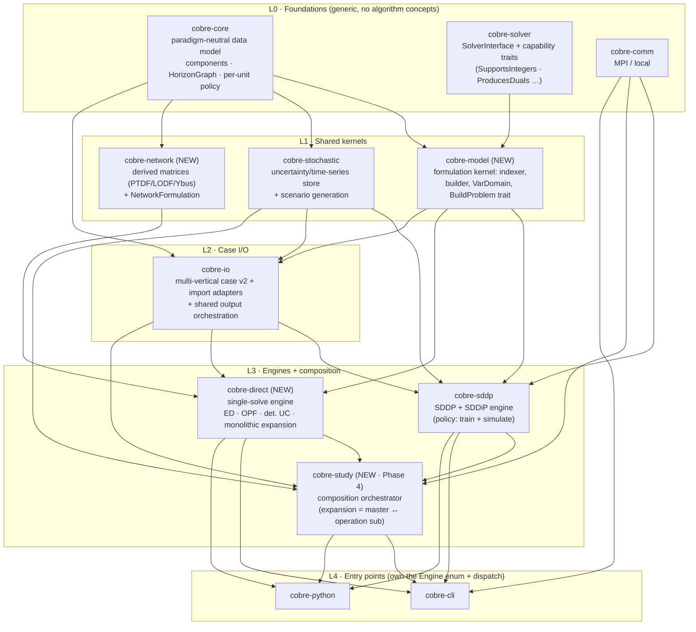

# Beyond SDDP — An Architecture Roadmap for Generalizing the Cobre Ecosystem

**Date:** 2026-07-14
**Status:** Research proposal / architectural roadmap (no implementation this cycle)
**Verification addendum (2026-07-16):** an independent feasibility pass executed
the two spikes this roadmap gates on (D10 monomorphization, D3 HiGHS MIP
determinism) and ran precedent research the original streams did not cover —
results, harnesses, and raw logs in `feasibility-verification-2026-07.md` and
`spikes/` (this directory). Sections and forks below have been amended in place
where that evidence landed; each amendment cites the addendum.
**State re-verification (2026-07-23):** the Part-I forensic snapshot was
re-verified claim-by-claim against `develop` at v0.12.0 (three releases after
the snapshot). Every load-bearing claim holds — `cobre-core` saw zero v0.12.0
commits — and the v0.11.0–v0.12.0 deltas that bear on the roadmap (new CLI
subcommands, the per-phase solver-profile surface, checkpoint cost-scale
provenance, a live admission-gate precedent) are amended in place, each tagged
(2026-07-23); micro-precision corrections (exact type names, counts) are
applied silently. The addendum's measurement erratum is recorded in
`feasibility-verification-2026-07.md` §5.
**Scope:** How to evolve Cobre from a single-vertical SDDP hydrothermal-dispatch
tool into a genuine multi-vertical power-system optimization ecosystem — the data
model, the crate/module borders, the solver and orchestration seams, and a
sequenced roadmap. Target verticals treated as first-class alongside SDDP:
unit commitment (unit-level MILP), hydro routing / flow propagation, network
power flow / OPF (DC and AC), and capacity expansion + deterministic dispatch.
**Mandate:** greenfield data-model redesign is on the table; a case-format
migration with a compatibility shim is acceptable.

---

## How to read this document

The document is organized as a descent from _diagnosis_ to _decision_ to _plan_,
and can be read at three depths:

- **The thesis (Part 0)** — the one-page verdict and the shape of the roadmap.
- **The analysis (Parts I–III)** — where Cobre is today (I), how the field solves
  the generalization problem (II), and the specific design axes and the choices
  each forces (III).
- **The plan (Parts IV–VI)** — the target crate/module architecture (IV); the
  phased roadmap with decision gates, the user-visible surface phase by phase
  (V.9), and a risk register (V); and the open
  decisions that need an owner's call (VI).

Appendices carry the cited source corpus, a glossary, and per-vertical data-field
checklists.

---

## Part 0 — Executive Summary

**The thesis, in one sentence.** Cobre today is an SDDP engine that has been given a
generic-sounding vocabulary — not yet a general framework that happens to ship SDDP
first — and the gap between those two things is concentrated principally in two
places — the `cobre-core` data model and the `cobre-cli` orchestration layer — with
secondary leakage in `cobre-io`'s cut-record checkpoint and `cobre-solver`'s stage
container (I.3).

**The verdict.** The parts that are genuinely hard to get right in a multi-vertical
scientific-computing framework are already in place: an acyclic, dependency-layered
crate topology; solver and communication backends consumed through compile-time
generic bounds rather than dynamic dispatch; a hard determinism contract; and even
the _named_ reserved algorithm-crate stubs (`cobre-flow`, `cobre-uc`, `cobre-emt`). The skeleton is
sound. What is missing is (a) a data model that does not bake SDDP/stochastic
concepts into its shared structs and (b) an algorithm-selection seam to replace the
CLI's hard-wired `cobre_sddp::StudySetup`. Both are well-trodden ground in the
reference ecosystems.

**What the field teaches.** Four mature ecosystems — NREL's Sienna, PyPSA,
PowerModels.jl, and the Brazilian CEPEL/PSR chain — converged independently on one
lesson: **separate formulation-free data from the formulation (device × formulation
→ math) from the solve/orchestration.** The same dataset then serves economic
dispatch, unit commitment, OPF, and expansion by swapping formulations, not by
re-modeling the system. Crucially, their _mechanism_ (Julia multiple dispatch,
stringly-keyed dicts, entity-relationship graphs) does not port to Rust — but
Cobre does not need it to. PyPSA, the most-used reference, deliberately retreated
from open runtime components to a **fixed component set** (v0.33 deprecated both
`override_components` and `override_component_attrs`) — exactly the closed-world
posture Cobre's no-`dyn`, determinism-first constraints impose. **Copy the
separation, not the mechanism.**

**The recommended path (Part V).** Sequenced so a cheap second consumer de-risks the
irreversible break:

0. **Seam + second consumer** — add the engine-selection seam and ship deterministic
   **economic dispatch** on the _existing_ case format; carve the `cobre-model`
   formulation kernel from the engine-neutral parts of `cobre-sddp`'s LP machinery —
   priced as new construction informed by existing code (IV.2), with its timing
   resolved as the 0a/0b split (VI, D12). Proves the abstraction with two real
   consumers before
   freezing it.
1. **Purify the data model** — the greenfield case-format break, now justified;
   stochastic state moves to a cross-vertical uncertainty store; the temporal model
   goes vertical-neutral. Gated on a bit-for-bit v1→v2 equivalence proof.
2. **Network ladder** — a passive electrical branch beside the transport edge;
   DC-OPF over one topology; a `cobre-network` crate for derived matrices.
3. **Integer domain + unit commitment** — `VarDomain`, the `SupportsIntegers`
   capability trait (III.6 — deliberately not a `MilpSolver` kind), and a
   `Unit`-under-`Plant` model, under the per-problem-class determinism-tier
   policy (III.6; owner-scoped 2026-07-16, `threads=1` Tier-1 default
   spike-evidenced).
4. **Capacity expansion + composition** — and only now promote the cut pool to a
   first-class value-function artifact, once a second value-function participant
   exists. Full AC-OPF is deliberately deferred (it breaks the _solver_ contract).

**The central risk, and how the roadmap answers it.** Cobre's "generic data model"
is enforced today by a CI grep for the tokens `sddp`/`SDDP`/`Benders`; that gate
passes to the letter while the _concepts_ have leaked structurally. An abstraction
is only proven correct once a second consumer exists — and Cobre has never had one.
Generalizing a data model from _one_ example toward _four_ unbuilt verticals is
speculative; the roadmap's answer is to make the greenfield redesign **pulled** by a
real second consumer (economic dispatch), not **pushed** by refactoring the core in
the abstract. The genuinely irreversible or contract-touching forks — the
case-format break's timing, the MILP determinism policy, universal-model vs a shared
physical cadastre, and whether AC-OPF is ever in scope — are surfaced for explicit
sign-off in **Part VI**, not resolved in passing. _(Status: the owner resolved D1, D2,
D9, D12, and D14 on 2026-07-16, and D7, D8, D11, D13, and the added D15 — the
horizon boundary-condition axis — on 2026-07-23; each Part VI entry records the
decision, its grounds, and the trigger that would reopen it. D3 is scoped to
determinism tiers with UC's tier signed off at Phase 3; D4–D6 remain open
recommendations.)_

---

## Part I — Where Cobre Is Today

This part is a forensic snapshot of the current codebase (as of the date above),
established by direct reading of the source. It is deliberately framing-neutral:
the comparative lens arrives in Part II. Citations are `path:line`.

### I.1 The crate topology — what is already sound

Cobre is a Cargo workspace with a clean, acyclic dependency layering. Arrows below
point from a dependency to its dependent.



Three properties of this topology are genuine assets for generalization:

1. **`cobre-solver` and `cobre-comm` are dependency-free foundations** (no
   intra-workspace dependency) consumed by algorithm crates through _generic type
   parameters_ — `SolverInterface` and `Communicator` bounds resolved at compile
   time by monomorphization, never `dyn`. A binary instantiates exactly one solver
   backend and one communication backend. This is the correct shape for a
   framework that will host several algorithm crates: each vertical consumes the
   same foundations without runtime dispatch cost and without a dependency knot.

2. **The vertical crates already exist as reserved stubs** — `cobre-uc` (MILP unit
   commitment), `cobre-flow` (AC/DC power flow), `cobre-emt` (electromagnetic
   transients) — each a one-line `lib.rs` with a `description = "Reserved crate
name…"`. The naming decision that a "vertical" is a sibling crate to
   `cobre-sddp` has effectively been made. The roadmap inherits it.

3. **The determinism contract is explicit and enforced** — bit-for-bit identical
   results regardless of input entity ordering and across runs. `cobre-core` sorts
   entities into canonical order at construction. This is a cross-cutting
   constraint every vertical must honor, and it materially shapes the solver-layer
   decisions in Part III.6 (parallel MILP branch-and-bound is a determinism
   hazard).

(Two workspace details omitted from the diagram for clarity — 2026-07-23: a
reserved umbrella lib crate `cobre` whose `lib.rs` re-exports nothing yet, and
the `cobre` _binary_ target, which is `cobre-cli`'s `[[bin]]`. Neither affects
the topology or the roadmap's moves.)

### I.2 The data model as it stands (`cobre-core`)

`cobre-core` describes itself as "the shared, solver-agnostic power-system data
model." Structurally it is a set of **monolithic plant-level entities**, a
**transport network**, a **stage/block temporal hierarchy**, and — as Part I.3
shows — a large amount of stochastic-SDDP input data carried as first-class fields.

**Physical entities** (`src/entities/`). Every entity shares an `EntityId`
(a newtype over `i32` — `entity_id.rs:33`; string IDs are explicitly unsupported),
a name, an `operational_start_date`, and a commissioning window
(`entry_stage_id`/`exit_stage_id`).

| Entity                  | File                              | Shape                                                                                                                                                                                                                      |
| ----------------------- | --------------------------------- | -------------------------------------------------------------------------------------------------------------------------------------------------------------------------------------------------------------------------- |
| `Bus`                   | `entities/bus.rs:27`              | Electrical node; a piecewise `DeficitSegment` unserved-energy curve + `excess_cost`.                                                                                                                                       |
| `Line`                  | `entities/line.rs:14`             | **Transport** interconnection: directional MW capacity (`direct`/`reverse`), `losses_percent`, `exchange_cost`. No electrical parameters.                                                                                  |
| `Hydro`                 | `entities/hydro.rs:170`           | 26-field reservoir/turbine/spill entity; cascade via `downstream_id` + scalar `travel_time_hours`; head/tailrace/efficiency/evaporation sub-models; `HydroGenerationModel ∈ {ConstantProductivity, LinearizedHead, Fpha}`. |
| `Thermal`               | `entities/thermal.rs:36`          | **Monolithic** plant: single scalar `cost_per_mwh`, `min`/`max_generation_mw`, optional `AnticipatedConfig` (a continuous forward-commitment _lead_, not a binary UC decision).                                            |
| `NonControllableSource` | `entities/non_controllable.rs:16` | Renewables: `max_generation_mw`, `allow_curtailment`, `curtailment_cost`.                                                                                                                                                  |
| `PumpingStation`        | `entities/pumping_station.rs:14`  | Water transfer between two reservoirs consuming bus power.                                                                                                                                                                 |
| `EnergyContract`        | `entities/energy_contract.rs:21`  | Import/export with an external system at a price.                                                                                                                                                                          |

**The one genuinely extensible seam** is `GenericConstraint`
(`constraints/generic_constraint.rs:362`): a user-defined linear constraint over a
closed catalog of 24 `VariableRef` LP-variable kinds (`HydroStorage`,
`ThermalGeneration`, `LineDirect`, `BusDeficit`, …). It is an enum-dispatched,
closed-world expression language — a useful pattern to study when generalizing,
but its variable catalog is itself the current LP's variable set.

**Temporal model** (`model/temporal.rs`). A two-level **`Stage` → `Block`**
hierarchy (stages are decision periods; blocks are intra-stage load levels such as
"LEVE/MEDIA/PESADA"), an orthogonal **`Season`** calendar, and a **`PolicyGraph`**
struct — its `graph_type: PolicyGraphType` selects `FiniteHorizon` or `Cyclic` —
of weighted stage `Transition`s with discount rates.
Three stage-addressing newtypes (`StageId`, `StudyPos`, `CalendarMonth`) make
addressing-convention mismatches compile errors — a good instinct that Part III
generalizes. `BlockMode ∈ {Parallel, Chronological}` selects whether intra-stage
sub-periods share storage dynamics.

**Network topology** (`topology/`). A **transport model only**: `NetworkTopology`
is three `HashMap`s wiring buses to their lines, generators, and loads. A grep for
`voltage`/`angle`/`impedance`/`reactance`/`susceptance`/`PTDF`/`kV` returns **zero
hits**. There is **no first-class `Load`/`Demand` entity** — demand exists only as
per-(bus, stage) mean/std statistics (see I.3) plus the bus deficit curve.

**Hydro topology** (`topology/cascade.rs:20`). A directed forest built from
`Hydro.downstream_id`, topologically ordered with a deterministic tie-break.
Turbined and spilled water are routed **together** down a single arc; diversion
(`DiversionChannel`) and pumping are separate arcs. Water delay is the **single
scalar** `Hydro.travel_time_hours`; diversion/pumping arcs are documented as
excluded from travel-time modeling (`hydro.rs:182`).

### I.3 The leakage points — SDDP and stochastic concepts inside the "generic" core

The infrastructure-genericity hard rule forbids the tokens `sddp`/`SDDP`/`Benders`
in the five infrastructure crates, checked by a CI grep
(`scripts/ci/check-infra-genericity.sh`). That check **passes to the letter** —
zero token violations in scanned files — though (2026-07-23) the gate itself
carries a documented exemption: the four policy-checkpoint files
(`cobre-io/src/output/policy/{mod,records,codec,checkpoint}.rs`) are excluded
because their cut vocabulary (`PolicyCutRecord`, `StageCutsPayload`, …) is the
persisted FlatBuffers format, renameable only under a format-version bump —
finding 6 below, pre-acknowledged as deferred tech debt by the gate's own
header. And the check is lexical: the _concepts_ have leaked structurally.
These are the load-bearing findings for the generalization effort:

1. **`System` stores the stochastic input model as first-class fields**
   (`system/mod.rs:107`): `inflow_models: Vec<InflowModel>` (PAR(p) autoregressive
   parameters), `load_models`, `ncs_models`, `correlation: CorrelationModel`, plus
   external/historical scenario tables. A deterministic economic dispatch or a
   power-flow study has no use for any of these, yet they are structural fields of
   the shared container. The entire `model/scenario.rs` (≈1,150 lines) is a
   stochastic-inflow pipeline living in the "generic" crate.

2. **`Stage` bakes in stochastic and risk configuration** (`temporal.rs:281`):
   `risk_config: StageRiskConfig` (`Expectation` | `CVaR{α, λ}`), `scenario_config`
   (`branching_factor`, `noise_method`), and `state_config.inflow_lags`. The
   temporal model cannot represent a stage without committing to these fields.

3. **`PolicyGraph`** is framed entirely around multi-stage-stochastic forward/
   backward traversal, discount rates, and cyclic (infinite-horizon) convergence.

4. **`InitialConditions`** (`constraints/initial_conditions.rs:183`) is
   SDDP-warm-start-shaped: `past_inflows` (PAR lag seeds), `past_defluences`
   (in-transit routing seeds), `past_anticipated_commitments`.

5. **`training_event.rs` lives in `cobre-core`** (`constraints/training_event.rs`,
   ≈940 lines): a `TrainingEvent` enum with `ForwardPassComplete`/
   `BackwardPassComplete`/`ConvergenceUpdate` variants and MPI-allreduce fields —
   iterative-decomposition training telemetry, placed in core so interface crates
   can observe training without depending on the algorithm crate. One field doc
   comment still reads "Active **cuts** after budget enforcement"
   (`training_event.rs:125`) — the lone lexical near-miss, on a struct otherwise
   genericized to "rows."

6. **`cobre-io`'s policy checkpoint format is literally cut-records**: a
   `cuts/stage_NNN.bin` directory of FlatBuffers `Cut`/`StageCuts` tables
   (`output/policy/…`). This is the single largest algorithm coupling in the
   infrastructure tier — a format seam a second vertical would collide with
   immediately. _(2026-07-23: the format additionally carries a
   `cost_scale_factor` provenance field in `policy/metadata.json` — cuts are
   stored in canonical currency units, every load rescales by the loading
   study's factor, and the CHANGELOG states a one-directional compatibility
   contract. A checkpoint provenance/versioning discipline therefore now
   exists de facto — groundwork the Phase-1 shim and the Phase-4
   `ValueFunctionArtifact` inherit.)_

7. **The config type is SDDP-shaped**: `cobre_io::Config.training` carries
   `forward_passes`, `stopping_rules`, `cut_selection`, `tree_seed`; and the _real_
   config→domain conversion is `cobre_sddp::StudyParams::from_config`, not a generic
   seam. The MPI-broadcastable `BroadcastConfig` is a hand-maintained SDDP-parameter
   subset. _(2026-07-23: v0.12.0 grew this surface — `training.solver.backward`/
   `.forward` and `simulation.solver` carry a 12-field per-phase LP
   solver-profile block keyed by SDDP phase names, and
   `training.parallelism.backward_scheduler` selects the backward scheduler;
   `BroadcastConfig` gained `backward_scheduler` and `cost_scale_factor`. The
   containment held one layer down: the `Phase` enum lives in `cobre-sddp`
   (`solve/solver_phase.rs`) and `cobre-solver` stayed phase-agnostic — a flat
   option bag behind a generic `ProfiledSolver<S>` — so this leakage stopped at
   the config/engine boundary rather than reaching L0.)_

8. **The leakage reaches one layer below `cobre-core`**: `cobre-solver`'s
   `StageTemplate` — the L0 CSC problem container — carries `n_state` (a contiguous
   state-column prefix), `n_transfer` (state carried between consecutive stages),
   `n_dual_relevant` (a gradient-extraction row prefix), and even `n_hydro` /
   `max_par_order` (domain and autoregressive-lag concepts). The "generic" solver
   crate's core type is multistage-decomposition-shaped and domain-aware.

The pattern is consistent: the crate _names_ were genericized (`rows` not `cuts`,
"iterative optimization" not "SDDP") while the _structures_ remained SDDP-shaped.
Genericity by vocabulary, not by a second consumer.

### I.4 The missing modeling axes

Some gaps are missing _data_; one is a missing _paradigm_.

- **No integer/binary variables anywhere** — the entire model is continuous `f64`
  bounds. This is not a data gap; it is a modeling-paradigm gap. Unit commitment is
  blocked at the level of "the framework has no concept of a binary decision," not
  merely "the thermal entity lacks a startup-cost field."
- **No unit-level modeling** — `Thermal`/`Hydro` are monolithic plants with a
  single `max_generation_mw`. No units-within-a-plant, no `min_up_time`/
  `min_down_time`, no startup/shutdown cost, no ramp limits, no minimum stable
  generation, no reserves/ancillary services. Thermal cost is a single scalar (no
  piecewise/quadratic curve).
- **No AC network** — as I.2 established, transport-only. DC-OPF (PTDF/B-θ) and
  AC-OPF (voltage/angle/reactive) are both absent, along with any place to store
  branch electrical parameters.
- **No first-class demand entity and no generic storage/battery** — load is
  statistics on a bus; the only storage is the hydro reservoir and pumped-hydro.
- **Hydro routing is a single scalar delay** — no Muskingum/linear-reservoir
  routing, no differentiated spill-vs-turbine routing to distinct downstream
  nodes, no river-reach network, and no routing at all on diversion/pumping arcs.

### I.5 The CLI and orchestration coupling (`cobre-cli`)

The `run` subcommand is SDDP-hydrothermal from top to bottom, with **no
algorithm-selection seam**:

- Its help text is "train an SDDP policy"; the whole lifecycle is the SDDP
  **train → simulate** two-phase shape gated on `training_enabled` and
  `n_scenarios`.
- The run is typed on the concrete `cobre_sddp::StudySetup`; training is
  `setup.train(...)`, simulation is `setup.simulate(...)` — inherent methods, no
  trait indirection or dispatch enum. The CLI imports ~70 symbols from `cobre_sddp`.
- Config conversion goes through `cobre_sddp::StudyParams::from_config`; the output
  tree is `training/` + `simulation/` + `hydro_models/` with a cut-based policy
  checkpoint; the summary vocabulary is lower-bound/upper-bound/gap and
  hydro-model-fit sections.
- Only `schema` and `version` are near-generic commands. `init` ships a single
  hydrothermal template (and stamps a version-pinned `$schema`). _(2026-07-23:
  three subcommands were added since the snapshot — `validate`, `report`, and
  `summary` — and none is engine-neutral: `validate` runs the same
  `StudyParams::from_config` conversion, and `report`/`summary` read the SDDP
  output tree. The seam must dispatch them per engine, not only `run`.)_

The insertion points for an algorithm-selection seam are therefore well-localized:
the `Command`/`RunArgs` dispatch, the `StudySetup`/`.train()`/`.simulate()` calls,
the `StudyParams::from_config` conversion, and the output-writer layer — plus,
since v0.12.0, the per-phase solver-profile resolution (SDDP-phase-keyed today;
a Direct engine has no forward/backward phases) and the `validate`/`report`/
`summary` subcommands (2026-07-23).

### I.6 Diagnosis

Cobre's crate skeleton anticipates a multi-vertical ecosystem; its data model and
orchestration layer do not yet inhabit one. The generalization is not a green-field
build — it is a **disentangling**: separating the genuinely general power-system
data model from the SDDP/stochastic input model and telemetry that currently share
its structs, and introducing an algorithm-selection seam where `cobre-cli` names
`cobre-sddp` concretely. The determinism contract and the no-dynamic-dispatch rule
constrain _how_ that disentangling is done (Part III), and the reference ecosystems
(Part II) have largely solved it already. The single most important sequencing
insight — expanded in Part V — is that the effort must be _pulled_ by a real second
consumer, not _pushed_ by refactoring the core in the abstract.

---

## Part II — How the Field Solves This _(comparative ecosystem study)_

The problem Cobre faces — "one data model, many problem classes" — is not novel.
Several mature ecosystems have solved it, and one of them operates in Cobre's exact
domain. This part reports what they do, established by reading their source and
documentation across four research streams (ecosystem teardowns, cross-cutting
design axes, domain requirements, academic reviews) and adversarially verifying the
load-bearing claims against primary sources. Part III turns the findings into
decisions; here the goal is to see the solution space clearly, including where the
references disagree and where their mechanisms will _not_ transfer to Rust.

### II.1 The reference architectures — Sienna, PyPSA, PowerModels

Three open ecosystems are the primary references; each has solved a different facet
of the problem well.

**Sienna (NREL) — the modular reference.** Sienna splits into three apps
(Data / Ops / Dyn). Its data model lives in `PowerSystems.jl` on the generic
`InfrastructureSystems.jl` backbone, as a purely _behavioral_ abstract type tree
(`Component` → `Topology` / `Device` / `Service`; `Device` → `StaticInjection` /
`Branch`; `Generator` → `ThermalGen` / `RenewableGen` / `HydroGen`). Concrete leaf
structs (`ThermalStandard`, `HydroEnergyReservoir`, …) hold **only descriptive
data** and — in the documentation's own words — a struct "does not prescribe how
the unit should be represented in a simulation." The structs are **code-generated
from a JSON descriptor**, each with getter/setter pairs (getters apply per-unit
conversion and preserve API stability). The defining architectural move is a clean
three-way split across _package boundaries_: DATA (`PowerSystems`) →
FORMULATION (`PowerSimulations`, whose `DeviceModel{Device, Formulation}` pairs one
device type with one formulation, aggregated into a `ProblemTemplate` and assembled
by a `construct_device!` that dispatches on the `(device, formulation)` pair) →
SOLVE (`JuMP` + MathOptInterface). The **same** `System` feeds economic dispatch,
unit commitment, or OPF purely by swapping formulations. Network fidelity is an
orthogonal axis (`NetworkModel`: copper-plate / PTDF / DC / AC). Time series is an
out-of-band backbone attached by reference, with a static-series-vs-forecast split
(forecast-as-view avoids duplicating overlapping windows). New device types and
formulations arrive as **extension packages** (`HydroPowerSimulations.jl`,
`StorageSystemsSimulations.jl`) with zero edits to the core.
_(Sources: PowerSystems.jl `type_structure.md`; Lara et al., ScienceDirect
S2352711021000765; Henriquez-Auba et al., PowerSimulations.jl, arXiv:2404.03074.)_

Two caveats keep Sienna from being copied wholesale. First, the
"separation across package boundaries" is cleanest in Sienna specifically; and
Sienna itself carries **two** thermal types (`ThermalStandard` _and_
`ThermalMultiStart`) — when multi-temperature startup data would not fit one
struct, it added a parallel type, not merely a richer formulation. So even the
reference has real exceptions to "one type, many formulations." Second, Sienna's
_mechanism_ (Julia runtime multiple dispatch, mutable structs, an untyped
`ext::Dict` escape hatch, insertion-ordered lazy iteration, auto-deleted HDF5-temp
time-series) is hostile to Cobre's no-`dyn`, immutable-after-build, bit-for-bit
world. **Copy the separation, not the mechanism** — a theme Part III returns to.
A third caveat is institutional: in late 2025 the Sienna GitHub organization
migrated (NREL-Sienna → Sienna-Platform) amid its host lab's renaming and
priority shift — the design lessons stand (the packages are permissively
licensed and the `DeviceModel`/`ProblemTemplate` core is unchanged through
PowerSystems.jl v5), but Sienna's _roadmap_ should be treated as a precedent,
not a stable multi-year anchor.

**PyPSA — the pragmatic single-package model, and the decisive precedent.** PyPSA's
`Network` holds one DataFrame per component type (`Bus`, `Generator`,
`StorageUnit`, `Store`, `Line`, `Link`, `Load`), split into **static** attributes
and **time-varying** (`_t`) attributes. One `Network` serves linear OPF, capacity
expansion (multi-investment-period), and **unit commitment** — the latter simply by
setting `committable=True` on a `Generator`, which introduces the binary status
variable on that same generator and unlocks `min_up_time`, `min_down_time`,
`start_up_cost`, and ramp limits. The optimization layer (`linopy`) is a
deliberately restricted LP/MILP/QP builder (no universal IR), traded for speed and
in-place warm-startable edits. Networks distinguish a controllable `Link`
(free flow up to a capacity, with efficiency) from a passive `Line`/`Transformer`
(governed by Kirchhoff's voltage law). The **decisive precedent for Cobre**: PyPSA
_deprecated open custom components_ in v0.33 — both `override_components` and
`override_component_attrs`, with the release notes leaving user-defined components
as only a possible future re-addition "in an improved way" — retreating to a
**fixed component set** whose richness lives in the standard per-component
attributes. A framework built on runtime extensibility deliberately adopted exactly
the closed-set posture Cobre's constraints impose. PyPSA v1.0 (2025) settled the
direction: the replacement is a curated, first-class `Components` API — there is
still **no plugin mechanism for user-defined component types** — and v1.0 also
added native two-stage stochastic programming with CVaR (two-stage only, no
multistage/SDDP overlap). One stale claim to retire: current PyPSA co-optimizes
unit commitment with capacity expansion — do not cite the old restriction.
_(Sources: docs.pypsa.org UC +
components; PyPSA v0.33 release notes and PRs #1130/#1131; PyPSA v1.0 user
guide; Brown et al.,
arXiv:1707.09913; cycle-flow formulation, arXiv:1704.01881.)_

**PowerModels.jl — the multi-fidelity network answer.** PowerModels selects among
15+ network formulations (ACP, ACR, DCP, BFA/NFA, LPACC, SOCWR, QCRM, SDPWRM, …)
through a `model_type` **type parameter** dispatched at build time, with every
formulation consuming **one** MATPOWER-derived branch record (`br_r`, `br_x`,
`rate_a`, …). A `ref`/`var`/`constraint` builder pattern and an orthogonal
multinetwork (`nw`) index handle multi-period problems; `InfrastructureModels.jl`
is the generic backbone. The lesson Cobre most needs: **one fidelity-maximal
topology, with fidelity chosen at consumption, not at storage** — and network
matrices (PTDF/LODF/Ybus) are _derived on demand_, never persisted in the case.
Nuances: PowerModels' data→formulation separation is _within_ one package
(not across package boundaries), and it selects _one network-wide_ formulation via
a type parameter — not Sienna's _per-device value_ pairing. The two references thus
sit at different points on a spectrum, not on a single shared mechanism.
_(Sources: PowerModels.jl `formulations.md`, `src/core/types.jl`, `src/form/*.jl`.)_

### II.2 The domain-adjacent incumbent — the Brazilian CEPEL/PSR chain

This is the single most relevant reference: it operates in Cobre's exact domain
(Brazilian hydrothermal planning) and is the daily toolset of Cobre's target
audience. It offers two _contrasting_ architectures.

**CEPEL: NEWAVE → DECOMP → DESSEM — three fidelities, three codebases, one boundary
object.** The official chain represents the same physical system at three
fidelities: **NEWAVE** (aggregate equivalent-energy reservoirs / REE, monthly,
5–10 yr, SDDP over LP subproblems); **DECOMP** (individualized plants, volume/flow
state, the concave piecewise-linear FPHA production hull, weekly-then-monthly
resolution, dual dynamic programming on a scenario tree); **DESSEM** (individualized
_and_ unit-committed MILP, half-hourly, explicit water travel time `tviag`, full
nodal DC network). The one artifact shared across all three tiers is
the physical cadastre **`hidr`** — proof that a single source-of-truth asset table
can feed every fidelity. The inter-tool boundary is the **Future Cost Function**
(piecewise-linear Benders cuts): NEWAVE's `cortes` become DECOMP's terminal cost,
which become DESSEM's terminal cost. The FCF is _algorithm-agnostic_ — it does not
care whether the consumer is LP, DDP, or MILP. **This is where the domain itself
draws the data/formulation/solve boundary: at the cost-to-go.**

CEPEL is equally instructive as an anti-pattern. Three separate Fortran codebases
hold three _inconsistent physical representations_ of the same rivers, coupled by
lossy hand-offs; the literature documents representivity error and an "optimistic
bias" from the coarse upstream models distorting downstream dispatch and prices
(arXiv:2410.13763; arXiv:2607.00504; LAMPS/PUC-Rio). The decks are positional
fixed-column Fortran text — untyped, versionless — forcing the community to
reverse-engineer typed readers (`inewave`/`idecomp`/`idessem`). Two load-bearing
claims here are _reported but not primary-verified_ and should be treated with
care: that "DESSEM is openly non-deterministic," and that "only `hidr` is shared."
And the aggregate-REE characterization is **already obsolete in production** — the
"NEWAVE Híbrido" individual-plant representation has been official for PMO/PLD
since January 2025 (individualized plants in the first twelve months; the 2025
CVaR recalibration is α = 15 %, λ = 40 %), and DESSEM v22 was authorized in
January 2026. No CEPEL model has been open-sourced — the 2025–26 movement is a
transparency/governance process (ANEEL-mandated consultation and a technical
portal), not open code. CEPEL is
therefore an instructive _contrast_, not a fixed target.

**PSR: SDDP / OptGen / NCP — the unified counter-model.** PSR's commercial stack
takes the opposite tack: **one codebase with fidelity as a switch.** Individual
plants are always present; the network is selectable (single-bus → transport → DC);
hydro unit commitment is a toggle (v17+); storage, fuel contracts, and
combined-cycle are first-class components; one engine emits LP or MILP as needed;
and the SDDP cost-to-go seeds OptGen (expansion) and NCP (short-term dispatch).
Analytics live in a decoupled scripting layer (PSRIO) over standardized result
tables. This unified-with-switches shape is the target; CEPEL's fork-per-fidelity
is the anti-pattern. The real lesson to _extract_ from CEPEL is "share the physical
cadastre" (`hidr`) — which motivates the shared-cadastre design option in III.1.
_(Sources: Maceira et al., "Twenty Years of SDDP … NEWAVE"; CEPEL DECOMP/DESSEM
methodology manuals; PSR SDDP user manual & release notes; `rjmalves/{inewave,
idecomp,idessem}`.)_

### II.3 The design-pattern taxonomy — the broader survey and the academic literature

A survey of the remaining frameworks (pandapower, GenX, Calliope, oemof.solph,
Antares, Dispa-SET, SpineOpt, Switch) yields six recognizable **data-model styles**,
ordered roughly from most-typed to most-generic:

1. **Fixed typed structs** (Cobre today; Sienna's leaves) — type-safe and fast;
   closed to third-party extension.
2. **Tables / DataFrames per type (SoA)** (PyPSA, pandapower) — columnar,
   vectorizable, schema-in-CSV; stringly-coupled, weakly typed.
3. **Nested stringly-keyed dicts** (PowerModels) — flexible and import-friendly;
   errors surface at model-build runtime.
4. **Abstract type-tree + codegen** (Sienna) — extensible via dispatch; requires a
   runtime type system to iterate abstract supertypes.
5. **Generic entity-relationship / EAV graph** (SpineOpt) — maximally general
   ("a constraint exists iff its parameter is defined"); maximally untyped, hostile
   to static typing and determinism.
6. **Component/flow graph** (oemof.solph) — a clean "nodes connected by flows"
   abstraction; more a modeling DSL than a domain data model.

The academic review literature (Pfenninger, Hawkes & Keirstead 2014; Ringkjøb et
al. 2018, surveying 75 tools; Hoffmann et al.'s typology; DeCarolis et al. on best
practice; the openmod movement) converges on a small set of principles —
modularity / separation of concerns, open validation corpora, reproducibility — and
one recurring **failure mode**: a single-purpose tool accretes features until its
data model ossifies around the original problem. A consistent pattern across these
reviews — this document's synthesis, not a single source's finding — is that tools
that _successfully_ spanned multiple problem classes separated data
from formulation **early — before the second problem class landed**, not after.

### II.4 Convergent vs divergent design choices

**Where the mature frameworks independently agree** (these are the safest signals):

- The data model is **formulation-free**: a component prescribes descriptive/physical
  data and no mathematical representation.
- Formulation is **selected per (device/network, choice)** and assembled into a
  template, so one dataset feeds ED / UC / OPF / expansion by swapping formulations.
- Network fidelity is a **per-solve choice over one fidelity-maximal topology**;
  PTDF/LODF/Ybus are **derived**, never stored in the case.
- Time-series/forecast data is **out-of-band**, with a static-vs-forecast split.
- UC granularity is **attribute-gated** (a `committable` flag), with the aggregate
  as the degenerate case.
- The **solver paradigm is emergent** from the chosen formulation, not a user axis.
- Components are keyed by **(type, id)**, never one flat untyped id space.
- External formats (MATPOWER, PSS®E) are **import-only**, corrected on ingest.
- Multi-model composition uses **typed hand-off** (value function / fixed
  decisions), with the cost-to-go as the canonical boundary object.
- A **closed component set, with richness carried by standard attributes rather
  than new component types**, is the mature end-state — PyPSA's v0.33 retreat from
  open components (including its attribute-override mechanism) is direct evidence.

**Where they diverge** (these are the decisions Cobre must make deliberately):

- **Extensibility mechanism**: open runtime type sets + dispatch (Sienna,
  PowerModels) vs closed set, richness via standard attributes (PyPSA post-0.33) vs open EAV graph
  (SpineOpt). Cobre's no-`Box<dyn>` rule _forces_ the closed-set posture — aligning
  it with mature PyPSA and against the Julia frameworks' mechanism.
- **Transport vs DC network entity**: one superset record with optional fields
  (PowerModels) vs distinct entity kinds — controllable `Link` vs passive `Line`
  (PyPSA). Cobre's current `Line` is semantically the former (a transport edge).
- **Capacity expansion**: one monolithic perfect-foresight LP (PyPSA
  multi-investment) vs Benders / dual-dynamic decomposition (GenX, PLEXOS LT/ST,
  PSR OptGen). Cobre's existing cut machinery favors decomposition.
- **Model organization**: one codebase with a fidelity switch (PSR, PowerModels) vs
  a program per fidelity coupled by an FCF (CEPEL). The unified model is the target.
- **Modeling layer**: a universal `(function, set)` IR with automatic bridges
  (MathOptInterface) vs a deliberately restricted LP/MILP/QP layer (linopy — and
  Cobre's own direct-FFI stance). Cobre should stay lean and _not_ build a MOI-style
  IR.

### II.5 Comparison matrix

| Framework                                    | Data-model style                                                 | Data/formulation split                                                                | Network fidelity                                                                                                | Verticals                                            | Solver / paradigm                                                                        | Time & stochastic                                                                                 | Extensibility                                                                                 |
| -------------------------------------------- | ---------------------------------------------------------------- | ------------------------------------------------------------------------------------- | --------------------------------------------------------------------------------------------------------------- | ---------------------------------------------------- | ---------------------------------------------------------------------------------------- | ------------------------------------------------------------------------------------------------- | --------------------------------------------------------------------------------------------- |
| **Sienna** (PowerSystems / PowerSimulations) | Abstract behavioral type-tree of code-generated structs          | **Strong** — separate packages; `DeviceModel{Device,Formulation}` + `ProblemTemplate` | Copper / PTDF / DC / AC via `NetworkModel` over one topology; matrices in PowerNetworkMatrices.jl (VirtualPTDF) | ED, UC, OPF, hydro, storage, dynamics                | JuMP/MOI deferral; LP/MILP/NLP emergent                                                  | Out-of-band TimeSeriesData (static vs forecast), HDF5; multi-stage via `Simulation` + FeedForward | Open type set + multiple dispatch                                                             |
| **PyPSA** / PyPSA-Eur                        | Table/DataFrame per component (SoA), CSV attr schema             | **Loose** — attributes + flags drive `optimize`                                       | `Link` (transport) vs `Line` (KVL: B-θ / PTDF / cycle); AC Newton                                               | LOPF/ED, UC, multi-invest expansion, sector coupling | linopy LP/MILP/QP only; `committable` toggles MILP                                       | snapshots × investment_periods; deterministic perfect-foresight, no scenario tree                 | Fixed component set — richness via standard attributes (open components **deprecated** v0.33) |
| **PowerModels** / InfrastructureModels       | Nested stringly-keyed dict + derived `ref`                       | **Strong** — problem recipe vs physics-by-dispatch                                    | ~15 fidelities (NFA/DC/LPAC/SOC/QC/SDP/AC) via `model_type` over one dict                                       | OPF, PF, OTS, TNEP, multinetwork OPF                 | JuMP/MOI; math-class → solver class                                                      | Orthogonal `nw` multinetwork index                                                                | Open — add abstract subtype + override methods                                                |
| **CEPEL chain** (NEWAVE/DECOMP/DESSEM)       | 3 separate Fortran decks; shared `hidr` cadastre                 | Weak within a tool; **strong between** via FCF                                        | Fidelity ladder: NTC → reduced → full DC per tier                                                               | Long/med/short hydrothermal + network-UC             | Per-tool: LP-SDDP / DDP / MILP; MILP reportedly non-deterministic (not primary-verified) | Heterogeneous resolution per tier; PAR(p); FCF hand-down                                          | Fork a new program per fidelity (**anti-pattern**)                                            |
| **PSR** (SDDP/OptGen/NCP)                    | One individualized model; fidelity as a switch                   | Moderate — feature toggles                                                            | single-bus → transport → DC toggle                                                                              | Stochastic dispatch, expansion, short-term UC        | One engine emits LP or MILP                                                              | Long-to-short unified; stochastic                                                                 | Component variants + feature flags                                                            |
| **SpineOpt**                                 | Generic EAV object/relationship graph                            | "Constraint exists iff parameter defined"                                             | Generic connections                                                                                             | ED/UC/expansion, multi-energy                        | LP/MILP                                                                                  | Per-component `temporal_blocks` (variable step) + investment axis                                 | Fully open EAV (**rejected** for Cobre)                                                       |
| **Cobre (today)**                            | Fixed typed structs, one `Vec` per kind; untyped `EntityId(i32)` | **None** — SDDP config on data; CLI hard-wires `StudySetup`                           | **Transport/NTC only** (Line is a controllable Link)                                                            | **SDDP hydrothermal only**                           | **LP-only** (HiGHS/CLP FFI), no MILP                                                     | Stage→Block + PolicyGraph{finite,cyclic}; PAR(p)/CVaR on data structs                             | Enum dispatch, no `Box<dyn>`, closed set                                                      |

---

## Part III — The Axes of Generalization _(the design decisions)_

Generalization is not one decision; it is a small number of _orthogonal_ axes that
must not collapse into a combinatorial type explosion. The axes are: **which problem**
(vertical), **which grid physics** (network fidelity), **which time/horizon regime**,
**which variable domain** (continuous/integer), **which aggregation level**, and
**how uncertainty is represented**. Each is independently selected, per study, over
one shared data model. This part takes them one at a time. Each subsection states
the decision, the realistic options, the trade-offs under Cobre's hard constraints
(Rust, bit-for-bit determinism, no `Box<dyn>`, no hot-path allocation), and a
recommendation, and the genuine forks that need an owner's decision rather than a
silent default.

### III.1 The data model — component modeling in Rust without dynamic dispatch

**The decision.** How should components be modeled so that one dataset serves five
verticals, in a language that forbids the runtime polymorphism every reference
framework leans on?

Every reference mechanism is unavailable to Cobre: Sienna's abstract-type iteration
and multiple dispatch, PowerModels' stringly-keyed dicts, SpineOpt's entity-relation
graph — all assume runtime type machinery and none survives a no-`Box<dyn>`,
determinism-first world. The correct reading of the evidence is **copy the
separation, not the mechanism**, and this is not a compromise: PyPSA, the most
widely used of the references, _deprecated_ open runtime components in v0.33 (its attribute-override mechanism
included) and retreated to a **fixed component set** — converging on exactly the
posture Cobre's constraints impose. Cobre already proves the idiom
works internally (`HydroGenerationModel`, `TailraceModel` are closed enums). The
price — losing "a third party adds a formulation with zero core coordination" — buys
compile-time exhaustiveness — the compiler catches ill-formed cases the reference
frameworks catch only at model-build runtime. (III.3 draws the precise line between
what the type system enforces and what a runtime admission gate must check.)

Two sub-decisions deserve care:

- **Component identity.** Keep the flat `EntityId(i32)` as the storage/lookup key:
  per-type `Vec`s with per-type indices already isolate lookups by kind, so a bus and
  a hydro sharing id `1` is harmless. Add per-kind newtype IDs (`BusId`, `HydroId`,
  `UnitId`, `BranchId`) at narrow API boundaries only, for compile-time ergonomics
  (`system.hydro(bus.id)` should not type-check). Do **not** introduce a sealed
  `Component` registry with heterogeneous `components_of(kind)` iteration — it adds an
  enum tag and match branching onto the tight typed loops that are Cobre's hot-path
  strength.
- **The shared-physical-cadastre option.** The strongest _alternative_ to "one
  universal `System`" is the CEPEL lesson done right: a `cobre-cadastre` layer owning
  the authoritative individual physical registry (the `hidr` analog), with each
  vertical holding its own projection/view on top. This captures "share the physical
  registry" — the real lesson behind CEPEL's failure — while hedging the highest-risk
  bet (that a single general struct can serve four unbuilt verticals). It should be
  evaluated _explicitly_ against the universal-model design, not defaulted past
  (carried into VI as an open decision).

A possible accelerator, borrowed from Sienna: **code-generate the component structs,
their accessors, the Python bindings, and the committed JSON schemas from one
descriptor.** Sienna proves the descriptor→struct leg; the schema and Python-binding
targets are extrapolation beyond that precedent (Appendix D). The default therefore
remains Cobre's struct-first + schemars pipeline; the descriptor inversion is
evaluated as a spike during the v2 design and adopted only if it demonstrably
shrinks the model/schema/binding mirror surface.

**Decision:** closed enums + monomorphized trait generics + canonically-sorted
containers; per-kind newtype IDs; reject the sealed-registry; struct-first +
schemars schemas with a descriptor-codegen spike (adopt only on a positive result);
evaluate shared-cadastre-vs-universal-model as an explicit fork (VI).

### III.2 Granularity and the degenerate-aggregate principle

**The decision.** How do a monolithic-plant SDDP view and a unit-level UC view
coexist without the physics diverging (the exact failure the NEWAVE/DECOMP/DESSEM
split produced)?

The convergent answer is **generality by degeneracy**: richness lives in
attributes/variants of one generalized entity, and the simple case is the
_parameter-free specialization_. A `Unit` sub-entity sits beneath a `Plant`;
plant-level aggregates are **derived from** the units (a pure projection), so the
aggregate cannot drift from the detailed model. UC-only features (ramp, min-up/down,
reserves, forbidden zones) are `Option`-gated; crucially, the SDDP degenerate case
must be the _literal absence_ of binaries — `CommitmentConfig::None` emits **no**
integer variables at all, not binaries fixed to 1 — so the flagship vertical's cheap
continuous LP is untouched. The same principle covers the network (single-arc
cascade, zero-reactance transport) and the variable domain (`Continuous` is the
degenerate case of `{Continuous, Integer, Binary}`).

Two verification-pass amendments (2026-07-16) sharpen this. First, the
granularity precedent is split: the open-source formulation libraries
(UnitCommitment.jl, Egret, Sienna, PyPSA) all **flatten** to one generator = one
unit, while `Unit`-under-`Plant` is the shape of the **production dispatch
tools** — DESSEM's unidades geradoras under usinas (the daily tool of Cobre's
audience) and PLEXOS's unit clustering — and the per-unit data that advanced UC
needs (multi-temperature startup stages, hydro forbidden operating zones) is
affirmative evidence for the hierarchy. Frame the choice as production-dispatch
alignment, not academic convention. Second, commitment is assigned **per entity
class**, not as one global switch (Sienna's `DeviceModel` map is the precedent):
a study commits thermal units while hydro and renewables stay continuous, so
`CommitmentConfig` is a per-class (ultimately per-unit-class) field of the
template, with `None` remaining the zero-binary degenerate default everywhere.

One caveat keeps this from being a dogma: **a parallel variant is warranted when
attributes genuinely cannot express the difference.** Sienna keeps _two_ thermal
types (`ThermalStandard` + `ThermalMultiStart`) because multi-temperature startup data
does not fit one struct. So the rule is "degenerate case by default; a parallel type
only when attributes cannot capture the physics" — a per-entity judgment. Either way
the individual/detailed model stays authoritative and aggregates (REE-style) are
derived as compile-time projections.

**Decision:** `Unit`-under-`Plant` (production-dispatch precedent: DESSEM,
PLEXOS), aggregates as derived projections,
`Option`-gated features, commitment assigned per entity class with
`CommitmentConfig::None` emitting zero binaries; permit a
parallel entity type only where attributes provably cannot capture the physics.
(DECOMP reconciliation, 2026-07-23: the hierarchy arrives earlier and in
continuous form — bridge-D9 mandates `unit_groups[]` under `Hydro` as the
long-term canonical capability representation, with per-group `bus_id` and
nominal unit ratings, cobre computing per-group capability, and same-bus
groups collapsing to today's LP. Phase-3 commitment then attaches to that
substrate as cluster commitment over `n_units`-identical units per group —
`decomp-program-reconciliation.md`.)

### III.3 Data / formulation / algorithm separation — the central seam

**The decision.** What replaces the CLI's hard-wired `cobre_sddp::StudySetup` so that
one dataset feeds SDDP, economic dispatch, UC, OPF, and expansion — without conflating
what those things _are_?

The design is a layered separation of concerns, each layer a compile-time construct
(a closed enum or a monomorphized trait bound), grounded in both the Julia/Python
frameworks (MOI/JuMP, GAMS/CVXPY, SDDP.jl, Sienna/PowerModels, Pyomo/PyPSA) and the
compiled-language / Rust-native set (SMS++, OR-Tools, MiniZinc, Coluna,
`good_lp`/`argmin`):

> **DATA → FORMULATION → PROBLEM (a composed template _value_) → STRUCTURE (an
> admissibility _gate_) → METHOD (chosen explicitly) → SOLVER (emergent,
> capability-matched via trait bounds).**

These are distinct domains and must never collapse into one enum. A **method** (SDDP),
a **problem** (economic dispatch, OPF, expansion), and a **formulation feature** (unit
commitment) each live at a different layer. Unit commitment is integrality
(`VarDomain::Binary`) + commitment constraints, with `CommitmentConfig::None` emitting
zero binaries so the SDDP LP is untouched: a deterministic UC is a direct MILP, a
multistage-stochastic UC is SDDiP — and SDDiP is a _sub-strategy_ of the SDDP method
(SDDP.jl's `duality_handler`: `ContinuousConicDuality` vs `LagrangianDuality`), not a
peer of it.

Two properties carry the design:

- **The problem is a composed `ProblemTemplate` _value_, never a top-level enum.**
  Problem identity is _emergent_ from which per-axis formulations the template holds
  — as in Sienna's `DeviceModel`/`ProblemTemplate` and Coluna's typed `Annotation`.
  The UC libraries confirm the same shape independently (verification addendum):
  UnitCommitment.jl fills abstract per-axis formulation slots with paper-named
  marker structs, and Egret composes a nine-slot `UCFormulation` template — i.e.
  **one closed enum per formulation axis** (ramping, piecewise costs, startup
  costs, generation limits, min-up/down), composed into the template. Egret's
  stringly-typed `getattr` selection is the anti-pattern contrast; Cobre's enums
  provide the compile-time closed set it lacks.
- **Dispatch is two-level, keyed on the engine — never on a `problem × method`
  bundle.** _Outer_ (cold, once per run): a closed `Engine` enum + `match` living
  **only at L4** (`cobre-cli`/`cobre-python`, the sole layer that sees every engine),
  routing into named per-engine entry-point functions — OR-Tools' "closed enum at the
  boundary + named entry point per paradigm." Every variant is one solve **engine**
  (one L3 crate); the problem is the template, so no variant spans layers. _Inner_
  (hot loop): the engine is a concrete type behind a `Solver`-shaped trait resolved by
  monomorphized generics (`argmin`'s `Executor<O, S, I> where S: Solver<O, I>`), not a
  discriminant enum matched in shared code.

**Structure gates; method is chosen; solver is emergent.** Structure validates
admissibility and bounds the legal method set — it never routes. The operator/config
names the method (SMS++'s `BlockSolverConfig` is explicit-config-only; Gurobi/CPLEX
auto-select only _inside_ an already-chosen engine, never at the framework layer). The
solver backend then follows from the chosen method's subproblems, capability-matched by
trait bounds.

**Compile-time versus runtime enforcement.** The **legal set** of combinations is
compile-enforced: exhaustive `match`; type-level `(device, formulation)` pairings where
a legal pair has a `BuildProblem` impl and an illegal one has none (Coluna); capability
bounds via where-clauses (`argmin`); backend exclusivity via Cargo `compile_error!`
(`good_lp`). Rust's `diesel` (marker traits, backend as a type parameter) and
`embedded-hal` (fine-grained per-capability traits consumed via bounds; note its
traits are deliberately _open_ to out-of-tree implementations — precedent for
capability granularity, not for sealing) show compile-time backend-capability
enforcement done well — the precedents to mirror. The **config-selected instance**
(which engine + formulation a given run requests) is runtime data, so it is a **typed
admission gate that rejects** an unsupported combination (OR-Tools' `ModelIsSupported`),
not a compile error.

SMS++ is the cautionary precedent: it is the most structure-first compiled framework
in existence and _does_ materialize structure as first-class `Block` objects — but it
matches Block↔Solver via a string factory + RTTI `dynamic_cast` to capability base
classes, i.e. exactly the `Box<dyn Trait>`/registry shape Cobre forbids. Its
_mechanism_ does not transplant; Cobre must reach the same separation with closed
enums + trait bounds.

The maintenance cost is real, and it splits into a measured half and a budgeted
half. Measured: **the monomorphization spike (D10) was executed** (2026-07-16,
verification addendum). The recommended value-based template shows **no
formulation-matrix multiplier at all** — codegen scales with source size, ~×2
per engine — while the worst-credible type-level matrix costs 3.2× compile /
1.6× binary at 15 legalized tuples × 2 engines, **linear in legalized tuples**;
restricting to the built tuples verifiably collapses it back to baseline. So
**legalize only the tuples actually built** stands as the verified mitigation,
and the constructive design is fundable-to-build from the compile-cost axis
(D9 — resolved — fixes the split: inner legality compile-enforced, outer
selection a runtime gate). Budgeted, not
measured: the per-formulation touch list — the per-axis enum, a `BuildProblem`
impl, the admission-gate legal-tuple set plus a rejection test and error
message, the committed schemas, the Python stubs, and the determinism-harness
case — and the CI wall-time trajectory as the feature matrix grows. Neither is
covered by the spike; both belong in the Phase-0 review checklist.

**Decision:** a composed `ProblemTemplate` _value_ (per-axis closed enums, problem
identity emergent); outer `Engine`-enum dispatch to named entry-point functions at
L4; inner engine as a monomorphized trait (not a discriminant enum), SDDiP a
sub-strategy of SDDP; structure gates, method is chosen; the legal set compile-enforced
(`diesel`/`embedded-hal` idiom) while the config-selected instance is a runtime
admission gate; legalize only built tuples (mitigation verified — the D10 spike
was executed and the compile-cost gate is satisfied; see the verification
addendum and D10).

### III.4 The temporal model and a problem-composition layer

**The decision.** Can one temporal abstraction serve single-period OPF, chronological
UC, multi-stage stochastic SDDP, and multi-year expansion — and does Cobre need an
explicit layer to _compose_ verticals?

The temporal answer is yes, and Cobre already owns most of it. A policy graph is a
**universal** structure: SDDP.jl's `LinearGraph` is deterministic multi-period, a
1-node graph is single-period OPF/ED, `MarkovianGraph` is multistage stochastic, and
`UnicyclicGraph` is infinite-horizon with the cycle arc as the discount. Cobre's
`PolicyGraph{finite, cyclic}` is this same object welded to SDDP concerns. The move
is to **rename/relocate it to a vertical-neutral `HorizonGraph`** out of the
SDDP-flavored `temporal.rs`, strip CVaR/branching/inflow-lag off `Stage` into a
per-node SDDP config, and add (a) a per-node `TemporalStructure` (a variable-timestep
resolution array plus an explicit chronological-adjacency flag) and (b) an
_orthogonal_ `InvestmentPeriod` axis with NPV weights for expansion.

Two coupling categories must stay distinct. **Inter-node state** — reservoir storage
carry-over and in-transit water — rides _between_ nodes on the graph transitions
(SDDP.jl's `volume.in`/`volume.out` water balance is the archetype). **Intra-node
coupling** — ramps, min-up/down — couples sub-timesteps _within_ a node's subproblem.
Putting storage on the intra-node index instead would misplace the coupling and
corrupt every hydro vertical. Capacity expansion
also often uses **representative periods** (clustered days) rather than full
chronology — a distinct temporal regime that collides with intra-node ramp coupling
(ramps cannot cross representative-period boundaries) and must be modeled as its own
choice, not folded into the resolution array.

**Composition** is subtler. The domain's natural inter-vertical boundary is the value
function (the cost-to-go / FCF); Cobre's append-only cut pool _is_ an FCF; and there
are three hand-off "currencies": value-function edges (valid **only** between convex
producers/consumers), fixed-decision feedforward (the only currency that crosses a
convex→nonconvex boundary, e.g. into UC/AC), and budget-to-bound. A general
composition DAG + a promoted `ValueFunctionArtifact` would generalize from n=1,
though — only SDDP produces a value function today, and for the nonconvex problems
(UC and AC-OPF) the value-function currency is unavailable. The verification
pass hardened the defer: **no open, typed value-function/FCF schema exists
anywhere in the field** — StochOptFormat deliberately excludes the cost-to-go
(and has been frozen at v1.0.0, single-implementation, since 2023), SDDP.jl's
cut files are an undocumented Julia-coupled single-tool round-trip, and the
production FCF artifacts (CEPEL `cortes.dat`, PSR's terminal cost function) are
proprietary binaries decoded by community readers. When the artifact is
eventually built, Cobre will be **defining** the first open schema, not
adopting one — and because FCF files move markets and are corrected under
regulatory deadlines, provenance, versioning, and auditability are first-class
requirements of that schema, not afterthought metadata. So: **design the boundary rules now** (a typed composition edge whose
type enforces "value-function edges are convex-producer-only; any edge into a
MILP/nonconvex vertical is fixed-decision feedforward") and **defer building** the
general DAG and the artifact promotion until a _second_ value-function producer or
consumer actually exists. (2026-07-23: the horizon **boundary condition** is
this hand-off's data-side face — D15 makes it a per-study axis whose
`ValueFunction` kind is exactly what a composition edge delivers, and SDDP's
existing `policy.boundary` terminal-row injection is its in-tree precursor.)
(DECOMP reconciliation, same date: the deferral's precondition has since been
met in the field — the cobre-bridge FCF importer is a second value-function
_producer_ and DECOMP-like studies are consumers via `policy.boundary`, the
first live composition instance, executed manually by the bridge rather than
by a `cobre-study` orchestrator. The artifact promotion still does not happen
in isolation: it folds into the node-axis checkpoint redesign Rung 2 licenses,
designed jointly with the `HorizonGraph` generalization —
`decomp-program-reconciliation.md`.)
This also interacts with Cobre's MPI decomposition (a
study-level DAG raises "which axis owns parallelism" and how edges serialize across
ranks) — a question to answer before, not after, building it.

**Decision:** rename `PolicyGraph`→`HorizonGraph` (vertical-neutral); keep
inter-node state vs intra-node coupling strictly separate; add `TemporalStructure` +
orthogonal `InvestmentPeriod` + a representative-
period regime; specify the typed composition-edge convexity rule now but defer the
general composition DAG until a second value-function participant exists.

### III.5 The network-fidelity ladder (transport → DC → conic → AC)

**The decision.** How does one topology serve transport, DC, and (eventually) AC
physics, given Cobre stores no electrical parameters today?

Fidelity is an **orthogonal axis over one fidelity-maximal topology**, gated at
_consumption_ not storage — PowerModels feeds ~15 formulations from one branch
record. But transport/NTC and impedance-flow are genuinely _different physics_: DC
needs per-bus angle relationships and per-branch reactance that are meaningless in a
transport model. Cobre's current `Line` (asymmetric `direct`/`reverse` capacity,
`losses_percent`, `exchange_cost`) is **a transport/NTC edge** — like PyPSA's
controllable `Link`, and unlike a passive impedance branch. So:
**add a passive `ElectricalBranch`** (`r`, `x`, `b`, thermal rating, tap/phase-shift,
angle limits as `Option`) _alongside_ the controllable transport edge — do **not**
retrofit impedance onto the transport struct where those fields have no meaning.
Network matrices (PTDF/LODF/Ybus) are **derived on demand** (with a lazy row-cached
`VirtualPTDF` for large grids), never stored in the case format, and live in a
dedicated **`cobre-network`** crate (sibling to `cobre-stochastic`) with a _pinned
deterministic factorization order_, a canonical slack bus (lowest id), and a
`θ_ref = 0` pin to preserve bit-for-bit reproducibility.

The verification pass (2026-07-16) filled the two blanks that recommendation
left. **Backend:** `faer` on its single-threaded path (`Par::Seq`, or built
without its `rayon` feature) — the only pure-Rust library carrying the sparse
LU + Cholesky + QR this ladder needs (AMD ordering; MIT/Apache-2.0; pin the
version and golden-test the still-young sparse module against a dense
reference) — with vendored KLU FFI as the fallback (the PowerNetworkMatrices.jl
choice; LGPL-2.1 relink obligation noted; UMFPACK-based routes are a GPL trap
for an Apache-2.0 distribution). **Contract:** the canonical slack bus is
necessary but not sufficient — **canonical bus/branch ordering before matrix
assembly** joins the determinism contract, because AMD's elimination order is a
function of input order and order variance surfaces at the last ULP (the D3
permutation probe demonstrates the same physics on the MIP side). The lazy
`VirtualPTDF` row cache is exactly what PowerNetworkMatrices.jl ships (stored
KLU factors + on-demand rows + LRU eviction); dense PTDF at Brazilian scale
(~10k buses × ~15k branches ≈ a gigabyte of f64) is feasible on a workstation
but wasteful — lazy is the right default, with eager materialization as an
opt-in for small grids.

A further axis must be pinned before any impedance-based
vertical lands: **a units / per-unit policy** (base MVA, per-unit vs SI, angle
units, sign conventions). Under a bit-for-bit contract, unit ambiguity is a silent
correctness landmine, and it is far cheaper to fix in the greenfield break than
after four verticals mix conventions. Note also that fidelity (physics of a given
topology) is distinct from **spatial aggregation** (nodal/zonal/copper-plate/REE) —
CEPEL's REE and PyPSA clustering are aggregation, not fidelity — so aggregation
deserves its own axis rather than being folded into either fidelity or III.2.

The most on-point external source in the entire corpus sits exactly on this
decision: Rosemberg et al., _"Assessing the Cost of Network Simplifications in
Long-Term Hydrothermal Dispatch"_ (arXiv:2107.09755), which quantifies the dispatch-
cost error of collapsing DC to transport and of DC vs conic/SDP — precisely Cobre's
transport-vs-DC fidelity question.

**Decision:** add a passive `ElectricalBranch` beside the transport edge; a
`NetworkFormulation` enum orthogonal to `Engine`; a `cobre-network` crate owning
derived matrices with pinned deterministic ordering — `faer` single-threaded as
the factorization backend (KLU-FFI fallback) and canonical bus/branch
pre-ordering added to the contract; a documented per-unit policy;
spatial aggregation as its own axis.

### III.6 Solver-paradigm expansion (LP/MILP → NLP/conic) and determinism under MILP

**The decision.** Cobre's solver layer is LP-only today (HiGHS/CLP bindings with no
MIP surface). UC needs MILP;
AC-OPF needs NLP; convex relaxations need conic. How far up this ladder should Cobre
go, and how is determinism preserved when integers enter?

The paradigm should be an **emergent consequence of the formulation**, not a
user-facing axis, and the solver layer should be organized by **capability, not by
solver kind**. A four-kind taxonomy (`LpSolver` / `MilpSolver` / `ConicSolver` /
`NlpSolver`) is the tempting shape to avoid: it is the one MOI abandoned and OR-Tools
migrated away from (its `MPSolver` had a flat solver×problem-type enum; `MathOpt`
replaced it with one enum variant per solver package **plus a separate per-backend
capability manifest**, `SupportedProblemStructures`, checked at admission) — because a
mixed-integer-conic subproblem has no home between `MilpSolver` and `ConicSolver`, and
_kinds_ do not compose. Instead, keep the **single `SolverInterface` trait** and add
**fine per-feature capability traits** —
`SupportsIntegers`, `ProducesDuals`, `SupportsWarmStartBasis`,
`SupportsIndicatorConstraints` (SMS++'s `CDASolver` capability-class idea reified as
real Rust traits with real methods, consumed via **where-clause bounds**, never via
RTTI/`dyn`). A vertical is then generic over only the capabilities it needs (UC:
`S: SolverInterface + SupportsIntegers`; LP-only ED: `S: SolverInterface`), and
capabilities **compose freely** where kinds dead-ended. Solver identity is a
monomorphized type parameter (one backend per binary), so it is not even a runtime
enum; a **typed admission gate rejects** an unsupported (formulation, backend)
combination (OR-Tools' `InvalidArgument`/`Unimplemented`; CPLEX Full-Benders throws on
mismatch) rather than silently reformulating. `good_lp` (one flat solver trait across its
LP/MILP backends) and `argmin` (fine composable capability traits on the problem)
confirm the shape for no-`dyn` Rust. `VarDomain{Continuous, Integer, Binary}` stays as
generic vocabulary; "MILP-ness" is just "the backend's capability set includes
`Integer`," checked by a bound. The reachable ladder on the existing HiGHS/CLP stack is
large: **transport, DC-Bθ, DC-PTDF, and LPAC are all LP**; UC and expansion are MILP on
the same HiGHS library; **LPAC is the highest-value step still in LP-land**. Two facts
about the _current_ bindings keep the MILP leg honest: the in-tree HiGHS FFI exposes
**no MIP surface today** (no integrality marking, no MIP solve/solution path), so
`SupportsIntegers` is new binding + solve-path work, not a trait split; and the CLP
backend can never provide it (Cbc is not vendored), so the admission gate must
**reject any integer formulation on a `clp`-feature binary** — a rejection shape
the codebase now practices (2026-07-23): since v0.12.0 the CLP backend rejects
any per-phase solver-profile override at setup with a named error identifying
the phase and the unsupported setting, the live in-tree precedent the admission
gate generalizes. A third MIP option
now exists and deserves a named place: **SCIP is fully Apache-2.0** (since
v8.0.3, reaffirmed through v10) and `russcip` ships a bundled build — the same
thin-FFI-to-vendored-C philosophy as Cobre's own backends, and SCIP documents
seed-fixed reproducibility where HiGHS documents nothing. It is the designated
fallback if HiGHS MIP proves weak on performance or correctness, not a third
simultaneous backend. SOC/QC
relaxations need a conic backend (the pure-Rust `Clarabel.rs` is a candidate); full
**AC-OPF is nonconvex NLP** (Ipopt-class via FFI).

The reformulations Cobre actually needs — UC's LP→MILP expansion and SDDiP's
binary-state expansion + Lagrangian cuts — call for a small, closed, named transform
set. That middle ground (MiniZinc's redefinition library:
std/family/solver-specific tiers, static override-precedence, a named reject) is a
**small, closed, named transform set** — neither zero nor MOI's open runtime bridge
hypergraph. Each transform is its own concrete named type (SMS++'s `LagBFunction`
pattern — the transform is simultaneously the math object and owns a nested
subproblem — realized via generics, not RTTI); adding one is a recompile + version
bump, not a runtime plugin. Naming SDDiP a _transform_ bounds its architectural
home, not its cost: it binarizes the state vector (new cut geometry), replaces LP
backward solves with MIP solves (no simplex basis — the slot-identity warm-start
machinery does not apply), and adds a Lagrangian dual iteration per backward node in
place of reduced-cost Benders duals. It is a new algorithm stack _inside_ the SDDP
engine, funded as its own effort (V.6, D13).

The decisive point governs AC: **AC-OPF breaks the _solver_ contract, not
merely the data model.** Interior-point NLP has no reproducible vertex/basis, AC is
nonconvex and path-dependent, and bundling `Ac` as a peer enum member invites the
core to grow voltage/reactive/shunt fields to serve a vertical Cobre cannot solve
deterministically. **Split the AC track out entirely**: commit to
transport → DC-PTDF → DC-Bθ → (optionally LPAC/SOC) on the LP/QP/conic path; put
AC-NLP behind a distinct, later effort with its _own_ determinism policy that openly
acknowledges AC solutions are at best tolerance-reproducible, not bit-for-bit — or
the decision not to ship AC at all. Do not let AC's data needs enter core now.

**MILP determinism was the item the anti-simplification rule said to escalate;
the escalation has since produced evidence and an owner decision.** The factual
ground first, updated by the verification pass (2026-07-16): deterministic
_parallel_ branch-and-bound has long been available in commercial solvers
(Gurobi/CPLEX ship it by default via deterministic work clocks; CBC has an
opt-in mode) but remains **absent from HiGHS** — the single open-source result
(arXiv:2604.09556, Apr 2026) is an unmerged academic prototype, and the HiGHS
maintainer describes the concurrent path as "(theoretically) non-deterministic"
with deterministic pseudo-clocks as future work. HiGHS documentation still makes
no determinism statement even for single-threaded MIP — but the D3 spike
**retired that assumption empirically on the vendored HiGHS 1.13.1**: seeded
symmetric UC MIPs were bit-identical run-to-run and across processes on a
2,466-node proven-optimal search, a node-limit-truncated search was bit-identical
too (node/gap limits are determinism-safe; **wall-clock limits are not** and are
forbidden on any deterministic path), and a column-permutation probe diverged at
the last ULP — canonical entity ordering before the solver is load-bearing for
MIP exactly as it is for LP (`spikes/mipdet/`, verification addendum). Three
operational facts follow: HiGHS **defaults** are `threads=0` + `parallel="choose"`,
so the deterministic configuration must be explicitly pinned (`threads=1`,
`parallel="off"`, pinned `random_seed`); HiGHS **version upgrades are both
determinism- and correctness-sensitive** (a 1.14 MIP correctness regression and
a 1.15 prototype multithreaded MIP solver are upstream facts) — every vendored
upgrade re-runs the determinism and correctness harness; and the "DESSEM is
openly non-deterministic" precedent remains reported, not primary-verified.

**Scope of the contract (owner decision, 2026-07-16):** the hard bit-for-bit
reproducibility requirement is anchored to the **current applications of the
SDDP vertical** — it is a property demanded by those applications, not an
intrinsic property every problem class must inherit. Determinism is therefore a
**per-problem-class tier declared by the study**: Tier 1, bit-for-bit (SDDP
operation-planning today, and any vertical whose application demands it —
`threads=1` MILP under this tier, now evidence-backed); Tier 2, deterministic
under a pinned environment (pinned solver version + thread count — where the
deterministic-parallel tooling matures); Tier 3, documented non-reproducible
(AC-NLP interior point, V.6, already framed this way). For MILP under any tier,
**warm ≠ cold must be accepted** (multiple equally-optimal integer solutions),
extending Cobre's existing "cross-algorithm equivalence is not contracted"
caveat. The tier a given vertical ships under is part of its Phase gate
(UC's assignment is signed off at Phase 3 — D3).
This also decides _where UC lives_: full MILP UC fits the deterministic-dispatch and
expansion settings far better than inside the SDDP training LP, where it would
collide with the slot-identity basis warm-start machinery (`basis_reconstruct.rs`
assumes an LP simplex basis) and with the convexity requirement for valid Benders
cuts.

**Decision:** keep the single `SolverInterface` + composable per-feature capability
traits (`SupportsIntegers`, `ProducesDuals`, …) + a typed admission gate — **not** a
4-kind solver taxonomy; a generic `VarDomain`; a small closed named reformulation set
for UC/SDDiP; climb transport→DC→LPAC→(SOC) on the LP/conic path; defer AC-NLP to its
own effort (Tier-3 determinism); determinism is a per-problem-class **tier**
declared by the study (owner decision 2026-07-16), with bit-for-bit anchored to
the SDDP vertical's applications, `threads=1` MILP as the Tier-1 default
(evidence: D3 spike), the warm≠cold caveat documented, and SCIP/russcip as the
named MIP fallback.

### III.7 Extracting the stochastic layer out of `cobre-core` (and generalizing it)

**The decision.** SDDP/stochastic concepts are first-class fields of `System` and
`Stage` (Part I.3). The prerequisite for every other vertical is to make the data
paradigm-neutral — but _how far_, given SDDP is the only paying customer?

Formulation-shaped state (CVaR risk config, branching factors, inflow-lag flags,
`forward_passes`) does not belong on the data structs. But **purity means
paradigm-neutral, not attribute-free** — even Sienna's data layer carries economic
cost data on components — so the answer is not to strip everything. Distinguish two
things:

1. **Algorithm/formulation config** (CVaR α/λ, branching, stopping rules, cut
   budgets) — this is unambiguously SDDP-formulation state; relocate it into the
   formulation layer (`cobre-sddp` / the SDDP formulation config), off the data.
2. **Uncertainty representation** (PAR(p) inflow models, load/renewable stochastic
   models, correlation, scenario data) — this is **not** SDDP-specific and must
   _not_ simply be dumped into `cobre-sddp`. It is a **cross-vertical axis**:
   stochastic UC, chance-constrained/robust OPF, and scenario-based expansion each
   need an uncertainty representation. If it is relocated into a private SDDP closet,
   the other verticals will each grow their own — re-fragmenting exactly the seam the
   redesign set out to unify.

The right home for (2) is a **generic time-series / uncertainty store**, attached to
components _by reference_, with a static-vs-forecast split (borrowing Sienna's
forecast-as-view, but content-addressed via postcard/FlatBuffers per Cobre's rules,
not Sienna's implicit HDF5-temp). A typed `Switchable<T>{Scalar(T), Series(handle)}`
forces every consumer to handle both arms at compile time (eliminating PyPSA's
silent-broadcast bug class), and `Option<f64>` replaces any NaN sentinel. The "by
reference" idiom is a genuine design choice rather than a universal convention
(PyPSA's `_t` is a parallel collection keyed by name); it earns its place here on
determinism and generality grounds.

One more missing axis to fold in here: the **output boundary that makes
Python-parity scale** — re-specified by the verification pass (2026-07-16),
which found the original "shared results trait" framing misdiagnosed the
mechanism. Today parity is achieved because CLI and Python both call the same
`cobre-io` writers; what is duplicated is the **hand-mirrored call-site list**,
and the write orchestration is conditional on config/system state, not on a
result value — so a trait returning primals/duals would not collapse the
duplication. The correct seam is **one shared output-orchestration entry point
in `cobre-io`** — a single call-site list consumed by both the CLI and the
Python bindings — taking a per-engine results value plus the config/system
context it needs. Per-engine results stay typed and engine-shaped (SDDP
training telemetry is not a single-solve primal/dual report); the generalized
results _schema_ is deferred until the second engine exists — the
pull-don't-push rule applies to outputs exactly as it does to the data model.

One sub-decision inside the store deserves an explicit trade-off rather than a
silent default: the **bulk time-series binary layer**. Cobre's rules point to
postcard/FlatBuffers; the domain-dominant choice is netCDF/HDF5 (Sienna ships
JSON + HDF5; PyPSA argues netCDF explicitly for cross-language access, float
-precision control, and lazy loading). FlatBuffers keeps the in-house toolchain
and zero-copy reads; netCDF buys third-party analyzability of large series.
Decide it as a named choice during the v2 design, with the interoperability
cost stated either way.

**Decision:** relocate SDDP formulation config off the data; generalize the
uncertainty representation into a cross-vertical time-series/uncertainty store
(`Switchable<T>`, by-reference, content-addressed) rather than an SDDP-private one;
one shared output-orchestration entry point in `cobre-io` (per-engine results
values; results-schema generalization deferred to the second engine) so
Python-parity scales; bulk-series binary layer decided as a named trade-off.

---

## Part IV — Target Crate & Module Architecture _(where things go)_

The axes of Part III land in the crate graph as a small number of moves: one data
model purified, one new shared _formulation kernel_ carved out (`cobre-model`), one
new derived-matrices crate (`cobre-network`), two new engine-layer crates
(`cobre-direct`; at Phase 4, `cobre-study`), the reserved stubs resolved
(`cobre-uc` dissolved into a formulation feature; `cobre-flow`/`cobre-emt` left
reserved), and the CLI turned into a
dispatcher. The layering below preserves Cobre's existing virtues — acyclic
dependencies, foundations consumed through generic bounds, no `dyn` — and adds the
seams the verticals need. It reflects the **universal-model** choice (D1 —
resolved, with IV.6 as the documented escape hatch); IV.6 notes
where the shared-cadastre alternative (VI) would change the picture.

### IV.1 The target layering



The invariants that make this work: **L0/L1 name no engine or problem** — with one
action item the diagram implies but the hard rule does not yet cover: the
infrastructure-genericity rule is a closed five-crate enumeration (`cobre-core`,
`cobre-io`, `cobre-solver`, `cobre-stochastic`, `cobre-comm`), so extending it to
`cobre-model` and `cobre-network` means amending the rule text and the CI grep's
crate list, not assuming it extends; **base engines depend on the shared kernels,
never on each other**; and the **`Engine` enum lives only at L4**, where `cobre-cli`
and `cobre-python` already depend on every engine crate, so the dispatcher sees all
variants without creating a cycle (IV.4) — with one qualified exception:
`cobre-study` (L3) names both base engines per DAG node, legal because it also
depends on both engine crates; the precise invariant is "no crate _below the
composition layer_ names an engine." The reserved `cobre-flow` (an
AC/DC power-flow Newton engine) and `cobre-emt` stay out of this roadmap's scope —
OPF is served by the `cobre-direct` engine over the network formulation, not by
`cobre-flow`.

### IV.2 The formulation kernel — `cobre-model` (the key construction)

The single most important structural move is to **carve the engine-neutral
model-building machinery out of `cobre-sddp`** into a new L1 crate, `cobre-model`.
Today `cobre-sddp` owns both the SDDP algorithm _and_ the LP construction
(`src/lp/builder`, `src/lp/indexer`); the latter is not SDDP-specific and is exactly
what every engine needs. `cobre-model` owns:

- the **variable/constraint indexer** and the **LP/MILP builder** (generalized over
  `VarDomain{Continuous, Integer, Binary}`), plus the expression accumulator;
- the **`BuildProblem` trait** (the Rust analog of Sienna's `construct_device!`):
  each formulation implements it to emit variables, constraints, and objective for its
  `(device, formulation)` pair, and any engine consumes the result;
- the **`ProblemTemplate`** scaffolding (a `NetworkFormulation` + per-device
  `Formulation` selection), as data the dispatcher fills;
- the generic **`GenericConstraint`/`VariableRef`** machinery (today in `cobre-core`)
  migrates here — it is formulation vocabulary, not paradigm-neutral data. Because
  the case format carries user-defined generic constraints (and the study config
  names formulation choices), this adds a `cobre-model → cobre-io` dependency edge
  (IV.1): the I/O layer parses formulation vocabulary it does not interpret.

This crate is what makes "one data model, many engines" real without dynamic
dispatch: it is consumed through generic bounds, monomorphized per engine, and its
closed `VarDomain`/`Formulation` enums are the compile-time exhaustiveness guarantee.

**Net-new, and genericity unproven at n=1.** `cobre-model`, `ProblemTemplate`, and
`VarDomain` do not exist today — they are new construction, not existing substrate.
And the current
`lp/indexer`+`lp/builder` is saturated with SDDP-specific geometry (state-space
columns, cost-to-go θ columns, cut projection, anticipated-decision rings); the
extraction must take **only** the method-neutral substrate (variable/constraint
indexing, CSC/expression assembly, bounds and objective), leaving that geometry in
`cobre-sddp`. Concretely: today's builder is a _stage-template_ factory — noise is
pre-baked into row bounds, a patch buffer rewrites the stochastic entries on every
solve, and every equipment column is anchored _after_ the SDDP state region
(`StateSpace::control_region_start()` = θ + 1) — while a direct engine needs a
one-shot extensive-form build that exists nowhere in the workspace, and no seam
serves both build modes. Roughly a fifth to a quarter of the existing `lp/` code is
engine-neutral emission logic (entity indexing, block/cursor primitives, plain
equipment columns/rows, generic-constraint lowering, FPHA planes) — and even that
must be re-parameterized off the θ-anchored layout; the majority is the SDDP
decomposition itself and stays put. "Extraction" therefore means _carving a new
kernel that reuses this logic_, priced as a rewrite, not a move (D12 — resolved:
carved in Phase 0b, pulled by two live engines). The crate's claim to be
engine-neutral rests on n=1 until the second
consumer (economic dispatch, Phase 0) actually exercises the shared surface. Of
the two conditions that made this fundable-to-spike rather than
fundable-to-build, the monomorphization spike has since been executed and
passed (D10, verification addendum) and D9 is resolved; what remains is the
real one — the shared
surface being validated by a real second consumer (Phase 0b).

### IV.3 New and repurposed crates

| Crate                                 | Status                      | Role in the target architecture                                                                                                                                                                                                                                                                                                                                                                                                                                      |
| ------------------------------------- | --------------------------- | -------------------------------------------------------------------------------------------------------------------------------------------------------------------------------------------------------------------------------------------------------------------------------------------------------------------------------------------------------------------------------------------------------------------------------------------------------------------- |
| `cobre-core`                          | **purified**                | Paradigm-neutral data only: components (`Plant`→`Unit`), topology (`WaterArc` multigraph, `ElectricalBranch`), `HorizonGraph`, `TemporalStructure`, `InvestmentPeriod`, per-unit policy. Loses PAR(p)/CVaR/branching/`training_event` and the `GenericConstraint` vocabulary.                                                                                                                                                                                        |
| `cobre-solver`                        | **purified + capabilities** | Sheds the multistage-state fields its "generic" `StageTemplate` carries today (`n_state`/`n_transfer`/`n_dual_relevant`/`n_hydro`/`max_par_order` — I.3); gains the per-feature capability traits (III.6). `SupportsIntegers` is net-new HiGHS MIP FFI work, and the CLP backend never provides it — the admission gate rejects integer formulations there.                                                                                                          |
| `cobre-model`                         | **new (L1)**                | The formulation kernel (IV.2): indexer, builder, `VarDomain`, `BuildProblem`, `ProblemTemplate`. Carved from the engine-neutral parts of `cobre-sddp`'s `lp/` (new construction — IV.2, D12); consumed by every engine.                                                                                                                                                                                                                                              |
| `cobre-network`                       | **new (L1)**                | Derived matrices (PTDF/LODF/Ybus, lazy `VirtualPTDF`) with pinned deterministic factorization — backend `faer` single-threaded, KLU-FFI fallback, canonical bus/branch pre-ordering in the contract (III.5); the `NetworkFormulation` enum + builders. Consumed by any network-constrained engine (e.g. `cobre-direct` for OPF).                                                                                                                                     |
| `cobre-stochastic`                    | **generalized**             | The cross-vertical uncertainty / time-series store (`Switchable<T>`, by-reference, content-addressed) + scenario generation. (The `ValueFunctionArtifact` promotion — a lower, algorithm-agnostic home for the cut pool — is **deferred**: SDDP.jl keeps its `ValueFunction` inside the method, so the pool stays in `cobre-sddp` until proven a bare convex-PWL form and a second value-function participant exists.)                                               |
| `cobre-io`                            | **generalized**             | Multi-vertical case format v2 (struct-first + schemars; descriptor codegen only if the III.1 spike lands) + v1 compat shim; import adapters (MATPOWER → PSS®E → ONS/CEPEL deck); the **shared output-orchestration entry point** (per-engine results values; III.7) so Python-parity scales. Checkpoint format generalized from SDDP cut-records to an engine-neutral policy artifact (the lower `ValueFunctionArtifact` home is deferred — see `cobre-stochastic`). |
| `cobre-sddp`                          | **slimmed → engine**        | The **SDDP + SDDiP engine** (policy iteration: train + simulate), generic over the problem via the template; consumes `cobre-model` + `cobre-stochastic`. SDDiP is a duality/cut sub-strategy, not a peer — and a separately-funded effort (D13, V.6).                                                                                                                                                                                                               |
| `cobre-direct`                        | **new (L3 engine)**         | The **single-solve engine**: build the extensive form once, solve via HiGHS/CLP, extract. Serves economic dispatch, OPF (over `cobre-network`), and deterministic unit commitment (the `commitment` feature), plus monolithic capacity expansion. The **cheap second consumer** (Part V) enters here.                                                                                                                                                                |
| `cobre-study`                         | **new (L3 · Phase 4)**      | The **composition orchestrator**: runs a study that is a DAG of base-engine solves wired by typed value-function / fixed-decision edges (Part III.4). Capacity expansion is its first Composed study (investment master ↔ operation sub); the investment _formulation_ lives in `cobre-model`. There is no `cobre-expansion` crate.                                                                                                                                  |
| `cobre-flow`                          | **reserved**                | The AC/DC **power-flow engine** (Newton-Raphson / fast-decoupled) — a non-optimization nonlinear solve. Out of this roadmap's near-term scope; OPF is `cobre-direct` over `cobre-network`, not here.                                                                                                                                                                                                                                                                 |
| `cobre-uc`                            | **dissolved**               | Unit commitment is a formulation _feature_ (`commitment` + `VarDomain::Binary` + constraints in `cobre-model`), not an engine. Deterministic UC → `cobre-direct` (MILP); multistage-stochastic UC → the SDDiP sub-strategy in `cobre-sddp` (once funded — D13). The reserved `cobre-uc` stub is retired (see the dissolution sweep below).                                                                                                                           |
| `cobre-emt`, `cobre-tui`, `cobre-mcp` | unchanged                   | Out of scope for this roadmap.                                                                                                                                                                                                                                                                                                                                                                                                                                       |

Retiring `cobre-uc` is not a one-line deletion. The sweep touches the workspace
member list (`Cargo.toml`), the member-count and reserved-crate prose and the
crate diagram in `CLAUDE.md`/`ARCHITECTURE.md`, the `CONTRIBUTING.md` directory
tree, a regenerated `THIRD_PARTY_LICENSES.md`, and a **new** `CHANGELOG.md` entry —
the changelog is append-only history; the original reservation entry is never
edited.

Detailed **hydro routing** is deliberately _not_ a crate: it is a data-model +
formulation capability (`WaterArc` multigraph + `RoutingModel` enum in `cobre-core`
/ `cobre-model`) consumed by any engine that models hydro (SDDP, direct, expansion) alike. A dedicated
"flow-propagation study" mode, if wanted, is a thin formulation over that capability,
not a new algorithm crate.

### IV.4 The engine-selection seam without a dependency cycle

The `run` command's hard-wired `cobre_sddp::StudySetup` (Part I.5) is replaced by the
**outer** level of the two-level dispatch (III.3): a single cold `match` on the
**engine**. Because the engine (the solve orchestration) is the only thing that
dictates distinct top-level control flow, it is the sole top-level fan-out; the
**problem** rides in `template`, and the **inner** engine is a monomorphized generic,
not a discriminant enum. The `Engine` enum lives at **L4**
(`cobre-cli`/`cobre-python`), which already depends on every engine crate — avoiding
the cycle a lower-layer enum would create:

```rust
// cobre-cli — the only layer that sees every engine. One cold dispatch per run.
// A base engine solves ONE ProblemTemplate; a COMPOSITION wires several (Part III.4).
// The problem (ED / OPF / UC / operation-planning / expansion) is carried by
// `template`; it is never a variant here.
enum Engine { Direct, Sddp }   // base engines, one template each. SDDiP = a sub-strategy of Sddp.

match study {
    Study::Single { template, engine } => match engine {
        Engine::Direct => cobre_direct::run(&system, &template, solver),      // build once, solve once: ED, OPF, det. UC, monolithic expansion
        Engine::Sddp   => cobre_sddp::run(&system, &template, solver, comm),  // policy iteration: train + simulate
    },
    Study::Composed(dag) => cobre_study::run(&system, &dag, solver, comm),    // base-engine solves wired by value-function / fixed-decision edges
}
```

**Studies, problems, and features are not variants.** What a user runs is a
**study** — "operation planning", "day-ahead UC", "expansion" — a preset that expands
into a `ProblemTemplate` (the problem) plus an `Engine` (the solve). So economic
dispatch and OPF are `Engine::Direct` over different template features (network
fidelity); a deterministic day-ahead UC is `Engine::Direct` with `commitment` enabled;
a multistage-stochastic UC is `Engine::Sddp` with `commitment` enabled (→ the SDDiP
sub-strategy); and capacity expansion is either `Engine::Direct` over a combined
investment+operation template (monolithic) or a `Study::Composed` — an investment
master wired to an operation subproblem by Benders / value-function edges (Part III.4).
There is **no `Engine::Benders`**: Benders is the composition's edge mechanism, not a
base engine (SDDP is itself nested Benders), and "expansion" is a problem, not an
engine. Each `run` returns a result implementing a shared `results` trait from
`cobre-io`, so the CLI and Python bindings serialize outputs through one boundary
(closing the Python-parity gap). Engine selection is **data** — defaulted by the study
preset, overridable in config, and validated against the problem's structure (III.3's
gate) — not a subcommand per algorithm. Engine selection is
runtime-config-driven in one binary (Part VI, D9 — resolved): the _inner_
(device, formulation) and (method, capability) legality stays compile-enforced,
and the outer selection is the one runtime admission gate. One scope-honesty
note: today the entire `run` pipeline — case load, the MPI broadcast that
reconstructs state on every rank, and both phases — is typed on
`cobre_sddp::StudySetup` end-to-end, so introducing `Engine::Direct` is a refactor
of that pipeline into engine-generic (or engine-tagged) stages, not the addition of
one match arm. Two consequences the dispatch sketch hides (verification
addendum): the setup stage is **rank-collective** (config broadcast, non-root
stochastic reconstruction, barriers) while `cobre_direct::run` above takes no
communicator — so `Engine::Direct` under `mpirun -n > 1` needed defined
semantics: **resolved (Part VI, D14) as rank-0-executes** — non-root ranks skip
the case broadcast and all setup, join only the final barrier, and the run
summary's `ranks_participated` records 1; and the engine-tagged setup must
**skip the stochastic reconstruction** for engines that do not consume it, or
the "cheap second consumer" silently drags the SDDP setup machinery on every
rank. The six-line dispatch above is the destination; the existing
`cobre run <case>` UX and v1 config remain valid throughout (engine defaults to
`Sddp`).

### IV.5 What moves out of `cobre-core`

The purification of `cobre-core` (Part III.7) is concrete: `InflowModel`,
`LoadModel`, `NcsModel`, `CorrelationModel`, and the external-scenario tables leave
`System` for the `cobre-stochastic` uncertainty store; `StageRiskConfig` (CVaR),
`ScenarioSourceConfig`, and `inflow_lags` leave `Stage` for an SDDP per-node config;
`training_event.rs` moves to a telemetry module the verticals emit into (not core);
`InitialConditions`' PAR-lag/defluence seeds follow the uncertainty and routing state
respectively. What _remains_ in `cobre-core` is the genuinely shared, paradigm-neutral
physical model — the honest "power-system data model" the crate has always claimed
to be. The purification also reaches one layer below core (I.3): `cobre-solver`'s
`StageTemplate` sheds `n_state`/`n_transfer`/`n_dual_relevant`/`n_hydro`/
`max_par_order`, which relocate to the layer that owns the multistage layout
(the kernel/engine side), leaving the L0 container pure CSC.

### IV.6 If the shared-cadastre alternative is chosen instead

Should VI resolve toward the shared-cadastre design, the change is contained: a
`cobre-cadastre` crate takes L0's place as the authoritative physical registry
(the `hidr` analog), and each vertical holds its own projection/view over it rather
than over one universal `System`. The kernel, network, solver, and I/O layers are
unaffected; only the data-model home shifts from "one `System`" to "one cadastre +
per-vertical projections." This is the lower-variance bet if the four verticals'
requirements prove more divergent than a single struct can gracefully absorb.

---

## Part V — The Phased Roadmap

### V.0 The sequencing principle

The strongest argument for sequencing is also the simplest: extracting a
"genuinely general" data model from _one_ working example (SDDP) toward _four_ unbuilt
verticals is textbook speculative generalization, and the "rule of three" says an
abstraction earns its keep only once a second concrete consumer exists. This does not
contradict the greenfield mandate — it _sequences_ it. The greenfield data model is
the destination; a cheap second consumer is the vehicle that proves the seams before
they are frozen. Concretely, the roadmap obeys three rules:

1. **Pull, don't push.** Build the algorithm-selection seam and a second real vertical
   _before_ the irreversible data-model break, so the general model is derived from
   two working examples, not four hypotheses.
2. **Cheap and safe first; irreversible and speculative later.** Do the localized,
   non-breaking, high-value moves immediately (per-kind IDs, `VarDomain` vocabulary,
   the `ElectricalBranch`/transport split). The `cobre-model` kernel is **not** on
   that list — it is the roadmap's largest single construction (IV.2), and its
   timing is resolved as the Phase-0a/0b split (D12). Defer the
   case-format break, the `ValueFunctionArtifact` promotion, and the composition DAG
   until a second consumer demands them.
3. **Escalate the true forks.** The MILP determinism policy, the greenfield-break
   timing, and universal-model-vs-shared-cadastre are owner decisions (VI), not
   choices to make silently mid-implementation.

_Owner scoping (2026-07-23):_ the near-term program is **generalization only**.
The first scope is defining the framework — the engine seam, the data schemas,
the user-interface contract — landable against the existing engine alone, with
no new problem or engine required to complete it; the cobre schema's
flexibility and generality is itself the headline deliverable (D8). Engine
internals are **default-path byte-frozen** (refined later the same day —
DECOMP reconciliation): what any existing study computes does not change, and
speculative engine work stays deferred (D13; adapters deferred at D8) — but
the opt-in engine extensions commissioned by the DECOMP program (Rung 1,
bridge-D8/D9, W1/W2 — `decomp-program-reconciliation.md`) do land, each
byte-neutral at defaults, the same discipline the per-phase solver profiles
and the cost-scale factor shipped under. ED then validates the seam per D7.
This slices Phase 0a's internal order
(V.1); it changes no phase gate. _(Sequencing, 2026-07-23, later: the DECOMP
program takes implementation priority — this roadmap's Phase-0a work queues
behind the commissioned DECOMP-pulled items, per
`decomp-program-reconciliation.md` §5. Phase content and gates are unchanged;
only the start order moves.)_

The phases below are capability milestones, each with an explicit **gate** that must
pass before the next begins.

### V.1 Phase 0 — The seam and the second consumer _(no data-model break)_

**Goal.** Prove the algorithm-selection seam with a second, cheap vertical while the
existing v1 case format is untouched.

**Why economic dispatch.** Deterministic economic dispatch is the LP degenerate case
of every other vertical: single-period (or a short chronological horizon), continuous,
copper-plate/transport network, no MILP/NLP, no new solver, no determinism landmine.
It nonetheless _forces the seam into existence_ — the CLI must stop naming
`cobre_sddp::StudySetup` and start dispatching on an `Engine`. The existing case
format already carries everything ED needs, demand included: `LoadModel.mean_mw`
is already the deterministic load-balance RHS with `std_mw = 0`, so **no new
input field is required** — with one correction (2026-07-23): the std-zero
deterministic semantics is _not_ documented at the field (`scenario.rs`
documents only "seasonal mean/standard deviation"), so Phase 0a verifies that
the `std = 0` noise term annihilates in exact arithmetic (the V.2 obligation,
checked here rather than assumed) and adds that doc comment, instead of leaning
on documentation that does not exist. What ED surfaces is a
_relocation_ requirement instead — demand lives inside the stochastic scenario
pipeline rather than as first-class data (III.7) — which is exactly the kind of
concrete pull that should shape the general model, rather than a guess.

**Deliverables.** Introduce the `Engine` enum + dispatch in `cobre-cli`/`cobre-python`
(a refactor of the `StudySetup`-typed run pipeline — IV.4); implement deterministic
ED in `cobre-direct` at copper-plate/transport fidelity, reading the current v1 case
unchanged (demand = `LoadModel.mean_mw`; no new field); implement the resolved
**D14** MPI semantics — rank 0 executes the Direct study serially, non-roots
skip setup and idle to a final barrier, `ranks_participated` records 1 (an
existing manifest field — D14) — with
the engine-tagged
setup stages skipping stochastic reconstruction for engines that do not consume
it (IV.4); add the **shared output-orchestration entry point** in `cobre-io`
(the re-specified results seam, III.7) and wire ED outputs in _both_ CLI and
Python through it (Python-parity
from day one). Two deliverables the v0.12.0 surface adds (2026-07-23): the seam
covers the full command surface — `validate`, `report`, and `summary` are
SDDP-shaped today (I.5) — and the study/config layer defines **per-engine
solver-profile scoping**: the per-phase profile blocks are SDDP-phase-keyed
(backward/forward/simulation), so an `Engine::Direct` study needs its own
single-solve profile surface, and phase-keyed config naming phases the chosen
engine lacks is an admission-gate rejection, not a silent ignore. That is
**Phase 0a**. _Owner-scoped internal order (2026-07-23):_ the framework
surfaces — the seam, the `study`/config schema, the admission gate, the
output-orchestration entry point — land **first and alone**, against the
existing SDDP engine with byte-identical behavior and no second engine
required; `cobre-direct` ED then follows through the standing seam as its
validating consumer, carrying the **D15 boundary-condition axis**
(`TargetStorage` + the documented zero-terminal-value degenerate; the
`ValueFunction` kind generalizes SDDP's existing `policy.boundary` injection
and reaches Direct with the composition currency, III.4). **Phase 0b** (per
the resolved D12 split)
then carves the `cobre-model` kernel (`BuildProblem`, `ProblemTemplate`,
`VarDomain` — continuous only, for now), pulled by the two live engines and
priced as new construction
(IV.2); add per-kind newtype IDs (ergonomics, non-gating). The
**monomorphization spike** (III.3) was already executed on a synthetic matrix
(verification addendum — D10 satisfied); re-run `cargo-bloat`/`cargo-llvm-lines`
on the real kernel once it exists as a regression check, not as a gate.

**Gate.** One `cobre run` binary dispatches SDDP _and_ ED end-to-end over the same
loaded system — **including under MPI (`mpirun -n > 1`), exercising the D14
semantics**, not only single-rank; SDDP results are bit-for-bit unchanged from
a **pinned pre-seam develop baseline** (2026-07-23: pin the baseline commit
explicitly — v0.12.0's backward solve-order default legitimately moved
degenerate-optimum outputs since this document's snapshot, so "today" is a
moving referent); ED output is mirrored
in Python through the shared orchestration entry point; kernel
`cargo-bloat`/compile-time regression check within budget. Under the
D12 split, the kernel carve that follows re-proves the same bit-for-bit condition
before Phase 1 opens.

### V.2 Phase 1 — Purify the data model _(the greenfield break, now justified)_

**Goal.** With two consumers informing it, cut the general data model and the case
format v2.

**Deliverables.** Move the stochastic/uncertainty representation off `System`/`Stage`
into the `cobre-stochastic` uncertainty store (`Switchable<T>`, by-reference,
content-addressed) — re-pointing the Phase-0 ED consumer's demand access, which reads
`LoadModel` from its current `cobre-core` home; relocate SDDP formulation config into
the SDDP layer; rename
`PolicyGraph`→`HorizonGraph` and correct the inter-node-state vs intra-node-coupling
split (III.4); pin the per-unit/units policy (III.5) — **scoped to documentation and
new electrical fields only: existing v1 quantities are never converted**, otherwise
the bit-for-bit gate below is unsatisfiable by construction; run the
descriptor-codegen spike (III.1) and adopt it only on a positive result; ship **case
format v2 with a v1 compat shim**.

**Gate.** The v1→v2 translation is proven **bit-for-bit**: SDDP on a shimmed v1 case
equals SDDP on the native v2 case equals today's output; ED continues to pass. This is
the determinism-critical gate — the translation itself is subject to the hard rule.

**The general constraint this gate implies — stated once so it is not
rediscovered per quantity:** v2 is structurally greenfield but **numerically
frozen**. The gate forbids changing how any existing quantity is computed —
reduction order, scaling, access path — for the life of the shim; the per-unit
carve-out above is one instance of this rule, not the whole of it. Every
relocated quantity carries an exact-arithmetic equivalence obligation (the
`Switchable::Scalar` arm must reproduce the current stats-path arithmetic
bit-for-bit — which holds for demand only because `std = 0` annihilates the
noise term, a property to verify per quantity, not assume). And the v1 schema
with its CI drift gate does not retire at v2 — it runs beside v2's for the
shim's whole lifetime, as do the dual Python stubs.

### V.3 Phase 2 — The network-fidelity ladder

**Goal.** Climb from transport to DC-OPF over one topology.

**Deliverables.** Add the passive `ElectricalBranch` beside the transport edge; the
`cobre-network` crate (derived PTDF/LODF/Ybus with pinned factorization, canonical
slack, `θ_ref = 0`); the `NetworkFormulation` enum (CopperPlate → Transport → DC-Bθ →
DC-PTDF → LPAC); DC-OPF via `cobre-direct` over `cobre-network`. Optionally introduce a `ConicSolver` trait
and SOC relaxation (Clarabel.rs) as a reserved, later step.

**Gate.** DC-OPF is reproducible bit-for-bit; a network-simplification-cost check
reproduces the direction of Rosemberg et al. (arXiv:2107.09755) on the largest case
the import adapters (V.8) have landed — no Brazilian-scale corpus exists in-repo, so
this leg is explicitly data-dependent: with only a MATPOWER/pegase-class import
available, the check runs there and the Brazilian-scale validation moves later. AC-OPF
is explicitly _out_ of this phase (V.6).

### V.4 Phase 3 — The integer domain and unit commitment

**Goal.** Introduce binaries and the unit-commitment feature.

**Deliverables.** Plumb `VarDomain::{Integer, Binary}` through the kernel; add the
`SupportsIntegers` capability trait over the HiGHS MILP backend (not a `MilpSolver`
kind — III.6; SCIP/russcip is the named fallback if HiGHS MIP disappoints); add
the `Unit`-under-`Plant` sub-entity with `Option`-gated
ramp/min-up-down/startup, commitment assigned per entity class (III.2), with
`CommitmentConfig::None` emitting zero binaries so SDDP
is untouched; implement network-constrained **deterministic** UC as the
`commitment` feature — direct MILP in `cobre-direct` over `cobre-network`; adopt a
tight-and-compact formulation family as the target (not necessarily the first
cut — the field's default set is Knueven-Ostrowski-Watson piecewise costs +
Morales-España ramping + Rajan-Takriti min-up/down).
Multistage-stochastic UC (the SDDiP sub-strategy in `cobre-sddp`) is **not** in this
phase — it is a new algorithm stack (III.6) behind its own decision gate (D13, V.6).

**Gate.** UC MILP is reproducible under its **signed-off determinism tier**
(III.6, V.7, D3),
verified by extending the determinism reference harness to MIP — upstream HiGHS
documents no determinism guarantee, even single-threaded, so the harness is the
evidence, not the docs (the `spikes/mipdet/` probe is that harness's prototype
and already evidences the `threads=1` tier on the vendored 1.13.1); the harness
re-runs on every vendored HiGHS upgrade as a determinism **and correctness**
gate (III.6); the
`warm ≠ cold` caveat for MILP is documented as an extension of the existing
cross-algorithm caveat. This gate cannot open until UC's tier is signed
off (VI, D3).

### V.5 Phase 4 — Capacity expansion and composition

**Goal.** Build the composition layer, with capacity expansion as its first use.

**Deliverables.** The `cobre-study` composition orchestrator (a DAG of base-engine
solves wired by typed edges); the investment _formulation_ in `cobre-model` with an
orthogonal `InvestmentPeriod` axis and a representative-period temporal regime (III.4);
the typed composition edge whose type enforces the convexity rule (value-function
edges convex-producer-only; edges into MILP/nonconvex problems are fixed-decision
feedforward). Capacity expansion is the first Composed study — an investment master
(`cobre-direct`) wired to an operation subproblem (`cobre-direct` or `cobre-sddp`) by
Benders / value-function edges; a **monolithic** expansion is already available earlier
as `Engine::Direct` over a combined template, without this layer. With a second
value-function participant now real, **promote the cut pool to the
`ValueFunctionArtifact`** (deferred until here on purpose). Answer the
composition-vs-MPI question (III.4) before building the general DAG.

**Gate.** An expansion→operation composition runs deterministically; the
`ValueFunctionArtifact` carries no algorithm-specific **concepts** — judged at
concept level, not by the token grep (a renamed cut record passes the grep exactly
the way today's leaked structs do — I.3), which presupposes the genericity-rule
re-scope from IV.1.

### V.6 Explicitly deferred

- **AC-OPF (NLP).** A separate, later effort with its _own_ determinism policy that
  openly acknowledges interior-point AC is at best tolerance-reproducible. AC data
  (voltage, reactive, shunts) does **not** enter `cobre-core` before then.
- **Stateful hydro routing (Muskingum/Nash).** Phase-in after the LP-linear
  propagation-curve `RoutingModel` (the DESSEM-validated v1 target) proves out;
  flow-dependent (nonlinear) travel time is out of scope (it breaks the LP structure).
- **SDDiP (multistage-stochastic integer).** Architecturally an intra-SDDP duality
  sub-strategy (III.3), but a new algorithm stack in cost (III.6): binarized state
  (new cut geometry), MIP backward solves (the slot-identity basis warm-start does
  not apply), Lagrangian dual iterations. Funded separately (D13), only after
  deterministic UC (Phase 3) proves the integer kernel plumbing.
- **Conic relaxations beyond LPAC, security-constrained UC/OPF (N-1), reserve
  co-optimization, EMT.** Named as real axes (VI / Appendix C) but beyond this roadmap.

### V.7 Determinism preservation (cross-cutting)

Determinism filters every borrowed idea — but as a **per-problem-class tier**,
not a single global absolute (owner decision, 2026-07-16): the bit-for-bit hard
rule is anchored to the current applications of the SDDP vertical; each new
vertical declares its tier (bit-for-bit / pinned-environment / documented
non-reproducible — III.6) as part of its phase gate. The
`clp_determinism.rs`-style reference harness is extended per phase
(order-invariance + run-to-run for each vertical shipping Tier 1). The standing
mitigations: canonical sort / `IndexMap`
iteration (never `HashMap` order); pinned matrix-factorization order in
`cobre-network` (single-threaded `faer`, canonical bus/branch pre-ordering —
III.5);
`Option<f64>` never NaN sentinels; deterministic termination via node/gap
limits only, never wall-clock (empirically shown determinism-safe vs unsafe —
verification addendum); and, for Tier-1 MILP, **`threads = 1` +
`parallel="off"` + pinned `random_seed`, explicitly set** (HiGHS defaults are
auto-parallel), _or_ a pinned-solver-version + pinned-thread-count
carve-out once deterministic-parallel tooling matures (on HiGHS it rests on a
single unmerged Apr-2026
result, arXiv:2604.09556), with `warm ≠ cold` accepted
for integer programs. The D3 spike retired the single-threaded assumption
empirically on the vendored HiGHS 1.13.1 (bit-identical across runs and
processes on a 2,466-node search — `spikes/mipdet/`); what remains for Phase 3
is extending the _production_ harness and re-running it **on every vendored
HiGHS upgrade**, which is also a _correctness_ gate (upstream 1.14 shipped a
MIP correctness regression; 1.15 ships a prototype multithreaded MIP solver).
The convexity-boundary edge rule (V.5) is itself a determinism guard: it
prevents a nonconvex vertical from silently corrupting a value-function hand-off.

### V.8 Migration and compatibility

The v1→v2 case migration (V.2) ships behind a compat shim proven bit-for-bit, so
existing SDDP studies keep running unchanged through the transition. Cobre already
plans a `cobre-bridge convert newave` path (per the documentation strategy); the
import-adapter order (MATPOWER → PSS®E → ONS/CEPEL deck, III / Appendix) gives the
network verticals free validation corpora and serves the NEWAVE-user audience.
_(D8 — resolved 2026-07-23: the stance is (a); no adapter is scheduled — the
first importer activates with Phase 2's validation-corpus need.)_ The
schema-export CI gate extends to cover the multi-vertical v2 schema.

### V.9 The user's view — what changes at the desk

Everything above is architecture; this section states the same roadmap as the
**user-visible contract** — what a person running studies sees change in the
CLI, the case data, the config, and the outputs, phase by phase. The governing
principle: **from an existing SDDP user's desk, the generalization must read as
"nothing broke; new studies became possible."** Selection is data, additions are
opt-in, and the one genuinely breaking event (the case format) arrives with a
shim and a converter.

**The stable spine (every phase).** The invocation remains `cobre run
<case-dir>` — a study/engine is **config data** (IV.4), never a new subcommand
per algorithm; `cobre schema`, `cobre version`, and `cobre init` remain. An
existing v1 SDDP case keeps producing bit-for-bit identical outputs through
Phase 0 (its gate) and, after the Phase-1 break, through the compat shim (its
gate). SDDP outputs keep the `training/` + `simulation/` tree; every output a
CLI run writes, the Python bindings write identically (the shared
output-orchestration entry point, III.7, is what makes that a mechanism rather
than a promise).

| Phase | New at the desk                                                                                                                                                                                 | Untouched                                                                                        |
| ----- | ----------------------------------------------------------------------------------------------------------------------------------------------------------------------------------------------- | ------------------------------------------------------------------------------------------------ |
| 0     | `study` block in config (preset name; defaults to today's SDDP train+simulate); ED study preset; dispatch-results output family; typed admission-gate errors; `cobre init` gains an ED template | CLI verbs; v1 case format; every existing config file (valid unedited); SDDP outputs bit-for-bit |
| 1     | Case format v2 + one-shot converter; v1→v2 field-relocation map; dual v1/v2 schema export                                                                                                       | The numbers (v2 is numerically frozen — V.2); unconverted v1 cases (shim, bit-for-bit)           |
| 2     | Optional electrical sections in the case; network-fidelity choice in the study config; OPF preset; MATPOWER/PSS®E importers                                                                     | Transport-only studies (degenerate default: absent sections change nothing)                      |
| 3     | Optional `units` under plants; per-class commitment in the study config; UC preset (MILP); visible determinism-tier declaration                                                                 | Cases without units; every continuous study (zero binaries emitted)                              |
| 4     | Composed-study config (investment ↔ operation wiring); expansion outputs; the value-function artifact as a file                                                                                 | Single-engine studies                                                                            |

**Phase 0 — selection appears; nothing moves.** The run config gains a `study`
section naming a preset — "operation-planning" (the default, ≡ today's SDDP
train + simulate) or "economic-dispatch" — which expands to a `ProblemTemplate`
and an `Engine` (IV.4). A config that does not name a study behaves exactly as
today. An ED run reads the **same v1 case** (demand = `LoadModel.mean_mw`,
V.1), writes a new dispatch-results family (per-stage/per-block dispatch,
marginal costs, no `training/` tree), mirrored in Python from day one. Two new
user-facing surfaces: the **typed admission gate** turns unsupported
(study × engine × backend) combinations into a structured error naming the
offending tuple — e.g. an integer formulation on a `clp`-feature binary — where
today the failure would surface as a deep solver error; and under MPI,
`mpirun` on a Direct study runs rank-0-only (D14 — resolved): the same
submission script works for every study preset, non-root ranks idle to the
final barrier, the run summary records `ranks_participated = 1`, and a
warning notes the idle allocation — documented, never
silent. One config surface takes a per-engine shape (2026-07-23): the
per-phase solver-profile blocks are SDDP-phase-keyed
(`training.solver.backward`/`.forward`, `simulation.solver`), so an ED study
carries a single solve profile, and phase-keyed config naming phases the
chosen engine lacks is an admission-gate rejection, not a silent ignore.
`cobre init` ships an ED template beside the hydrothermal one.

**Phase 1 — the one breaking event, shaped for migration.** Case format v2
relocates fields; it does not change results. The user-visible shape: a
**one-shot converter** (`cobre` gains a case-upgrade command; the
NEWAVE-adapter path `cobre-bridge convert newave` follows separately — V.8)
plus the **shim**, so an unconverted v1 case keeps running bit-for-bit for the
shim's lifetime. The relocations the user will notice in the case files:
stochastic inflow/load/renewable models leave the system file for the
uncertainty store; CVaR/branching/lag settings leave stage definitions for the
SDDP engine's config section; a v1→v2 **field-relocation map** ships with the
converter. `cobre schema export` emits both schema generations while the shim
lives. What the user must _not_ expect from v2: different numbers — the
translation is gated bit-for-bit (V.2), so migration is a file-layout event,
not a results event.

**Phase 2 — the network becomes opt-in data.** New, optional case sections
(passive electrical branches with `r`/`x`/`b`/ratings; AC bus attributes; a
first-class load entity) and a `network` fidelity choice in the study config
(copper-plate → transport → DC-Bθ → DC-PTDF → LPAC). A case without electrical
sections runs exactly as before — fidelity above transport is simply not
admissible for it, and the gate says so. OPF arrives as a preset over the same
case; `cobre import matpower` / `psse` adapters (V.8) let users pull public
grids in for validation.

**Phase 3 — units and integer studies, still opt-in.** Plants may declare
`units` sub-entities (min-stable generation, min-up/down, startup costs, ramps
— Appendix C); commitment is enabled **per entity class** in the study config
(III.2), and a case or study without commitment emits zero binaries — the SDDP
user sees no change. New UC preset = direct MILP; its run summary **declares
its determinism tier** (III.6) and the pinned solver settings
(`threads = 1`, seed) so reproducibility expectations are explicit in the
output metadata, including the documented `warm ≠ cold` caveat for integer
solutions.

**Phase 4 — studies compose.** The config can describe a composed study — an
investment master wired to an operation subproblem (V.5) — producing expansion
outputs (build/retire decisions, NPV accounting) beside the operation results,
and the value-function artifact becomes a **file a user can hand from one study
to another** (the FCF hand-off CEPEL/PSR users already practice, III.4 — now
typed, versioned, and auditable).

Two cross-cutting user-facing improvements ride the whole roadmap:
**error quality** (the admission gate converts "solver returned status -1" into
"this study requires X, which this build/backend does not provide") and
**diagnosability** (infeasibility diagnostics are a named future axis —
Appendix C — precisely because more verticals mean more ways for a study to be
infeasible at the desk).

### V.10 Risk register

| Risk                                                                                                                                        | Severity           | Mitigation (roadmap location)                                                                                                                                              |
| ------------------------------------------------------------------------------------------------------------------------------------------- | ------------------ | -------------------------------------------------------------------------------------------------------------------------------------------------------------------------- |
| **Speculative generality** — generalizing from n=1 to four unbuilt verticals                                                                | High               | Second consumer (ED) before the break; pull-not-push; kernel timed per the resolved 0a/0b split (V.0/V.1, D12)                                                             |
| **Phase-0 concentration** — the de-risking phase carries the kernel carve (a rewrite, not a move)                                           | Med–High           | D12 resolved: split 0a/0b; kernel priced as new construction (IV.2, V.1)                                                                                                   |
| **Case-format break cost** under a bit-for-bit contract (doubles I/O + schema surface; shim maintained for years)                           | High               | Defer to Phase 1; v1→v2 proven bit-for-bit; shim gated (V.2)                                                                                                               |
| **MILP determinism** — parallel B&B non-reproducible; open-source deterministic parallel is single-paper-thin                               | Med (was High)     | Determinism tiers (owner decision, III.6/V.7); `threads=1` Tier-1 default now spike-evidenced (`spikes/mipdet/`); `warm≠cold` documented; UC tier sign-off at Phase 3 (D3) |
| **Vendored-solver upgrades** — HiGHS releases are determinism- AND correctness-sensitive (1.14 MIP regression; 1.15 parallel-MIP prototype) | Medium             | Pin the vendored version; re-run determinism + correctness harness on every upgrade (V.7, III.6)                                                                           |
| **Engine::Direct under MPI** — comm-less direct engine dispatched after rank-collective setup                                               | Low (was Med–High) | D14 resolved: rank-0-executes; Phase-0 gate includes an MPI run exercising it; engine-tagged setup skips stochastic reconstruction (IV.4, V.1)                             |
| **Monomorphization / binary-size blow-up** from `vertical × formulation × fidelity × domain`                                                | Low (was Medium)   | D10 spike executed — cost bounded, linear in legalized tuples; legalize only built tuples (III.3, V.1)                                                                     |
| **AC-solver gap** — no NLP/conic backend; AC breaks the solver contract                                                                     | Medium             | Split AC out; climb the LP/conic ladder only (III.6, V.6)                                                                                                                  |
| **Purifying the wrong cut** — regressing the only paying customer for hypothetical ones                                                     | Medium             | Distinguish formulation-config (move) from uncertainty (generalize, not dump) (III.7)                                                                                      |
| **Obsolescing references** — NEWAVE moving to individual-plant / "Híbrido"; some CEPEL claims unverified                                    | Low–Med            | Treat CEPEL as contrast not target; verify `hidr`-sharing before leaning on it (II.2)                                                                                      |
| **Composition over-fit** — a general DAG/artifact for a boundary only SDDP uses today                                                       | Medium             | Specify the edge rule now, build the DAG/artifact only at Phase 4 (III.4, V.5)                                                                                             |
| **Corpus errors propagating** — a miscited paper, an inter/intra-node state error                                                           | Low                | Corrected in-text (III.4, III.5); unverified claims flagged, not asserted                                                                                                  |

---

## Part VI — Open Decisions _(forks that need an owner's call)_

Each of these is a genuine fork where the wrong silent choice is expensive and
hard to reverse. Recommendations are given, but per Cobre's anti-simplification
discipline they are surfaced for an explicit decision, not resolved in passing.
Where an entry is marked **Resolved**, the owner made the call (dated); the
entry keeps the option set and adds the decision, its grounds, and the
**reopen trigger** — the concrete observation that would legitimately put the
fork back on the table. A resolved fork is not a deleted fork.

**D1 — Data-model home: one universal `System` vs a shared physical cadastre.
_Resolved (owner, 2026-07-16): (a) — one universal `System`._**
Options were: (a) one general `System` struct serving all verticals (the default
throughout Parts III–V); (b) a `cobre-cadastre` authoritative physical registry with
per-vertical projections (III.1, IV.6). _Grounds:_ every reference framework that
serves multiple problem classes from one codebase does so with **one** data
model (Sienna, PyPSA, PowerModels, PSR — II); the cadastre shape exists in the
wild only as CEPEL's `hidr`, i.e. as the survival mechanism of a
**three-codebase** split this roadmap explicitly rejects; and the per-vertical
data deltas catalogued in Appendix C are **additive** (units, electrical
branches, investment axes) rather than conflicting representations of the same
physics — the case the degenerate-aggregate principle (III.2) is built for.
The `cobre-model` seam stays cadastre-agnostic (IV.6 remains the documented
escape hatch). _Reopen trigger:_ a vertical requiring a **conflicting**
representation of the same physical asset — not merely additional fields —
during Phase 1 or 2. _Stakes (unchanged):_ highest-variance bet in the
roadmap; the reopen trigger is deliberately checked at the phases where
switching is still cheap.

**D2 — Greenfield-break timing. _Resolved (owner, 2026-07-16): (a) — defer the
break to Phase 1._** Options were: (a) defer the case-format break to Phase 1,
after economic dispatch proves the seam (V.0); (b) break first, then
build verticals on v2. _Grounds:_ the break is the highest-cost
irreversible step and is pulled by two real consumers rather than four
hypotheses; the verification pass removed the last argument for (b) — ED
needs **no new input field** on v1 (`LoadModel.mean_mw`, V.1), so nothing
forces an early break — and established that v2 is numerically frozen either
way (V.2), so waiting costs no numerical opportunity. _Reopen trigger:_ none
realistic; (b) would resurface only if Phase-0 ED proved impossible on the v1
format, which the code evidence refutes.

**D3 — MILP determinism policy.** _Partially resolved._ Two inputs landed on
2026-07-16 (verification addendum). **Evidence:** the required empirical input
was delivered — a MIP determinism harness against the vendored HiGHS 1.13.1
(`spikes/mipdet/`) showed bit-identical results across runs and processes on a
2,466-node proven-optimal search and on a node-limit-truncated search, with a
column-permutation probe diverging at the last ULP (canonical ordering is
load-bearing for MIP). **Owner scoping decision:** the hard bit-for-bit
requirement is anchored to the current applications of the SDDP vertical, not
inherited by every problem class — determinism is a per-problem-class tier
declared by the study (III.6). Options for the UC vertical's tier remain:
(a) Tier 1, `threads = 1` deterministic solve (now evidence-backed);
(b) Tier 2, pinned-solver-version + pinned-thread-count deterministic-parallel
carve-out;
(c) Tier 3, a documented non-reproducible carve-out.
_Recommendation:_ (a)
as the default, revisiting (b) only if UC solve-time demands it and the
open-source deterministic-parallel tooling matures past its current single-result
state. _What remains for Phase 3:_ extend the production harness (the spike is
its prototype), re-run it on every vendored HiGHS upgrade (also a correctness
gate — III.6), and sign off UC's tier before the Phase-3 gate opens.
`warm ≠ cold` for
integer programs must be accepted under every tier.

**D4 — AC-OPF: defer vs commit.** Options: (a) defer AC-NLP indefinitely, ship the
LP/conic ladder (transport → DC → LPAC → SOC), and keep AC data out of core
(recommended); (b) commit to AC now, accepting an NLP backend and a tolerance-only
determinism story. _Recommendation:_ (a). _Stakes:_ committing to AC pulls
voltage/reactive/shunt fields into the core and a non-reproducible solver into a
determinism-first project — arguably a different product.

**D5 — Capacity-expansion method.** Both are supported, chosen per study: (a) a
**Benders composition** (`cobre-study`: an investment master ↔ operation subproblem
wired by value-function edges, reusing Cobre's cut machinery — recommended at scale);
(b) a **monolithic** perfect-foresight solve (`Engine::Direct` over a combined
investment+operation template — PyPSA-style). _Recommendation:_ default to (a) at
scale (perfect-foresight does not scale to SDDP-class scenario/stage counts) while
keeping (b) for small cases. _Stakes:_ (a) is what pulls the composition layer
(`cobre-study`) into being at Phase 4; it is a study/engine choice, not a crate-shaping
one.

**D6 — Uncertainty layer scope.** Options: (a) generalize the stochastic
representation into a cross-vertical uncertainty/time-series layer now (recommended,
III.7); (b) relocate it into an SDDP-private module and generalize later. _Stakes:_
(b) risks each future vertical growing a private uncertainty representation —
re-fragmenting the very seam the redesign unifies.

**D7 — Second-consumer choice. _Resolved (owner, 2026-07-23): (a) —
deterministic economic dispatch._** Options were: (a) deterministic economic
dispatch (cheapest, no new solver, LP degenerate case); (b) a unit-commitment
study (forces MILP + determinism landmines immediately); (c) OPF. _Grounds:_
the D2/D10 evidence base is built on (a) — ED needs no new input field and no
new solver capability. _Scoping rider (owner):_ the first scope of Phase 0a is
**defining the framework — the seam, the data schemas, the user interfaces —
landable against the existing engine alone**, with no second problem or engine
required to complete it; ED then follows through the standing seam as its
validating consumer (V.0, V.1). The pull-don't-push rule is unchanged: nothing
freezes until ED has exercised it. _Reopen trigger:_ none realistic — (b)/(c)
would resurface only if ED proved structurally unable to exercise the seam,
which the D2 code evidence refutes. _Stakes (unchanged):_ picking a harder
second consumer front-loads risk before the seam is proven.

**D8 — Data-standard stance. _Resolved (owner, 2026-07-23): (a) — domain-native
model, import-only adapters; adapter construction deferred._** Options were:
(a) domain-native model + import-only adapters, build order MATPOWER → PSS®E →
ONS/CEPEL deck (III/Appendix); (b) align the core to CIM/CGMES. _Grounds:_ (b)
imports CIM's asset/business baggage without closing Cobre's actual modeling
gaps, and the near-term effort goes to **the native cobre schema itself — its
flexibility and generality is the deliverable** — informed by CIM / PowSyBl
IIDM as reference ontologies so it is a deliberate simplification of a known
ontology rather than an ad-hoc one. No adapter is scheduled: the stance is
resolved, and the MATPOWER-first build order applies _when_ adapter work
activates. _Reopen trigger (activation, not reversal):_ Phase 2's
validation-corpus need (the Rosemberg direction check, V.3) activates the
first importer; only a mandated CIM/CGMES interchange requirement would reopen
the stance itself. _Stakes (unchanged):_ (b) imports CIM's asset/business
baggage without closing Cobre's actual modeling gaps.

**D9 — Engine selection: runtime-config-driven vs compile-fixed per binary.
_Resolved (owner, 2026-07-16): (a) — runtime-config-driven, one binary._**
Options were: (a) the study config names the engine at run time (IV.4), so the _outer_
(engine, formulation) / (engine, backend) admissibility is necessarily a runtime
typed gate; (b) each binary is compiled for one vertical, letting more of the legal
set be enforced at compile time (the `diesel`/`embedded-hal` idiom). _Grounds:_
(b) buys almost nothing it appears to — formulations are config data under
**either** option, so the admission gate exists regardless and (b) would
compile-fix only the engine axis; the D10 spike showed the compile/binary cost
of carrying every engine in one binary is trivial (~×2 builder codegen per
engine); and (b) multiplies the CI/build/ship matrix and breaks the single
`cobre run` entry point that the user contract (V.9) and HPC launch scripts
depend on. The _inner_ (device, formulation) and (method, capability) legality
stays compile-enforced; the outer selection is the one runtime gate, and the
gate's structured rejection is itself part of the user contract (V.9).
_Reopen trigger:_ a genuinely size-constrained deployment target needing a
minimal single-engine binary — addable later as a Cargo-feature subset without
breaking (a), since the traits are sealed (D11). This closes the last gate on
the constructive track (D10's condition (ii)).

**D10 — The monomorphization spike. _Resolved: executed, gate satisfied_**
(2026-07-16, verification addendum; harness `spikes/monospike/`). Result over a
synthetic vertical × formulation × fidelity × domain matrix: the recommended
value-based `ProblemTemplate` has **no formulation-matrix multiplier** (codegen
scales with source size, ~×2 per engine); the worst-credible type-level matrix
costs 3.2× compile / 1.6× binary at 15 legalized tuples × 2 engines, **linear
in legalized tuples**; restricting to built tuples verifiably collapses the
cost to baseline. The constructive
track (the `cobre-model` kernel, `ProblemTemplate`, capability traits, the SDDiP
transform) is therefore **fundable-to-build from the compile-cost axis**; its
remaining gate is (ii) alone — D9. Residual caveat: the spike is synthetic —
re-run `cargo-bloat`/`cargo-llvm-lines` on the real kernel as a regression
check once it exists (V.1). Single-axis solver-trait monomorphization already
had in-repo
precedent (`train<S: SolverInterface>` and the simulation pipeline are generic over
the compile-selected backend); the spike answered the multi-axis
formulation matrix.

**D11 — Sealing the extension axes.** Options: (a) seal `SolverInterface` + the
capability traits and the `Formulation`/vertical enums (closed to out-of-tree
implementers — the standard Rust sealed-trait pattern; note `embedded-hal`, cited in
III.3 for capability granularity, is the counter-example on this axis: its traits
are deliberately open to third-party implementations); (b) leave them open for
external verticals/backends. **_Resolved (owner, 2026-07-23): (a) — seal by
default._** _Grounds:_ sealing matches the no-`dyn`, closed-world discipline
and the determinism contract, and it is the reversible arm — sealed→open is a
non-breaking relaxation, open→sealed is a breaking change. _Reopen trigger:_ a
concrete out-of-tree backend or vertical with a named owner. _Stakes
(unchanged):_ open→sealed later is a breaking change; sealed→open is not — so
sealing is the reversible default.

**D12 — Phase-0 scope: bundle the kernel carve, split the phase, or carve after
purification. _Resolved (owner, 2026-07-16): (b) — split into 0a/0b._** The
`cobre-model` kernel is the roadmap's largest single construction (IV.2: a new
kernel reusing roughly a fifth to a quarter of today's `lp/` logic, re-parameterized
off the θ-anchored layout), yet Phase 0 is the phase meant to be cheap. Options were:
(a) bundle the carve into Phase 0; (b) split — Phase 0a ships the `Engine` seam plus
a bespoke ED build directly on `cobre-solver` (genuinely cheap; proves the seam, the
output-orchestration boundary, and Python parity), then Phase 0b carves the kernel
pulled by two
_live_ engines; (c) — added by the verification pass — Phase 0a as in (b), but
**defer the carve until after Phase-1 purification**, so the kernel is carved
once against the clean v2 core, eliminating the refit
that (a) and (b) incur when Phase 1 relocates the data homes the kernel
was carved against. _Grounds for (b) over (c):_ the kernel is precisely the
abstraction v2 must serve, so it should **exist before the break** — under (b)
the greenfield model is pulled by the kernel's real consumer surface, while
under (c) v2 is designed against two builders both scheduled for replacement
and the kernel must then adapt to a v2 it never informed. The refit (b)
accepts is bounded to the scheduled relocations (demand access re-pointing,
V.2) and is re-proved by the V.2 bit-for-bit gate, which doubles as the
kernel's post-purification **engine-neutrality re-gate** — that re-gate is
part of this resolution, not optional. (c) also stretches the bespoke
builder's life through Phase 1 and stacks the carve directly against Phase 2's
DC-OPF construction. _Reopen trigger → (c):_ if, when the v2 design starts,
the planned relocations grow into builder-facing access-pattern changes beyond
the demand/uncertainty homes. _Stakes (unchanged):_ (a) concentrates the
riskiest construction in the phase meant to de-risk; (b) costs a temporary
bespoke ED builder that the kernel later replaces.

**D13 — SDDiP: fund as its own effort, or defer indefinitely. _Resolved
(owner, 2026-07-23): (b) — deferred; no SDDiP work is scheduled._** SDDiP is
architecturally an intra-SDDP duality sub-strategy (III.3) and a new algorithm stack
in cost (III.6, V.6): binarized state, MIP backward solves, Lagrangian cut loops —
none of which reuses the simplex-basis warm-start or the reduced-cost dual
extraction. Options were: (a) fund after Phase 3's deterministic UC proves the
integer kernel plumbing; (b) defer indefinitely (deterministic UC plus
continuous-state SDDP may cover the practical need). _Grounds:_ the program
focus is generalization — engine internals are behavior-frozen ("no big
changes in any engine"); raw functionality is kept and prepared for the
future, not extended algorithmically (V.0 owner scoping). _Reopen trigger:_ a
concrete multistage-stochastic-integer requirement arriving after Phase 3's
deterministic UC lands. _Stakes (unchanged):_ treating it as a Phase-3 line
item hides an effort comparable to a new engine.

**D14 — `Engine::Direct` execution semantics under MPI** _(added 2026-07-16,
verification addendum)_. The run pipeline is rank-collective before the engine
dispatch (config broadcast, non-root reconstruction, barriers; only rank 0
writes), SDDP's parallel axes are forward scenarios and backward openings — and
a direct solve has neither, so `cobre_direct::run` takes no communicator in
IV.4's sketch and `mpirun -n > 1` on `Engine::Direct` currently has no defined
meaning. Options: (a) **reject** — the admission gate errors on a
multi-rank direct study (simplest honest Phase-0 answer); (b) **rank-0 solves,
non-roots idle** at a final barrier (matches the existing rank-0-writes
discipline; wastes allocated ranks); (c) **redundant deterministic solve** on
every rank (bit-for-bit makes it safe and collective-free, N× wasteful);
(d) **a real parallel axis** for multi-period/multi-scenario direct studies —
which is the Phase-4 "which axis owns parallelism" question (III.4) arriving
early. **_Resolved (owner, 2026-07-16): (b) — rank 0 executes, non-roots
idle._** _Grounds:_ (b) is the only option that keeps one submission script
valid for every study preset — the V.9 user contract — where (a) would make a
config edit (SDDP study → ED study) break an unchanged `mpirun` launch line;
and (b) is operationally minimal: for a Direct study, non-root ranks skip the
case broadcast and all setup, participate in **no** collective except the
final barrier, and rank 0 runs exactly the serial path. The waste of idle
ranks is the submitter's choice and is made visible: the run summary's
`ranks_participated` records 1, and a warning is logged when `n > 1` ranks are
allocated to a Direct study. (c) buys nothing over (b) — output is rank-0-only
regardless — and (d) is deferred to the composition layer, where a study DAG
gives Direct solves a genuine parallel axis. The Phase-0 MPI gate run (V.1)
tests exactly these semantics. The engine-tagged setup skipping stochastic
reconstruction for engines that do not consume it (IV.4) is part of this
resolution. _Reopen trigger → (d):_ a single-engine multi-period/
multi-scenario Direct workload that materially needs rank parallelism before
the composition layer exists. _Stakes (now bounded):_ the semantics are
defined, tested at the gate, and recorded in output metadata. _(2026-07-23:
`cobre-io`'s output manifest already carries `ranks_participated`, documented
"may differ from `world_size` if some ranks were idle" — the recording surface
pre-exists; D14's deliverable is the write path and the idle-rank warning, not
new schema.)_

**D15 — Horizon boundary condition as a generic problem axis** _(added
2026-07-23; surfaced by the state re-verification)_. V.1's deterministic ED
has no defined storage boundary condition: a finite-horizon LP with free
terminal water is myopic (it drains reservoirs), the v1 case carries no
terminal-value input, and SDDP never faced the question because it _builds_
its terminal value function. Options: (a) hard-code one behavior per engine
(ED always zero terminal value, documented); (b) make the boundary condition
a **per-study axis of the generic problem layer** — a closed multi-kind
choice, engine-gated at admission; (c) defer until the composition layer
delivers value functions (Phase 4). **_Resolved (owner, 2026-07-23): (b) — a
multi-kind boundary-condition axis in the generic layer._** The working kind
set: **`ValueFunction`** — a cost-to-go hand-off; SDDP's existing
`policy.boundary` config (loads rows from a source checkpoint and injects
them as fixed terminal boundary conditions) is the in-tree precursor and
becomes this kind's first expression, and it is exactly what a Phase-4
composition edge delivers (III.4); **`TargetStorage`** — reach a stated
storage at horizon end; the reserved, currently-unwired
`Hydro.filling_target_violation_cost` penalty vocabulary is the natural
surface to examine first, per the unwired-config hard rule; and the
**documented zero-terminal-value degenerate** — explicit and warned, myopic
by declaration, never by accident. Engines admit subsets via the gate
(III.3): SDDP builds its own cost-to-go and already admits `ValueFunction`
injection; Phase-0 ED admits `TargetStorage` and the documented zero-value;
`ValueFunction` into a Direct LP is a convex-consumer hand-off and arrives
with the composition currency. The exact kind set and its schema are
finalized during the schema-design focus (D8 grounds). _Reopen trigger:_ a
vertical needing a boundary form not expressible as one of these kinds
(e.g. a chance/terminal-distribution constraint). _Stakes:_ without the
axis, each engine grows a private terminal-condition convention — the exact
per-engine fragmentation the redesign exists to prevent. _(DECOMP
reconciliation, 2026-07-23: the `ValueFunction` kind now has an external
producer — the cobre-bridge FCF importer authors synthetic checkpoints
consumed through `policy.boundary` — and Rung 2 generalizes the source
selector from a stage to a node; the Phase-1 unification into
`study.boundary` must carry both facts.)_

---

## Appendices

### Appendix A — Cited source corpus

Grouped by theme; these are the primary sources actually consulted during the research
streams (framework source, official documentation, peer-reviewed papers).
The 2026-07-16 verification pass consulted an additional sourced corpus — HiGHS
determinism primary quotes (maintainer statements, solver-vendor determinism
docs), the UC formulation libraries (UnitCommitment.jl, Egret), policy-artifact
formats (StochOptFormat, MSPFormat, OMMX), Rust sparse linear algebra (faer,
SuiteSparse licensing), and 2025–26 ecosystem deltas — cited in
`feasibility-verification-2026-07.md` rather than duplicated here.

**Sienna (NREL).**

- PowerSystems.jl type structure — <https://nrel-sienna.github.io/PowerSystems.jl/stable/explanation/type_structure/>
- Lara et al., _PowerSystems.jl — A power system data management package_, ScienceDirect S2352711021000765 — <https://www.sciencedirect.com/science/article/pii/S2352711021000765>
- Henriquez-Auba et al., _PowerSimulations.jl_, arXiv:2404.03074 — <https://arxiv.org/abs/2404.03074>
- `DeviceModel` / `ProblemTemplate` source — <https://github.com/NREL-Sienna/PowerSimulations.jl/blob/main/src/core/device_model.jl>, <https://github.com/NREL-Sienna/PowerSimulations.jl/blob/main/src/operation/problem_template.jl>
- InfrastructureSystems.jl — <https://github.com/NREL-Sienna/InfrastructureSystems.jl>; time series — <https://nrel-sienna.github.io/PowerSystems.jl/stable/tutorials/working_with_time_series/>
- PowerNetworkMatrices.jl (PTDF / VirtualPTDF) — <https://github.com/NREL-Sienna/PowerNetworkMatrices.jl>
- HydroPowerSimulations.jl, StorageSystemsSimulations.jl, PowerSystemCaseBuilder.jl (extension packages)

**PyPSA.**

- Unit commitment + OPF (committable generators) — <https://docs.pypsa.org/latest/>
- Components & design — <https://docs.pypsa.org/v1.0.0/user-guide/design/>; Links — <https://docs.pypsa.org/stable/user-guide/components/links/>
- Open-component deprecation (v0.33) — <https://github.com/PyPSA/PyPSA/releases/tag/v0.33.0>, PRs #1130/#1131
- Brown et al., _PyPSA_, arXiv:1707.09913; cycle-flow formulation, arXiv:1704.01881

**PowerModels.jl.**

- Formulations — <https://github.com/lanl-ansi/PowerModels.jl/blob/master/docs/src/formulations.md>; types — `src/core/types.jl`; forms — `src/form/{acp,dcp}.jl`
- Multi-networks — <https://lanl-ansi.github.io/PowerModels.jl/stable/multi-networks/>; PSS®E parser — `src/io/psse.jl`
- InfrastructureModels.jl — <https://github.com/lanl-ansi/InfrastructureModels.jl>

**Brazilian chain (CEPEL / PSR).**

- Maceira et al., _Twenty Years of SDDP … NEWAVE_ — ResearchGate 327332350; _Short/Mid-Term Hydrothermal Dispatch … Brazil_ — ResearchGate 327332099
- CEPEL DECOMP user manual (2021); DESSEM methodology manual (2023); model-coupling docs — <https://see.cepel.br/manual/libs/latest/acoplamento_modelos/>
- Water travel time — <https://see.cepel.br/manual/libs/latest/usinas_hidreletricas/tempo_viagem_agua.html>
- PSR SDDP — <https://www.psr-inc.com/en/software/sddp/>; OptGen — <https://www.psr-inc.com/en/software/optgen/>; SDDP 18 release notes
- Deck readers — <https://github.com/rjmalves/inewave>, `/idecomp`, `/idessem`
- Rosemberg et al., _Assessing the Cost of Network Simplifications in Long-Term Hydrothermal Dispatch_, arXiv:2107.09755
- Optimistic-bias / representivity — arXiv:2410.13763, arXiv:2607.00504; LAMPS/PUC-Rio

**Unit commitment (formulations).**

- Knueven, Ostrowski & Watson (tight-and-compact) — FERC W1-A-1; Egret model library — <https://github.com/grid-parity-exchange/Egret/tree/main/egret/model_library/unit_commitment>
- Rajan & Takriti (min-up/down polytopes); Morales-España et al. (generation limits)

**Hydro routing.** DESSEM travel-time (CEPEL, above); Muskingum/Nash routing and
short-term hydro-scheduling literature (`doi.org/10.1016/j.jhydrol.2021.126764`;
`doi.org/10.1002/2014WR015662`); HEC-ResSim / HEC-HMS (USACE).

**Solver & modeling layers.** MathOptInterface — <https://jump.dev/MathOptInterface.jl/stable/>;
HiGHS parallel MIP — <https://ergo-code.github.io/HiGHS/dev/parallel/> (note: the
official HiGHS docs make no determinism statement — see V.7); Para-B&B
(open-source deterministic parallel B&B, Apr 2026) arXiv:2604.09556; Clarabel.rs
(pure-Rust conic) — <https://github.com/oxfordcontrol/Clarabel.rs>; ipopt-rs; linopy;
SDDiP (Zou, Ahmed, Sun) — Math. Programming 175:461–502.

**Dispatch & capability precedents (III.3 / III.6).** OR-Tools MathOpt —
<https://developers.google.com/optimization/math_opt> (successor-to-`MPSolver` status
per the maintainer statement, <https://github.com/google/or-tools/discussions/3992>);
SMS++ Block/Solver architecture — <https://gitlab.com/smspp/smspp> (`Block.h`
string-keyed factory + `dynamic_cast` capability checks); SDDP.jl integrality /
`duality_handler` — <https://github.com/odow/SDDP.jl/blob/master/docs/src/guides/add_integrality.md>;
argmin (`Executor`/`Solver` traits) — <https://github.com/argmin-rs/argmin>;
good_lp (flat solver trait, backend `compile_error!`) — <https://github.com/lovasoa/good_lp>;
Coluna.jl / BlockDecomposition annotations — <https://github.com/atoptima/Coluna.jl>;
diesel (backend-generic marker traits) — <https://diesel.rs>; embedded-hal (open
capability traits) — <https://github.com/rust-embedded/embedded-hal>; MiniZinc
solver-specific redefinition libraries — MiniZinc Handbook, <https://docs.minizinc.dev/>.

**Temporal / composition.** SDDP.jl policy graphs — <https://sddp.dev/stable/guides/create_a_general_policy_graph/>;
SpineOpt temporal framework — <https://github.com/spine-tools/SpineOpt.jl/blob/master/docs/src/advanced_concepts/temporal_framework.md>;
PLEXOS LT/ST plan.

**Data standards.** MATPOWER case format; PSS®E RAW (PowSyBl docs); CIM/CGMES (ENTSO-E,
IEC 61970) — <https://www.entsoe.eu/digital/common-information-model/>.

**Academic reviews.** Pfenninger, Hawkes & Keirstead 2014; Ringkjøb, Haugan &
Solbrekke 2018 (75-tool review); Hoffmann et al. (typology); DeCarolis et al.
(best practice); openmod — <https://openmod-initiative.org/>.

_(The full deduplicated URL list from all research streams is preserved in the
research corpus under the session scratchpad; the above is the load-bearing subset.)_

### Appendix B — Glossary

| Term                                   | Meaning                                                                                                                                     |
| -------------------------------------- | ------------------------------------------------------------------------------------------------------------------------------------------- |
| **SDDP**                               | Stochastic Dual Dynamic Programming — Cobre's current vertical                                                                              |
| **FCF / cost-to-go / value function**  | Future Cost Function: the piecewise-linear (Benders-cut) approximation of expected future cost; the domain's canonical inter-model boundary |
| **UC**                                 | Unit Commitment — the MILP scheduling of on/off unit status with min-up/down, startup cost, ramps                                           |
| **ED / OPF**                           | Economic Dispatch / Optimal Power Flow — single-/multi-period dispatch, optionally network-constrained                                      |
| **NTC / transport**                    | Net Transfer Capacity — a flow-limit-only network model (Cobre's current `Line`)                                                            |
| **DC-OPF (B-θ / PTDF)**                | Linearized network via bus angles (`B-θ`) or Power Transfer Distribution Factors                                                            |
| **LPAC / SOC / QC / SDP**              | LP/conic approximations & relaxations of AC power flow                                                                                      |
| **LODF / Ybus**                        | Line Outage Distribution Factors; nodal admittance matrix                                                                                   |
| **REE**                                | Reservatório Equivalente de Energia — NEWAVE's aggregate energy-reservoir                                                                   |
| **FPHA**                               | Função de Produção Hidráulica Aproximada — DECOMP's concave hydro-production hull                                                           |
| **Muskingum**                          | A hydrologic flow-routing method with attenuation and delay                                                                                 |
| **VarDomain**                          | The proposed `{Continuous, Integer, Binary}` variable-domain tag in the kernel                                                              |
| **`BuildProblem` / `ProblemTemplate`** | The proposed formulation-kernel trait / config that pairs devices+network with formulations                                                 |
| **`ValueFunctionArtifact`**            | The proposed algorithm-agnostic FCF/cut-pool boundary object                                                                                |

### Appendix C — Per-vertical data-field checklists (concrete `cobre-core` deltas)

**Unit commitment (a formulation feature in `cobre-model`; served by the `cobre-direct` engine as MILP; the SDDiP route in `cobre-sddp` is separately funded — D13).** New: a `Unit` sub-entity under `Plant`
(`min_stable_generation`, `startup_cost` incl. stepwise/temperature-dependent,
`shutdown_cost`, `min_up_time`, `min_down_time`, ramp-up/down + startup/shutdown ramp,
piecewise/quadratic cost curve, forbidden operating zones for hydro units); binary
commitment/startup/shutdown variables via `VarDomain`; reserve/ancillary requirements
(cross-cutting — see below). Aggregate plant view = sum over units (projection).

**Hydro routing (data-model capability).** Replace `downstream_id` + scalar
`travel_time_hours` + `DiversionChannel` with a `WaterArc { source, dest, kind:
{Turbine, Spill, Divert, Pump}, routing: RoutingModel }` multigraph;
`RoutingModel ∈ {Instantaneous, PureDelay (today), PropagationCurve (LP-linear, v1
target), Muskingum (stateful, later)}`; in-transit propagation state joins the
warm-start/MPI wire-format discipline; a travel-time-vs-timestep discretization check.

**Network / OPF (`cobre-direct` + `cobre-network`).** New passive `ElectricalBranch`
(`r`, `x`, `b`, thermal rating, tap/phase-shift, angle limits as `Option`); `ACBus`
electrical attributes (base voltage, angle/voltage limits, bus type); a first-class
deterministic `Load`/`Demand`; a documented per-unit policy (base MVA, SI vs pu,
angle units). Derived PTDF/LODF/Ybus live in `cobre-network`, never in the case.

**Capacity expansion (a problem — investment formulation in `cobre-model`; solved monolithically by `cobre-direct` or decomposed via the `cobre-study` composition layer).** An orthogonal `InvestmentPeriod` axis
(NPV/discount weights, WACC, vintaging, endogenous vs exogenous retirement); build/
retire decision variables; a representative-period temporal regime distinct from full
chronology.

**Further axes named but scoped out of this roadmap** (surfaced by the completeness
critic; recorded so they are chosen, not forgotten): the **shared
output-orchestration boundary** (Part III.7, as re-specified — one `cobre-io`
entry point with per-engine results values, required for Python-parity at
scale, in Phase 0; the generalized results _schema_ waits for the second
engine);
**reserves / ancillary-services co-optimization** (a cross-vertical axis, à la
Sienna `ServiceModel`); **security / contingency** (N-1, SCUC/SCOPF via LODF);
**spatial aggregation** (nodal/zonal/copper-plate/REE) as an axis distinct from
network fidelity; and **infeasibility diagnostics** (IIS/relaxation) as a usability
concern that grows with the number of verticals.

### Appendix D — Evidential grounding and readiness

Each element of the proposed design is labelled by how well it is grounded in prior
art, so no recommendation reads as settled when it is a bet: **Funded** (a mature
framework exemplifies it), **Partial** (partial precedent, or a Rust idiom with only
indirect precedent), **Rust-idiom** (a local choice with no direct framework
precedent), or **Deferred** (adopt later, when a second consumer justifies it).

| Design element                                                                                                      | Grounding  | Precedent / note                                                                                                                                                                                                                                       |
| ------------------------------------------------------------------------------------------------------------------- | ---------- | ------------------------------------------------------------------------------------------------------------------------------------------------------------------------------------------------------------------------------------------------------ |
| Layered separation (DATA→FORMULATION→PROBLEM→STRUCTURE gate→METHOD→SOLVER) as a compile-time separation of concerns | Funded     | MOI, Sienna, PowerModels; SMS++ (compiled)                                                                                                                                                                                                             |
| `cobre-model` formulation kernel — the method-neutral substrate only                                                | Funded     | Sienna PowerSimulations; genericity is n=1 until a 2nd consumer exercises it                                                                                                                                                                           |
| `ProblemTemplate` as a composed value (problem identity emergent)                                                   | Funded     | Sienna `DeviceModel`/`ProblemTemplate`, Coluna `Annotation`                                                                                                                                                                                            |
| Method as a monomorphized `Solver`-shaped trait (inner); closed `Engine` enum at L4 (outer)                         | Funded     | `argmin` `Executor`; OR-Tools closed enum + named entry points; in-repo: `train<S: SolverInterface>` is already solver-monomorphized                                                                                                                   |
| Structure gates; method chosen; solver emergent                                                                     | Funded     | SDDP.jl, StochasticPrograms, mpi-sppy, SMS++                                                                                                                                                                                                           |
| Compile-time legal set + runtime admission gate for the config-selected instance                                    | Partial    | `diesel`, `embedded-hal`, Coluna, `argmin` (compile-time); OR-Tools `ModelIsSupported` (runtime)                                                                                                                                                       |
| Single `SolverInterface` + composable capability traits + admission gate                                            | Funded     | OR-Tools MathOpt (`SolverType` + `SupportedProblemStructures`); `good_lp`, `argmin`                                                                                                                                                                    |
| `VarDomain{Continuous,Integer,Binary}` as generic vocabulary                                                        | Funded     | MOI integrality-as-a-set                                                                                                                                                                                                                               |
| Small, closed, named reformulation set (UC LP→MILP; SDDiP)                                                          | Funded     | MiniZinc redefinition library; SMS++ `LagBFunction`                                                                                                                                                                                                    |
| `HorizonGraph` (policy-graph universality); inter-node state vs intra-node coupling                                 | Funded     | SDDP.jl policy graphs                                                                                                                                                                                                                                  |
| `Switchable<T>` store, split from the fitted stochastic process                                                     | Funded     | Sienna time series (static vs forecast); PyPSA static/varying                                                                                                                                                                                          |
| Network fidelity over one topology + `cobre-network` derived matrices                                               | Funded     | PowerModels, Sienna `PowerNetworkMatrices`                                                                                                                                                                                                             |
| Schema-first codegen of structs + accessors                                                                         | Partial    | Sienna descriptor codegen; the JSON-schema / Python-binding targets are extrapolation — keep the struct-first + schemars path                                                                                                                          |
| Per-kind newtype IDs at API boundaries                                                                              | Rust-idiom | no framework precedent; a local ergonomics choice                                                                                                                                                                                                      |
| `ValueFunctionArtifact` + composition DAG                                                                           | Deferred   | SDDP.jl keeps `ValueFunction` inside the method; promote only when a 2nd value-function participant exists — and the promotion is itself the rename-to-generic move I.3 criticizes, legitimate only under the concept-level genericity re-scope (IV.1) |

**Shapes deliberately declined** — the evidence says not to build these: a
`SolutionMethod` **discriminant enum** carrying per-iteration behavior (no framework
uses it; the method is a trait); a **structure→method router** that derives the method
from the problem's structure (auto-selection is legitimate only _inside_ a chosen
solver, never at the framework layer); and a **four-kind solver taxonomy**
`{Lp,Milp,Conic,Nlp}` (the shape MOI abandoned and OR-Tools migrated off — kinds do
not compose, so mixed-integer-conic has no home).

**Readiness — the guardrails are frozen; the build is one fork from open.** The
declined
shapes above are the best-verified conclusions and _protect_ the architecture — adopt
them immediately. Of the two conditions that gated the constructive track (the
`cobre-model` kernel, `ProblemTemplate`,
the capability traits, the SDDiP transform), **(1) is now satisfied** — the
monomorphization spike was executed 2026-07-16 and the closed-enum cost is
bounded and mitigable (D10) — **and (2) is now also resolved** (D9:
runtime-config-driven, one binary). The constructive track is open; what
validates it from here is the Phase-0b second consumer itself. Two items remain hypotheses, not
funded: the SDDiP transform as a single named type that is both the math object and
owns a nested subproblem (its only prior art, SMS++'s `LagBFunction`, uses a mechanism
Cobre forbids); and whether a second value-function participant will ever exist.
A third graduated from hypothesis to evidence: single-threaded run-to-run
determinism of HiGHS MIP, undocumented upstream, was shown empirically on the
vendored 1.13.1 (`spikes/mipdet/`; production-harness extension remains, D3). Worth
studying before building: `diesel` and `embedded-hal` (Rust compile-time capability
enforcement), SciML `DifferentialEquations.jl` (framework-level auto method-selection —
the sharpest test of the structure-gates-not-routes boundary), and COIN-OR OSI and
Gravity.

---

_End of roadmap. Part 0 summarizes; Parts I–VI carry the argument; the appendices
carry the evidence and the concrete deltas._
