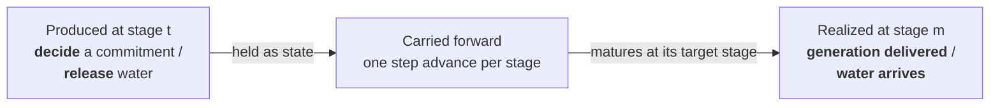
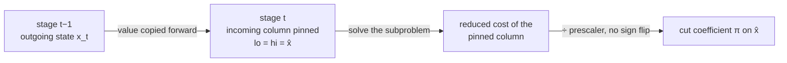
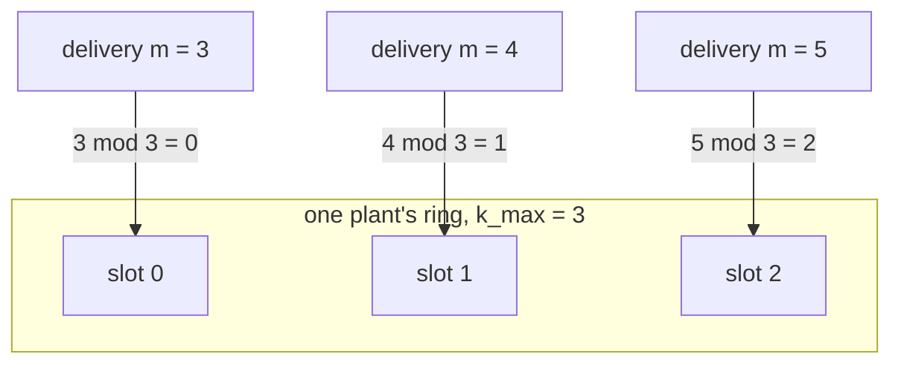
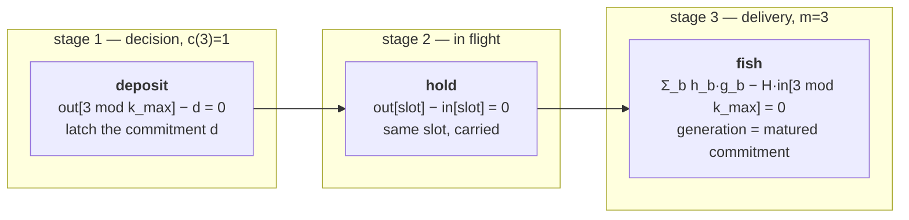
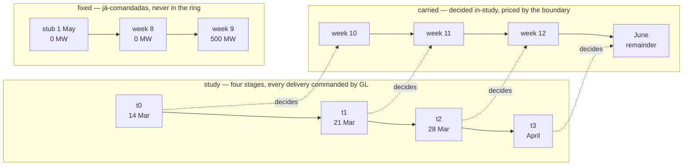
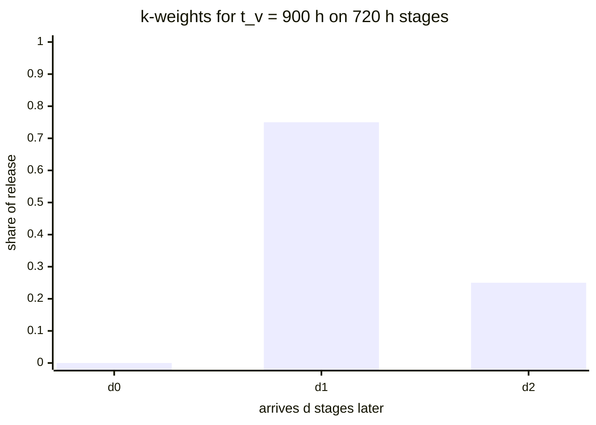
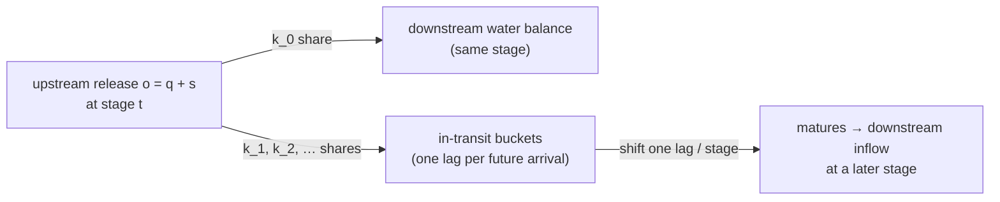
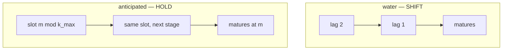

# Anticipated thermals & water travel time — a first-timer's guide

**Status: Primer.** This is the gentle introduction. It assumes you know SDDP but
are new to cobre, and it builds both features up from the physical problem, through
the math, to the files you actually edit and read. For the code-level correctness
contracts (symbol-by-symbol, with the invariants each regression test pins), read
the companion reference [`../design/anticipated-thermals-and-water-travel-time.md`](../design/anticipated-thermals-and-water-travel-time.md)
after this.

Notation follows the workspace SDDP conventions. Stage indices are **0-based**
(`t = 0, 1, …, T−1`) to match the code's arithmetic; `T` is the number of study
stages.

---

## 1. Why these two features exist

Ordinary SDDP dispatch has a comfortable assumption baked in: a decision you make
in stage `t` takes effect in stage `t`. You turbine water now, it generates now.
You run a thermal plant now, its MWh count now. The only thing that couples one
stage to the next is **reservoir storage** — the classic state variable that
carries forward as `v̂` and gets priced by the future-cost cuts.

Two physical realities break that assumption:

- **Fuel lead time (anticipated thermals).** An LNG plant (originally _Gás Natural
  Liquefeito_, GNL), a long-haul coal contract, or any plant whose fuel must be
  ordered ahead cannot decide _now_ to generate _now_. The committed quantity must
  be **locked in a lead time ahead** of the stage where the energy is delivered.
  The decision and its delivery live in **different stages**.

- **Water travel time.** Water released from an upstream reservoir does not
  teleport into the downstream one. On a long reach it takes hours or days to
  arrive — often spanning one or more stage boundaries. The release happens now;
  the downstream **inflow arrives later**.

Both are the _same shape of problem_: **a quantity is produced at one stage and
realized at a later stage, and the amount in between has to be remembered.** In
SDDP, "something that couples stages and must be remembered" has exactly one home:
it becomes **state**. So each feature adds state — and, as we'll see, they add it
through one shared mechanism.



---

## 2. The one idea: a lagged-delivery ring

Before the two features diverge, they share a substrate. Understanding it once
makes both features easy.

### 2.1 How cobre carries SDDP state (the "fishing" trick)

You know SDDP cuts approximate the future-cost function `V_t(x)` with hyperplanes
`θ ≥ α + πᵀ x̂`, where `x̂` is the incoming state and `π` is the subgradient
(the dual of the state-transition). Cobre realizes this without a state-fixing
_constraint row_. Instead, **each incoming-state coordinate is its own LP column,
pinned by equal bounds**:

```
column lower bound = column upper bound = x̂        (the value from stage t−1)
```

The cut coefficient `π` for that coordinate is then the **reduced cost** of
the pinned column (divided by a fixed per-column prescaler, with no sign change).
This is cobre's version of SDDP.jl "fishing": you fix the incoming state, solve,
and read the price straight off the pinned column.



**Everything below reuses exactly this machinery.** A new feature adds new state
coordinates; each one is an outgoing column (resolved to its cut coefficient by
identity) and a pinned incoming column. Nothing about the cut algorithm changes.

### 2.2 The ring

The in-flight amount lives in a **ring of state slots**. Picture a small carousel
of `k_max` slots. Each stage:

- the slot that **matures this stage** is consumed (its content is realized),
- the surviving slots **advance one step**, and
- a **fresh amount is deposited** into a slot for future delivery.

That carousel is a single code primitive, `DeliveryRing`, and **both features are
instances of it**. A ring is a dense grid of `n_lanes × depth` columns with two
mirror blocks — an _outgoing_ block (contributes to the state and to cuts) and an
_incoming_ block (pinned to the previous stage). Its column address is:

```
out_col(slot, lane) = out_block.start + slot·n_lanes + lane      (slot-major, lane-minor)
in_col (slot, lane) = in_block.start  + slot·n_lanes + lane
```

The ring knows how to emit four kinds of structural rows; each feature uses a
subset:

| Ring operation          | What it emits                                   | Used by         |
| ----------------------- | ----------------------------------------------- | --------------- |
| `emit_shift_rows`       | `out[slot] = in[slot+1]` — advance to next slot | **water**       |
| `emit_carry_rows`       | `out[slot] = in[slot]` — hold in the same slot  | **anticipated** |
| `emit_deposit`          | latch a decision column into a slot             | anticipated     |
| `freeze_masked_columns` | pin unreachable slots to `[0, 0]`               | both            |

The single most important difference to keep in mind: **water _shifts_** (physical
mass moves one slot closer to arrival each stage), while **anticipated _holds_**
(a commitment sits in the slot of its delivery target and waits). We'll see why in
§5.

### 2.3 Where the state lives

Both rings sit inside one contiguous state vector, in a fixed region order. With
`N` hydros, `L` AR-inflow lags, `B` water buckets, and `A` anticipated plants over
`k_max` ring depth:

```
[0,        N)             storage             — outgoing storage volumes
[N,        N(1+L))        inflow_lags         — AR lag variables
[N(1+L),   +B)            transit_buckets_out — WATER ring (outgoing)
[+B,       +S)            commit_out          — ANTICIPATED ring (outgoing), S = A·k_max
                          z_inflow            — realized inflow (auxiliary, not state)
                          storage_in          — incoming storage      (pinned)
                          transit_buckets_in  — WATER ring (incoming)  (pinned)
                          commit_in           — ANTICIPATED ring (incoming, pinned)
                          theta               — future-cost variable θ
```

so the total state dimension is

```
n_state = N·(1 + L) + B + A·k_max
```

With no travel-time arc the bucket region collapses to width 0; with no anticipated
plant the commitment region collapses to width 0 — and the whole layout reproduces
the pre-feature bytes exactly. That "collapses to nothing when unused" property is
why turning a feature _off_ is guaranteed to change nothing.

---

## 3. Anticipated thermal generation

### 3.1 The setup

A thermal plant declares a **lead** — how far ahead the commitment must be locked.
Cobre supports two ways to say it (mutually exclusive):

- **`lead_stages`** — an integer count of stages (`≥ 1`). The calendar is never
  consulted; a decision for delivery stage `m` is made at stage `m − ℓ`.
- **`lead_time_hours`** — a physical duration in hours, resolved against the actual
  stage calendar (the same clock a water arc uses).

Call the resolved per-plant lead `K_i` (in stages). If a physical lead is shorter
than the decision stage's own duration, it resolves to `K_i = 0` — there is no
lead at all, and the plant is dispatched as an ordinary thermal that stage (with a
one-line advisory, never an error).

The per-stage thermal decision therefore **splits into two coupled quantities**:

- the **commitment** `d` — a MW value _decided_ at the decision stage, and
- the **delivered generation** `g_b` (per block `b`) — _forced to equal_ the
  matured commitment at the delivery stage.

### 3.2 From lead to ring slot

The lead resolves to a **decider** `c(m)`: the stage at which the commitment for
delivery stage `m` is decided. Deliveries are indexed on an **extended delivery
axis** `[0, n_delivery)` that can run past the study horizon (more on that in §3.5):

- `lead_stages`: `c(m) = m − ℓ`.
- `lead_time_hours`: end-anchored — `c(m)` is the stage containing
  `stage_end(m) − (lead hours)`. (End-anchoring is what lets a sub-stage lead
  resolve to `c(m) = m`, the `K_i = 0` case above.)
- `c(m) = None` means the decider is _before_ the study — a pre-study commitment
  (see the seed in §3.4).

The ring depth `k_max` is the **maximum number of commitments simultaneously in
flight**, across all plants and stages — not merely the lead. (On a plain
`lead_stages` study these coincide, `k_max = maxᵢ ℓᵢ`; they diverge once
pre-study commitments outlive the in-study in-flight count — including the
special case where a plant's own pre-study seed run is itself the deepest
moment, before the study has fished any of them.) Each delivery target is then
placed into the ring by its **residue**:

```
slot(m) = m mod k_max
```

This is safe because at any stage `t` the commitments still in flight target the
`k_max` consecutive stages `{t+1, …, t+k_max}` — `k_max` consecutive integers have
`k_max` distinct residues, so no two collide. The state region is `S = A·k_max`
(one lane per anticipated plant, `k_max` slots deep).



> **If the plant also has a fixed post-horizon commitment (§3.6):** that
> delivery stage is never one of the `k_max` consecutive stages above — it is
> excised from the ring before residues are taken, because it never occupies a
> ring slot at all. `slot(m) = m mod k_max` is exactly the formula whenever a
> plant declares no such commitment (the common case); with one declared, the
> residues above are counted on the ring's **own** axis, not the raw delivery
> axis, so the count still comes out exactly right.

### 3.3 The three LP row families

The whole commitment mechanism is three families of equality rows over the
anticipated ring. Take a plant with `lead_stages = 2` that decides at stage 1 for
delivery at stage 3:



1. **Deposit** (`emit_deposit`): the fresh decision at its decision stage pins the
   slot of _its own delivery target_ — `out_col(m mod k_max) − d = 0`.
2. **Hold** (`emit_carry_rows`): an in-flight, not-yet-due commitment is pinned to
   the **same** slot's incoming column — `out[slot] − in[slot] = 0`. It does not
   migrate; it waits in its delivery-residue slot until it matures.
3. **Fish** (maturity): at the delivery stage, the plant's per-block generation is
   tied to the matured commitment — `Σ_b h_b · g_b − H · in_col(m mod k_max) = 0`
   (MW → MWh) — where `b` indexes the stage's blocks, `h_b` is block `b`'s duration,
   `g_b` its generation, and `H = Σ_b h_b` the total stage hours. This row **reads** `commit_in`
   and never writes `commit_out`, which is exactly why the same stage's fresh
   deposit (which writes `commit_out`) can never collide with it. It fires for
   _every_ maturing delivery: a plant not yet commissioned never deposited,
   so its incoming slot is 0 and the row harmlessly pins that generation to 0.

**Cost and bounds are read at the _delivery_ stage, not the decision stage.** The
commitment column's bounds `[min_mw, max_mw]`, its fuel cost, its discount factor,
and its commissioning gate all come from stage `m`. The plant's per-block
generation columns carry _no_ objective cost — the fuel is booked once on the
commitment column, so nothing is double-charged. Intuitively: you pay for the
committed MWh, priced as if delivered at `m` and discounted back.

### 3.4 Seeding the leading stages

If a plant has a lead of `K_i`, then the first `K_i` study stages are delivered by
commitments that were decided _before_ the study began. Those are supplied as
**`past_anticipated_commitments`** — dated MW windows that tile the leading
delivery stages. They seed the stage-0 ring directly and are **sunk cost**: they
constrain the leading stages' generation but never enter the objective.

### 3.5 Delivering past the horizon (post-study stages)

A commitment decided late in the study can target a stage _after_ the horizon. To
price and bound such a delivery, the study declares **`post_study_stages.json`**: a
short continuation calendar plus, per `(thermal, post-study stage)`, a
`cost_per_mwh` / `min_mw` / `max_mw`. This **extends the delivery axis** to
`n_delivery = T + n_post`.

The key design point for a first-timer: a post-horizon delivery is **not** a
special separate structure. It is **one of the ring's own slots** — the slot its
residue `m mod k_max` resolves to — held open and priced through the same generic
`β·state` cut projection as every other slot. With no `post_study_stages.json`
declared, the axis is study-only (`n_delivery = T`), and any slot targeting `m ≥ T`
is unreachable and frozen to `[0,0]`.

The **decision-existence gate** is a single inequality on the extended axis:

```
a decision is active  ⟺  delivery_stage < n_delivery
```

That is the one rule that decides whether a commitment exists at all.

> **Note for readers of older material:** earlier cobre (and the currently-published
> methodology pages) modeled this with a Markov-1 _shift_ ring, a `future_anticipated_deliveries[]`
> input, and a separate block of "post-horizon lanes." All three are **retired**.
> The current model is the residue-keyed _hold_ ring described above, with
> `post_study_stages.json` as the sole post-horizon surface. If you see
> `future_anticipated_deliveries` anywhere, it is stale.

### 3.6 Fixed post-horizon commitments — what to declare

Some commitments are decided **before** the study even for a delivery **after**
the horizon — DECOMP calls this a "já-comandada" (already-committed) delivery.
Declaring one needs no new input surface: extend the plant's
**`past_anticipated_commitments`** windows (§3.4) past the study horizon,
exactly like any other commitment window. Three things to keep in mind:

- **A window may sit past the horizon.** The same dated-window shape
  (`{ thermal_id, start_date, end_date, value_mw }`) that seeds the leading
  in-study stages also covers a post-horizon delivery — there is no separate
  field or file for it.
- **An explicit zero is a legitimate window, not a placeholder to omit.** A
  short stub stage right at the horizon boundary is common in practice;
  declare it at `value_mw: 0` rather than leaving it uncovered — the
  validation matrix (the companion design reference) treats "uncovered" and
  "declared zero" very differently.
- **The value is sunk — it never enters the objective.** Exactly like the
  in-study seeds (§3.4), a fixed post-horizon value is priced only if a
  terminal boundary policy is loaded, and only through that boundary's
  future-cost pricing — never as a cost term in the current study's own
  objective. The run-level table `anticipated/fixed_deliveries.parquet`
  (§6.2) echoes it at its real delivery date.

This commitment never occupies a ring slot: unlike an in-study delivery or a
post-study delivery the study itself decides (§3.2, §3.5), a fixed
post-horizon value is a plain declared constant the ring never carries. If you
declare one and see no corresponding ring state for it in the policy
checkpoint, that is expected — see §6.3.

---

### 3.7 Worked examples: NEWAVE and DECOMP calendars

The two lead modes behave identically on a uniform calendar but diverge once stage
lengths vary. The two calendars you meet in practice are NEWAVE-style **monthly**
stages (real months vary 28–31 days, i.e. 672–744 h; we idealize them to 720 h
here) and DECOMP-style **operative weeks** (Saturday–Friday, 168 h) followed by a
final monthly stage.

#### Example A — `lead_stages` on a uniform monthly calendar

A plant with `lead_stages = 2` on monthly stages (each month 720 h). The decider
ignores the calendar — `c(m) = m − 2` — so the depth is `k_max = 2` and every
delivery lands in slot `m mod 2`. The first two deliveries are pre-study seeds; from
stage 0 on, each stage deposits the decision for two stages ahead and fishes the
delivery maturing now:

| Stage `t` | Fishes `m = t` (reads `commit_in`, slot `t mod 2`) | Deposits `m = t+2` (writes `commit_out`, slot `(t+2) mod 2`) |
| --------- | -------------------------------------------------- | ------------------------------------------------------------ |
| 0         | `m=0` — pre-study seed, slot 0                     | `m=2` → slot 0                                               |
| 1         | `m=1` — pre-study seed, slot 1                     | `m=3` → slot 1                                               |
| 2         | `m=2`, slot 0                                      | `m=4` → slot 0                                               |
| 3         | `m=3`, slot 1                                      | `m=5` → slot 1                                               |

At each stage the fish and the deposit touch the **same** slot index
(`(t+2) mod 2 = t mod 2`) — harmless because the fish reads `commit_in` while the
deposit writes `commit_out` (§3.3).

#### Example B — `lead_time_hours` vs. `lead_stages` on a DECOMP calendar

A DECOMP-style calendar: four operative weeks (Saturday–Friday, 168 h each), then a
final month (720 h). The stage-boundary hours from the study start are
`0, 168, 336, 504, 672, 1392` — stages `t0…t3` are weeks, `t4` is the month. Compare
two plants that both mean "two units of lead": one with `lead_stages = 2`, the other
with `lead_time_hours = 336` (two operative weeks). The physical lead is end-anchored
— `c(m)` is the stage containing `end(m) − 336`:

| Delivery `m` | Stage      | `lead_stages = 2` | `lead_time_hours = 336`           |
| ------------ | ---------- | ----------------- | --------------------------------- |
| `m = 2`      | week `t2`  | `c = 0` (lead 2)  | `c = 0` (lead 2)                  |
| `m = 3`      | week `t3`  | `c = 1` (lead 2)  | `c = 1` (lead 2)                  |
| `m = 4`      | month `t4` | `c = 2` (lead 2)  | `c = 4` — `K = 0`, self-delivered |

In the uniform weekly region the two modes agree (two weeks = two stages). At the
month they **diverge**: `lead_stages` still counts two stages back (delivery `m=4`
decided in week `t2`), but `lead_time_hours` sees that 336 h is shorter than the
720 h month, so the decision for `t4` falls _inside_ `t4` — the `K = 0` case,
dispatched as an ordinary thermal that stage (§3.2). This is why a physical lead is
calendar-aware and a stage-count lead is not. §3.8 walks a real DECOMP GNL deck,
where the lead reaches past the horizon.

### 3.8 Worked example: a faithful DECOMP GNL deck

Everything in §3.4–§3.6 comes together in the deck DECOMP users meet every
week: the LNG (_GNL_) plants of a two-month DECOMP study, priced at the horizon
by a NEWAVE future-cost function. This example walks the March 2026 rv2 deck
end to end — calendar, lead, files, ring, boundary pricing, outputs — with the
real numbers, so you can recognize each piece in your own case.

#### What DECOMP declares

DECOMP keeps its GNL plants out of the ordinary `CT` thermal registry, in
`dadgnl`:

- `TG` — the plant registry: code, submarket, per-block fuel cost (`CVU`),
  availability and inflexibility.
- `NL` — the dispatch-anticipation lag, in whole months (1 or 2). SANTA CRUZ
  and PSERGIPE I both declare 2.
- `GL` — the dispatch **already commanded** by earlier revisions: one register
  per operative week, with its start date and per-block MW. In this deck every
  in-study week is commanded at 0 MW; past the horizon, week 8 (2 May) is
  commanded at 0 MW and week 9 (9 May) at 500 MW for SANTA CRUZ.
- `GS` — the operative-week calendar (weeks per month).

The DECOMP horizon is two months: the current month in operative weeks
(Saturday–Friday), the next month as one stage. Under a 2-month lag, each March
week decides the **same operative week two months ahead** — in May — and the
April month decides the June remainder. So in this regime _every_ delivery
inside the study was commanded before it started, and _every_ decision the
study makes lands after its own horizon. That is exactly the shape §3.4–§3.6
were built for: the in-study deliveries are seeds, the already-commanded May
weeks are fixed post-horizon commitments, and the study's own decisions are
carried to the terminal state and priced by the NEWAVE boundary.

#### Step 1 — the extended delivery axis

The rv2 study runs 14 March → 1 May 2026: three operative weeks and the April
remainder (168 + 168 + 168 + 648 h = 1152 h). `post_study_stages.json`
continues the calendar with **seven** stages, and the lead (Step 2) sorts every
delivery `m` on the extended axis into one of three kinds:

| `m` | Window                          | Hours | Decided by                        | Kind                             |
| --- | ------------------------------- | ----- | --------------------------------- | -------------------------------- |
| 0   | 14 Mar → 21 Mar (week)          | 168   | before the study (`GL` week 1)    | seed (§3.4)                      |
| 1   | 21 Mar → 28 Mar (week)          | 168   | before the study (`GL` week 2)    | seed                             |
| 2   | 28 Mar → 4 Apr (week)           | 168   | before the study (`GL` week 3)    | seed                             |
| 3   | 4 Apr → 1 May (April remainder) | 648   | before the study (`GL` weeks 4–7) | seed                             |
| 4   | 1 May → 2 May (stub)            | 24    | before the study                  | **fixed**, 0 MW (§3.6)           |
| 5   | 2 May → 9 May (`GL` week 8)     | 168   | before the study                  | **fixed**, 0 MW                  |
| 6   | 9 May → 16 May (`GL` week 9)    | 168   | before the study                  | **fixed**, 500 MW for SANTA CRUZ |
| 7   | 16 May → 23 May (week 10)       | 168   | stage 0                           | carried (§3.5)                   |
| 8   | 23 May → 30 May (week 11)       | 168   | stage 1                           | carried                          |
| 9   | 30 May → 6 Jun (week 12)        | 168   | stage 2                           | carried                          |
| 10  | 6 Jun → 30 Jun (June remainder) | 576   | stage 3                           | carried                          |

Two calendar details are easy to miss. The study ends on a Friday (1 May) while
the operative-week grid restarts on Saturday (2 May): the 24 h **stub** `m = 4`
exists only to keep the delivery axis contiguous, and it is declared as an
explicit 0 MW window — never left uncovered. And the June remainder is a single
576 h stage: the April _month_ decides the June _month_, at monthly
granularity, exactly as DECOMP does.



#### Step 2 — the lead

"The same operative week two months ahead" is nine operative weeks: the first
delivery the study decides (week 10, 16 May) starts exactly 63 days after the
study start — `lead_time_hours: 1512.0`. The decider is end-anchored (§3.2):
`c(m)` is the stage containing `e_m − 1512`, where `e_m` is the end of stage
`m` in hours from the study start, and a tie on a stage boundary goes to the
**earlier** stage:

| `m`         | `e_m` | `e_m − 1512` | `c(m)`                                    |
| ----------- | ----- | ------------ | ----------------------------------------- |
| 6 (week 9)  | 1512  | 0            | before the study — tie at the study start |
| 7 (week 10) | 1680  | 168          | stage 0 — tie at the `t0` / `t1` boundary |
| 8 (week 11) | 1848  | 336          | stage 1                                   |
| 9 (week 12) | 2016  | 504          | stage 2                                   |
| 10 (June)   | 2592  | 1080         | stage 3                                   |

and every `m ≤ 5` lands before the study too. Any lead in `[1512, 1680)` h —
at least nine and less than ten operative weeks — resolves this same mapping.
Outside it, validation tells you which way you missed:

- **Too short** (say 1500 h): week 9 becomes _study-decided_, and the 500 MW
  window covering it is rejected — `past_anticipated_commitments cover
post-study stage index(es) [2], which the study itself decides … lengthen
anticipated_config's lead`.
- **Too long** (1680 h or more): week 10 becomes _pre-study-decided_, and the
  untiled stage is rejected — `past_anticipated_commitments do not tile
post-study stage index(es) [3] at coverage 1.0; declare the fixed commitment
for each`.

`lead_stages: 7` (four study stages plus the three fixed stages) resolves the
identical decider, `c(m) = m − 7`. The two spellings differ only in ring depth:
a stage-count lead keeps its `ℓ` as the depth, so the ring is 7 deep with three
permanently-masked slots per plant, while the physical lead sizes it at the
measured occupancy — 4 (Step 4). On a DECOMP calendar, prefer
`lead_time_hours`.

#### Step 3 — the files

`stages.json` is the ordinary four-stage study calendar; nothing about it is
special. The anticipated machinery lives in four other places.

`system/thermals.json` — the two GNL plants are ordinary entries carrying the
lead:

```jsonc
{
  "id": 94,
  "name": "SANTA CRUZ",
  "bus_id": 0,
  "operational_start_date": "2026-03-14",
  "cost_per_mwh": 199.22,
  "generation": { "min_mw": 0.0, "max_mw": 500.0 },
  "anticipated_config": { "lead_time_hours": 1512.0 },
}
```

(PSERGIPE I is `id: 95` on bus 2, 321.26 $/MWh, 0–1593 MW, the same lead.)

`post_study_stages.json` — the seven-stage continuation calendar, and a
cost/bounds cell **only for the stages the study decides** (indices 3–6). The
fixed stages 0–2 hold constants, not decisions, so they need none:

```jsonc
{
  "stages": [
    { "start_date": "2026-05-01", "duration_hours": 24.0 }, // 0 — stub
    { "start_date": "2026-05-02", "duration_hours": 168.0 }, // 1 — week 8
    { "start_date": "2026-05-09", "duration_hours": 168.0 }, // 2 — week 9
    { "start_date": "2026-05-16", "duration_hours": 168.0 }, // 3 — week 10
    { "start_date": "2026-05-23", "duration_hours": 168.0 }, // 4 — week 11
    { "start_date": "2026-05-30", "duration_hours": 168.0 }, // 5 — week 12
    { "start_date": "2026-06-06", "duration_hours": 576.0 }, // 6 — June remainder
  ],
  "thermal_bounds": [
    {
      "thermal_id": 94,
      "post_study_stage_index": 3,
      "cost_per_mwh": 199.22,
      "min_mw": 0.0,
      "max_mw": 500.0,
    },
    {
      "thermal_id": 94,
      "post_study_stage_index": 4,
      "cost_per_mwh": 199.22,
      "min_mw": 0.0,
      "max_mw": 500.0,
    },
    {
      "thermal_id": 94,
      "post_study_stage_index": 5,
      "cost_per_mwh": 199.22,
      "min_mw": 0.0,
      "max_mw": 500.0,
    },
    {
      "thermal_id": 94,
      "post_study_stage_index": 6,
      "cost_per_mwh": 199.22,
      "min_mw": 0.0,
      "max_mw": 500.0,
    },
    // … and the same four cells for thermal 95
  ],
}
```

`initial_conditions.json` — one `past_anticipated_commitments` window per
pre-study-decided delivery, in-study and post-horizon alike, translated
straight from `GL`:

```jsonc
"past_anticipated_commitments": [
  { "thermal_id": 94, "start_date": "2026-03-14", "end_date": "2026-03-21", "value_mw": 0.0 },   // seeds — GL weeks 1–3 …
  { "thermal_id": 94, "start_date": "2026-03-21", "end_date": "2026-03-28", "value_mw": 0.0 },
  { "thermal_id": 94, "start_date": "2026-03-28", "end_date": "2026-04-04", "value_mw": 0.0 },
  { "thermal_id": 94, "start_date": "2026-04-04", "end_date": "2026-05-01", "value_mw": 0.0 },   // … and weeks 4–7 on the April stage
  { "thermal_id": 94, "start_date": "2026-05-01", "end_date": "2026-05-02", "value_mw": 0.0 },   // fixed — the stub, an explicit zero
  { "thermal_id": 94, "start_date": "2026-05-02", "end_date": "2026-05-09", "value_mw": 0.0 },   // fixed — GL week 8
  { "thermal_id": 94, "start_date": "2026-05-09", "end_date": "2026-05-16", "value_mw": 500.0 }, // fixed — GL week 9, the já-comandada
  // … and the same seven windows, all 0 MW, for thermal 95
]
```

Note the split at the horizon: the April window ends at `2026-05-01` and the
stub starts there. A single window `2026-04-04 → 2026-05-09` would straddle the
horizon and is rejected — split it at the horizon end. The 500 MW must also lie
inside the plant's `[min_mw, max_mw]` (here it sits exactly at the cap).

`config.json` — the NEWAVE future-cost function DECOMP couples to, converted to
a cobre checkpoint, is the terminal boundary:

```jsonc
"policy": { "boundary": { "path": "boundary", "source_stage": 3 } }
```

`source_stage` names the source stage whose cut pool to load; omit it and the
loader matches the source's dated stages against the study's terminal calendar.

#### Step 4 — the ring

Per plant, at most four commitments are ever in flight at once — at stage 0
the three unfished seeds plus the week-10 decision, then a shrinking seed run
matched by a growing set of decisions — and the pre-study seed run is four deep
as well, so `k_max = max(4, 4) = 4` (§3.2): two lanes, eight anticipated state
dimensions. On the ring axis the fixed window `m = 4, 5, 6` is excised
(`r(m) = m` for `m ≤ 3`, `r(m) = m − 3` for `m ≥ 7`), so the residues recycle
exactly as in Example A:

| Stage `t` | Fishes (reads `commit_in`) | Deposits (writes `commit_out`)  | In flight after `t`    |
| --------- | -------------------------- | ------------------------------- | ---------------------- |
| 0         | `m=0` — seed, 0 MW, slot 0 | `m=7` (week 10) → `r=4`, slot 0 | seeds 1–3, week 10     |
| 1         | `m=1` — seed, slot 1       | `m=8` (week 11) → `r=5`, slot 1 | seeds 2–3, weeks 10–11 |
| 2         | `m=2` — seed, slot 2       | `m=9` (week 12) → `r=6`, slot 2 | seed 3, weeks 10–12    |
| 3         | `m=3` — seed, slot 3       | `m=10` (June) → `r=7`, slot 3   | weeks 10–12, June      |

Each stage's fish pins the plant's generation to its commanded seed — SANTA
CRUZ cannot be dispatched in-study no matter how cheap it would be, because
`GL` commanded 0 MW — and each stage's deposit is a genuine costed decision:
the commitment column is bounded by the delivery stage's `thermal_bounds`
cell, charged that stage's `cost_per_mwh × hours`, and discounted by the
cumulative factor **continued over the real post-study durations** — week 10's
decision is discounted to 16 May and the June remainder's to 6 June, not to
the horizon. The terminal state is the four post-horizon decisions per plant,
dated in the policy manifest at their month anchors (`20260501` three times,
then `20260601`). The three fixed windows never appear in it.

#### Step 5 — pricing at the boundary

The terminal future-cost function loaded from `boundary/` is NEWAVE's: its
anticipated-thermal slots are **monthly**, the study's are **weekly**, and the
two are joined by calendar date (§6.3). A week fully inside a priced source
month takes `overlap / H_M` of that month's coefficient — week 10 (16–23 May)
takes `168 / 744` of May's; a week straddling into a month the source does not
price is renormalized over its covered span; a slot no source month covers
prices at zero. The fixed windows enter the same join as constants: SANTA
CRUZ's 500 MW in week 9 folds into every boundary cut's intercept as
`coeff_May × (168 / 744) × 500` — the way DECOMP itself values a já-comandada
against the NEWAVE function — and never appears in the objective or in any
cost output (sunk, §3.6).

`cobre validate` reports the reconciliation before any solve. For this deck:

```
boundary reconciliation: 2184 copied, 6 fanned out, 2 defaulted to 0.0, 2 source slots dropped
```

Reading it: the 6 fanned-out slots are the three May weeks of each plant; the
2 defaulted slots are each plant's June remainder — this source checkpoint
prices April and May only, so the June delivery is valued at zero, which is
the thing to check whenever a delivery you expected priced comes back
defaulted; the 2 dropped source slots are April months nothing in the study
delivers into, a benign drop. `cobre validate --json` returns the same tally
per state family. Without `config.policy.boundary` at all, setup warns once,
naming SANTA CRUZ (a non-zero fixed value) and both plants (carried
decisions): everything post-horizon prices at zero terminal value.

#### Step 6 — what you read back

- `simulation/thermals/` — the in-study rows of ids 94 and 95 carry
  `is_anticipated = true` and `anticipated_committed_mw = 0`: generation
  pinned to the `GL` command.
- `simulation/anticipated_lanes/` — per scenario and stage, the deposited
  decision and its `delivery_date`: `20260501` at stages 0–2 (weeks 10–12),
  `20260601` at stage 3 (the June remainder).
- `anticipated/fixed_deliveries.parquet` — run-level, one row per fixed
  window echoing the input, `(94, 2026-05-09, 2026-05-16, 500.0)` among six —
  the counterpart of the `*` rows DECOMP's `relgnl` re-prints.

## 4. Water travel time

### 4.1 The setup

By default, water released this stage reaches the downstream reservoir _this_
stage. When the reach is long, a plant declares a **`travel_time_hours`** on its
main cascade arc (the arc to its `downstream_id`), and the release is delivered a
number of stages later instead. Only the main cascade arc delays; diversion and
pumping transfers stay instantaneous. Travel time absent, `null`, or `0` = no arc,
no state added.

### 4.2 From travel time to k-weights

Here is the one subtlety that a "shift by ⌈τ / stage⌉ stages" mental model
gets wrong: a stage is a _duration_, and a release is spread over it, so the
arriving water rarely lands neatly in one future stage — it **spreads across
several**, weighted by how much of the travel-delayed release window overlaps each
future stage.

Cobre measures that overlap exactly. Take a release spread uniformly over the
current stage (duration `h_t`), delay it by the travel time `t_v`, and intersect
the resulting arrival window `[t_v, t_v + h_t)` with each future stage window
`[S_d, S_{d+1})` (stage boundaries counted from the release stage). The fraction
landing in the stage `d` steps ahead is the **k-weight**:

```
k_d  =  | [t_v, t_v + h_t) ∩ [S_d, S_{d+1}) |  /  h_t
```

where `|·|` is the length (in hours) of the interval overlap. Two properties make
this a conservation law rather than an approximation:

- `Σ_d k_d = 1` — every released drop is accounted for (checked at runtime).
- `k_0` is the **same-stage share** — delivered onto the downstream water balance
  directly, with no bucket needed.

**Worked example.** Stages are 720 h (30 days) each. A plant has `t_v = 900 h`
(37.5 days). A release spread over the current stage arrives over `[900, 1620)`
hours from the stage start:

| Arrives `d` stages later | Overlap with `[900,1620)` | `k_d`   |
| ------------------------ | ------------------------- | ------- |
| `d = 1` (720 – 1440 h)   | `[900, 1440)` → 540 h     | `0.750` |
| `d = 2` (1440 – 2160 h)  | `[1440, 1620)` → 180 h    | `0.250` |

So three-quarters of this stage's release arrives one stage later and one-quarter
two stages later; nothing arrives the same stage (`k_0 = 0`).



The number of bucket slots a plant needs is **measured**, not assumed: it is the
deepest lag any of its arcs reaches on the actual stage calendar (folding in the
extra depth a pre-study release history may still be draining). Confluent arcs into
one downstream plant collapse into **one** aggregated bucket block.

### 4.3 The buckets in flight

Everything except the same-stage share `k_0` goes into **in-transit buckets** — one
`DeliveryRing` per downstream plant (`n_lanes = 1`). A bucket holds a volume (hm³)
maturing some number of stages out. Each stage the ring **shifts**: every in-flight
bucket moves one lag closer to arrival, and the bucket maturing this stage drops
straight into the downstream water balance.



Two details worth knowing early:

- **The release column feeds both** the same-stage balance (`k_0`) and the buckets
  (`k_1 …`). It is not a separate once-per-stage transaction; conservation
  (`Σ k_d = 1`) holds per release.
- **A maturing bucket is already a volume**, so it enters the downstream balance
  with a plain `−1` coefficient — no travel-time rescaling at arrival. (Under
  chronological blocks the arriving volume is spread over the arrival stage's
  blocks by a fixed arrival density that also sums to 1.)

### 4.4 Seeding: the pre-study release history

Because a study's first stages receive water released _before_ the study began, the
in-transit buckets must be seeded. That is **`past_defluences`** — windowed
pre-study release records (m³/s). They must cover the whole in-transit span
`(0, t_v]` before the study start, contiguously; a gap is a hard error (there is no
fallback seed). A follow-on run re-seeds itself from the `transit_seed` output (§6)
so a chained simulation is faithful.

---

### 4.5 Worked examples: uniform vs. varying calendars

#### Example C — a short travel time on a uniform monthly calendar

Take `t_v = 300 h` on 720 h months. The arrival window is `[300, 1020)`, so part of
the release arrives the **same** stage:

| Arrives `d` stages later | Overlap with `[300, 1020)` | `k_d`   |
| ------------------------ | -------------------------- | ------- |
| `d = 0` (0 – 720 h)      | `[300, 720)` → 420 h       | `0.583` |
| `d = 1` (720 – 1440 h)   | `[720, 1020)` → 300 h      | `0.417` |

So 58.3 % arrives the same stage (`k_0`, straight into the balance, no bucket) and
41.7 % one stage later (one bucket) — unlike the §4.2 example (`t_v = 900 h`), where
nothing arrived the same stage.

#### Example D — the same travel time, weekly vs. monthly destination (DECOMP)

On the DECOMP calendar (weeks of 168 h, then a 720 h month), the k-weights depend on
the length of the **destination** stages. Take `t_v = 200 h`.

**Released in a middle week** (destinations are also weeks, 168 h), arrival window
`[200, 368)` from the release-stage start:

| Arrives `d` stages later | Overlap with `[200, 368)` | `k_d`   |
| ------------------------ | ------------------------- | ------- |
| `d = 1` (168 – 336 h)    | `[200, 336)` → 136 h      | `0.810` |
| `d = 2` (336 – 504 h)    | `[336, 368)` → 32 h       | `0.190` |

**Released in the last week before the month** (destination is the 720 h month,
whose window starts 168 h after the release-stage start):

| Arrives `d` stages later     | Overlap with `[200, 368)` | `k_d`   |
| ---------------------------- | ------------------------- | ------- |
| `d = 1` (month, 168 – 888 h) | `[200, 368)` → 168 h      | `1.000` |

The same travel time `t_v = 200 h` produces **two** buckets (0.810 / 0.190) when the
water arrives into short weekly stages, but a **single** bucket (1.000) when it
arrives into the long monthly stage — because the k-weights measure overlap against
the destination stage lengths, not a fixed lag count. (A release inside the final
month itself would mature after the horizon, and its share is dropped unless a
terminal boundary is loaded — §5.)

## 5. How the two features differ

They share the ring skeleton, the one contiguous state region, the
out-by-identity / in-pinned column resolution, the two-sided masking, and the dual
sign convention. They differ in a handful of call-site choices:

| Aspect                 | Water travel time                        | Anticipated thermal                                                      |
| ---------------------- | ---------------------------------------- | ------------------------------------------------------------------------ |
| Ring instances         | one per downstream plant (`n_lanes = 1`) | one dense ring (`n_lanes` = #anticipated plants)                         |
| Transition             | **shift** (`slot → slot+1`)              | **hold** (same slot)                                                     |
| Slot key               | lag = distance still in flight           | delivery-target residue on the **ring axis** (`ring_index(m) mod k_max`) |
| What gets deposited    | a `k_d`-weighted share of a release      | a single decision commitment                                             |
| Depth sizing           | measured overlap of the arrival window   | `max(occupancy_max, n_none_in_study)` per plant                          |
| Reachable column bound | `[0, ∞)` — a volume                      | `(−∞, ∞)` — a signed MW value                                            |

The deepest difference is **shift vs hold**. Water physically _moves_: a drop
released now is one stage closer to arrival next stage, so its bucket shifts slot.
A thermal commitment does _not_ move: it is pinned to the slot of the stage it will
be delivered in and waits there — holding the same slot — until that stage
arrives. Same carousel, opposite motion.



There is a matching asymmetry at the horizon's edge, which the companion design doc
covers in full: a masked water bucket at the terminal drops a _genuine_ end-of-horizon
release share (a deliberate, bounded imprecision), whereas a masked anticipated
slot is _provably_ empty (no commitment ever targets it). And "keeping terminal
state live" is gated differently — water needs a loaded terminal boundary
(`policy.boundary`), while anticipated keys on whether a `post_study_stages.json`
delivery target exists.

---

## 6. Bridge to the cobre files

This section maps everything above to the actual files you edit and read. Field
names and file locations are the current (post-retirement) surface.

### 6.1 Inputs — what turns each feature on

**Anticipated thermal** — in `system/thermals.json`, on a plant:

```jsonc
{
  "id": 1,
  "cost_per_mwh": 120.0,
  "generation": { "min_mw": 0.0, "max_mw": 150.0 },
  "anticipated_config": { "lead_time_hours": 1000.0 }, // OR { "lead_stages": 2 }
}
```

- `anticipated_config` is optional; absent = ordinary thermal. Supply exactly one
  of `lead_time_hours` (finite `> 0`) or `lead_stages` (integer `≥ 1`) — both keys
  or neither is a parse error.

**Post-horizon delivery** — `post_study_stages.json` at the case-directory root:

```jsonc
{
  "stages": [{ "start_date": "2024-07-01", "duration_hours": 744.0 }],
  "thermal_bounds": [
    {
      "thermal_id": 1,
      "post_study_stage_index": 0,
      "cost_per_mwh": 120.0,
      "min_mw": 0.0,
      "max_mw": 150.0,
    },
  ],
}
```

- `stages[]` is the post-study calendar (no `end_date`; it is derived).
  `thermal_bounds[]` gives the price and bounds a post-horizon delivery is charged
  and constrained against. `min_mw == max_mw` pins a fixed post-study profile — a
  legitimate replay deck.

**Water travel time** — in `system/hydros.json`, on the upstream plant:

```jsonc
{ "id": 0, "downstream_id": 1, "travel_time_hours": 48.0 }
```

- Both `downstream_id` and a strictly-positive `travel_time_hours` are required for
  an arc; absent / `null` / `0` means instantaneous.

**Seeds** — in `initial_conditions.json`:

- `past_anticipated_commitments[]`: `{ thermal_id, start_date, end_date, value_mw }`
  — pre-study commitments delivering into the leading stages (sunk cost).
- `past_defluences[]`: `{ hydro_id, start_date, end_date, value_m3s }` — pre-study
  releases seeding the in-transit buckets (`end_date` is exclusive).

> **Retired:** `initial_conditions.future_anticipated_deliveries[]` no longer
> exists — the input rejects it (unknown field). Its role is now
> `post_study_stages.json`.

### 6.2 Outputs — what each feature writes

Simulation results are Hive-partitioned Parquet under
`<output>/simulation/<name>/scenario_id=NNNN/data.parquet`, sharing the
`(scenario_id, stage_id, node_id)` key prefix. Both the CLI and the Python bindings
write these through the same writer, so the two are identical by construction.

| Output partition                       | Written when                                                                    | Key columns                                                                                       |
| -------------------------------------- | ------------------------------------------------------------------------------- | ------------------------------------------------------------------------------------------------- |
| `simulation/anticipated_lanes/`        | a `post_study_stages` is declared                                               | `thermal_id`, `delivery_date` (`YYYYMM01`), `deposited_decision_mw`, `carried_committed_mw`       |
| `simulation/in_transit/`               | a travel-time arc is declared                                                   | `hydro_id` (downstream), `lag` (1-based maturity), `in_transit_volume_hm3`, `delayed_arrival_hm3` |
| `simulation/transit_seed/`             | a travel-time arc is declared                                                   | `scenario_id`, `hydro_id` (upstream), `start_date`, `end_date`, `value_m3s`                       |
| `simulation/inflow_lags/`              | any hydro present                                                               | `hydro_id`, `lag_index` (0 = most recent), `inflow_m3s`                                           |
| `anticipated/fixed_deliveries.parquet` | a fixed post-horizon window is declared (run-level, one file, not per scenario) | `thermal_id`, `start_date`, `end_date`, `value_mw` — one row per window, echoed from the input    |

### 6.3 In the trained policy

The policy checkpoint records each state coordinate as a typed entity slot
(`policy.fbs`, `EntityType`), so a loaded boundary or a warm start can line the
dimensions up by identity:

- `HydroStorage` — reservoir storage.
- `HydroInflowLag` — an AR inflow lag (subindex = 1-based lag order).
- `AnticipatedThermalState` — an anticipated commitment ring slot (subindex = ring
  slot, entity = the thermal plant).
- `HydroTransitBucket` — an in-transit water bucket (subindex = maturity lag,
  entity = the downstream hydro).

Each slot also carries a `delivery_date` (`YYYYMMDD`, day pinned to `01` for the
month-granular anticipated anchors), so cross-study boundary reconciliation can
join deliveries by date.

---

## 7. Where to go next

- The **companion reference**,
  [`../design/anticipated-thermals-and-water-travel-time.md`](../design/anticipated-thermals-and-water-travel-time.md),
  states the same mechanisms as correctness contracts — the exact masking rules,
  the drift reconciliation, the fan-out and `K = 0` gates, and the terminal-boundary
  pricing — each pinned to a named regression test.
- A minimal runnable deck lives at
  [`../../examples/deterministic/d55-post-study-anticipated-lanes/`](../../examples/deterministic/d55-post-study-anticipated-lanes/):
  a single anticipated plant whose lead reaches a declared post-study stage, which
  is the smallest end-to-end example of the anticipated path with a post-horizon
  delivery.
